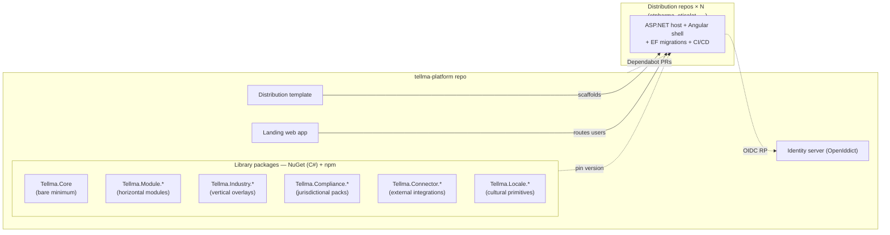
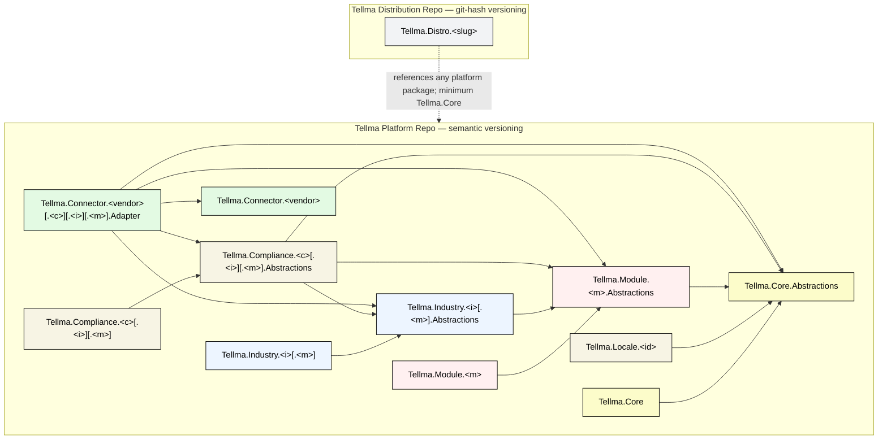
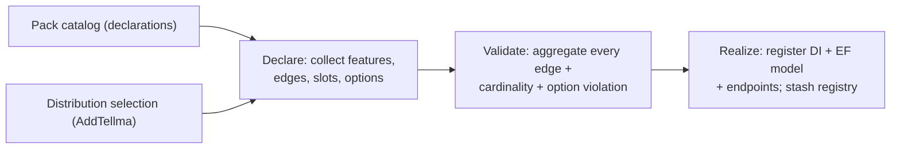
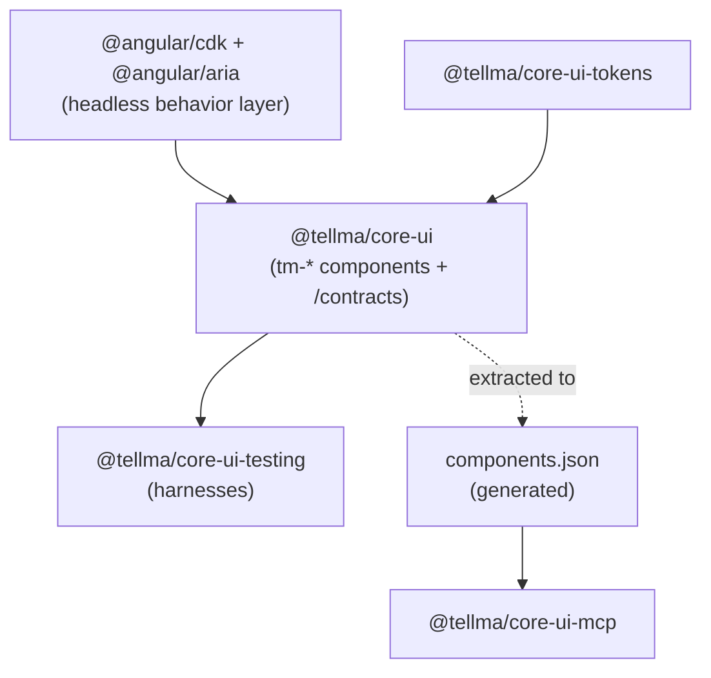
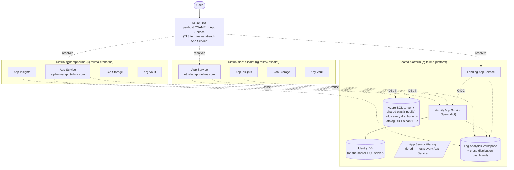

# Tellma Architecture

This document describes the architecture of the Tellma platform. It is a living document — edit it whenever a decision is made or changed.

## Vision

Today's Tellma is a single multi-tenant ASP.NET + Angular monolith with a per-tenant configuration and scripting layer. That layer:

- Limits customization to what the platform exposes; advanced changes require platform work.
- Is itself a coding environment — without modern IDEs, debugging, or test frameworks.
- Couples every tenant to the platform's release cadence: a platform change risks destabilizing complex production configurations, and we cannot test all tenants before rollout.
- Forces the platform to stay generic (`Text1`, `Text2`, …) which is hard to maintain.

This was acceptable when bespoke development was prohibitively expensive. With AI coding agents that reliably implement, test, and deploy, **the cost of bespoke is no longer the bottleneck** — so we trade the scripting layer for code.

The new shape:

- **`Tellma.Core` and platform packs** — a semver-versioned library family of ERP primitives (Angular components, C# services, SQL definitions). A bare-minimum core every distribution references, with opt-in packs layered on top along five dimensions: **Module** (horizontal functional areas), **Industry** (vertical specializations), **Compliance** (jurisdictional and standards-based rules), **Connector** (external-system integrations), and **Locale** (cultural and presentation primitives). See [Library architecture](#library-architecture). Extracted from today's monolith.
- **Distributions** — separate repos, one per tenant or per group of homogeneous tenants. Each takes a pinned dependency on `Tellma.Core`, adds tenant-specific code, and deploys as its own multi-tenant web app on its own sub-domain.
- **A shared landing page and identity provider** — single entry point and SSO across all distributions.
- **AI-native operations** — coding agents, automated tests, CI/CD, and dependabot upgrades make 100s of distributions feasible without a large team.

## Glossary

| Term | Meaning |
|---|---|
| **Tellma Platform** | The umbrella product: the reusable `Tellma.Core` library family, the deployable landing app, the deployable identity server, the dev toolchain, and the distribution template. Source lives in the `tellma-platform` GitHub repo. |
| **Tellma.Core** | The bare-minimum runtime library every distribution references (`Tellma.Core` C# NuGet, `Tellma.Core.EntityFrameworkCore` C# NuGet with its design-time companion `Tellma.Core.EntityFrameworkCore.Design`, `@tellma/core` npm package). Provides cross-cutting services — multi-tenancy, caching, settings, workflow engine, CRUD stack base, report base, feature flags — that every other pack and the distribution consume through `Tellma.Core.Abstractions`. |
| **Tellma.Core.Abstractions** | The interface surface of `Tellma.Core` — extension-point interfaces (e.g. `IEmailSender`), base entity classes, options types, capability interfaces. Every layer above Core (Module, Industry, Compliance, Locale, Connector Adapter) consumes Core through this package; the full `Tellma.Core` is referenced only by the distribution as the composition root. |
| **`@tellma/core-ui` family** | The Angular UI component library, shipped as Core-layer npm packages (`@tellma/core-ui`, `-tokens`, `-testing`, `-mcp`). Greenfield on `@angular/cdk` + `@angular/aria`; `tm-`-prefixed; signal-first. See [Frontend → UI component library](#ui-component-library). |
| **Platform pack** | An opt-in library referenced by distributions along one of five extension dimensions: **Module**, **Industry**, **Compliance**, **Connector**, **Locale**. Each pack ships entity classes (where applicable) and services; only the distribution generates migrations. See [Library architecture](#library-architecture). |
| **Abstractions library** | The `*.Abstractions` companion of a runtime library — interfaces, base/abstract entity classes, capability interfaces, options types. Implementers reference the `.Abstractions` package; the full implementation is referenced only by the distribution at composition. Shipped wherever a library declares extension points consumed by other layers. |
| **Module / Industry / Compliance / Connector / Locale** | The five extension dimensions along which platform packs are organized. See [Library architecture — the five dimensions](#the-five-dimensions). |
| **Promotion** | The process by which a feature graduates from distribution-local code to a platform pack. Triggered once three or more production distributions have independently implemented the same feature and converged on a common shape. See [Feature promotion](#feature-promotion). |
| **Distribution** | A deployed multi-tenant web app for one tenant or a group of homogeneous tenants. Has its own repo, its own sub-domain, its own Azure resources. Depends on `Tellma.Core`'s published packages. |
| **Landing page** | `tellma.com`. Authenticates the user, looks up which distributions they belong to, and routes them. Source in `tellma-platform`; deployed as its own App Service. |
| **Identity Provider** | Shared OIDC authority (OpenIddict + ASP.NET Core Identity). Single sign-on across all distributions. Source in `tellma-platform`; deployed as its own App Service. |
| **Tenant** | A single business unit using the system. Always owns one application database. |
| **Control plane** | A dedicated Tellma-owned distribution (the operator console) for managing tenants, billing, support, and operations *across* distributions. Distinct from any business distribution. See [Control Plane & Fleet Operations](#control-plane--fleet-operations). |
| **Stack** | The vertical unit of a feature: a table (with optional paired UDTT) generated from a C# entity class, plus the services, controllers/APIs, and Angular page that capture a full CRUD or report feature. The entity class is the single source of truth for storage shape. See [Data Layer](#data-layer). |
| **UDTT** | SQL Server user-defined table type — the TVP schema of the bulk save path. For tables that opt in, derived by migrations from the same entity class as the table itself (a row image of the table; no separate DTO class). See [Data Layer](#data-layer). |
| **Capability interface** | A C# interface declaring the columns one specific feature (report, auto-gen, validator) consumes from an entity — per-feature, compile-time column opt-in for forks. See [Data Layer](#data-layer). |
| **Queryex** | Tellma's typed query engine: entity-model expressions compiled to parameterized SQL at runtime. Powers within-stack CRUD and tier-1 reports. See [Reports — three tiers](#reports--three-tiers). |
| **`SqlBuilder<T>`** | Typed SQL composition helper used by pack code for tier-2 reports — identifiers via `nameof`, values via `SqlParameter`. See [Reports — three tiers](#reports--three-tiers). |

## Guiding Principles

These principles are not aspirations — they are the constraints every later decision in this document is solving for. A choice that violates them is an architectural regression, not an acceptable trade-off.

### Performance and Responsiveness

The application must feel fast to every user on every interaction. Heavily optimize for this from the start; treat any regression as a bug.

- **Initial UI load is fast.** Bundles are split per feature; nothing unneeded for the landing route loads upfront.
- **Subsequent UI loads are instant, even days after last use.** Aggressive client-side caching of static assets, API responses, definitions, and translations. Stale-while-revalidate for anything mutable. The user should never see a cold-spinner on a return visit.
- **Every user interaction shows instant feedback (hard UI rule).** No perceptible lag between action and visual response. Optimistic UI for mutations, skeleton placeholders rather than blank waits, local commit before server reconciliation. Non-negotiable.
- **The server API is as fast as possible.** In-memory caching with proper invalidation, output caching, response compression, prepared-statement reuse. Avoid N+1 queries with the same religious zeal as forbidding raw SQL string concatenation.
- **All I/O is bulkified.** Batch reads, batch writes, batch external calls. Loops that issue one query/request per iteration are bugs. Save endpoints accept arrays. Reports return aggregated data, not per-row computation across the wire.

`Tellma.Core` provides the primitives that make these the defaults — caching wrappers, bulk-aware repository bases, optimistic-mutation helpers in the Angular library — and distributions inherit them. A feature that ships without these is incomplete.

### Parallel Local Development

Multiple coding agents must be able to develop the same distribution, different distributions, or `tellma-platform` itself in parallel without interfering with each other.

- Local-dev tooling never mutates tracked files — `git status` stays clean in every worktree.
- Unreleased platform packages reach a distribution through a local package feed with unique prerelease versions, so parallel agents never collide on artifacts. See [Local Development & Debugging Loop](#local-development--debugging-loop).
- Worktrees are top-level siblings with matching branch names. See [Workspace Layout](#workspace-layout).
- Local stack uses a **two-tier isolation model**:
  - **Shared infrastructure** (SQL Server, Azurite blob emulator, Redis if any) runs as a single instance per developer machine on default ports. Each worktree namespaces its data inside — databases prefixed `Tellma.dev.<worktree-id>.*`, blob containers and Redis keys prefixed similarly. SSMS, Azure Data Studio, and other tools connect to default ports without hunting.
  - **Per-worktree app processes** (the distribution's ASP.NET host — running the in-proc identity mode for local auth, see [Identity](#identity) — and `ng serve`) bind to first-run-cached free ports. On initial setup, `dotnet tellma setup-worktree` asks the OS for free ports (`TcpListener` on port 0), writes them to a gitignored `.dev-ports.local` file in the worktree, and from then on every run reads from that file. Stable per worktree, no hash function, no collisions by design.
- **IDE integration is automatic.** `Properties/launchSettings.template.json` is tracked; `Properties/launchSettings.json` is gitignored and generated from the template + `.dev-ports.local` by an MSBuild target inside `build/Tellma.Core.targets` (shipped in the `Tellma.Core` NuGet package and auto-imported by every distribution). The target runs `BeforeBuild`, runs `dotnet tool restore` first if the `dotnet tellma` tool is not yet restored, invokes `dotnet tellma setup-worktree` if `.dev-ports.local` is missing, and regenerates `launchSettings.json` if older than the template. Net effect: `git clone` → open in VS or Rider → F5 just works. Same flow for `dotnet run` and for `npm start` (which uses a `bin` script in `@tellma/core` that reads `.dev-ports.local` and passes `--port` to `ng serve`).

When introducing new tooling or local-dev features, this is a hard requirement: if it cannot be run twice in parallel against the same repo in different worktrees, it is broken.

## Naming Conventions

All repos use lowercase kebab-case: **`tellma-platform`** for the platform, **`tellma-<slug>`** for distributions. Inside the platform repo, names match function: the reusable library family is `Tellma.Core` / `Tellma.Core.EntityFrameworkCore` / `@tellma/core` (because that's what it is — the *core* libraries distributions build on); the deployable services are `Tellma.Identity.Web` and `Tellma.Landing` (the identity server's reusable engine is the `Tellma.Identity` library); the toolchain is `dotnet tellma`; the build asset is `Tellma.Core.targets`. PascalCase + dots is preserved where the .NET ecosystem expects it; npm packages stay lowercase as npm requires.

Repo names and package ids are deliberately decoupled. This follows modern .NET convention (`dotnet/aspnetcore` → `Microsoft.AspNetCore.*`, `dotnet/efcore` → `Microsoft.EntityFrameworkCore.*`) and reflects the fact that `tellma-platform` produces multiple outputs — library packages, deployable apps, dev tools — no single one of which is the canonical identity. The repo is named after the umbrella; the things inside it are named after their functions.

The `<slug>` is the canonical identifier for a distribution. It is chosen once and propagates everywhere:

| Asset | Pattern | Example |
|---|---|---|
| GitHub repo | `tellma-<slug>` | `tellma-etpharma` |
| Subdomain | `<slug>.app.tellma.com` | `etpharma.app.tellma.com` |
| Azure resource group | `rg-tellma-<slug>` | `rg-tellma-etpharma` |
| App Service | `tellma-<slug>` | `tellma-etpharma` |
| Azure SQL server (dedicated tier only) | `sql-tellma-<slug>` | `sql-tellma-etpharma` |
| Storage account | `sttellma<slug>` | `sttellmaetpharma` |
| Key Vault | `kvtellma<slug>` | `kvtellmaetpharma` |
| Local clone folder | matches GitHub repo name | `tellma-etpharma/` |

A per-distribution Azure SQL server exists only when a distribution is promoted to dedicated SQL; the default is the shared platform server and elastic pools (see [Hosting on Azure](#hosting-on-azure)). Storage-account and Key Vault names omit hyphens because both cap at 24 characters (and storage accounts forbid hyphens outright).

Slug constraints:

- Lowercase letters, digits, and hyphens only.
- Must start with a letter.
- Max 15 characters — the tightest Azure name limits (storage account and Key Vault, 24 characters) must fit the 8-character `sttellma` / `kvtellma` prefixes plus the slug.
- Reserved — cannot be used as a slug: `core`, `landing`, `identity`, `platform`, `tellma`, `www`, `app`, `api`, `admin`, `auth`, `login`, `secure`, `support`, `help`, `training`, `status`, `demo`, `test`, `staging`, `sample`, `dev`. Because every distribution at `<slug>.app.tellma.com` is a first-party host with its own OIDC client and registered redirect URIs (see [Identity](#identity)), the reserved list is a security control kept deliberately broad against phishing-friendly names.

Local clones match the GitHub repo name exactly — never rename on clone. The workspace parent folder is a free local choice; a sensible default is `~/source/repos/tellma/`.

Shared-platform Azure assets sit in `rg-tellma-platform`, with App Services `tellma-landing` and `tellma-identity`.

Library package names follow a separate positional convention covered in [Library architecture — Package naming](#package-naming).

## Code Organization

There are exactly two kinds of repo: **one** `tellma-platform` repo and **N** distribution repos.



The `tellma-platform` repo wears two hats: it publishes the `Tellma.Core` library family (NuGet + npm) that distributions consume as code, and it deploys the cross-cutting services — landing, identity — that every distribution integrates with at runtime. Distributions own only the per-tenant code and infra.

### Platform repo layout

```
tellma-platform/
├── .config/
│   └── dotnet-tools.json                # dogfoods Tellma.Cli inside the repo itself
├── .github/
│   ├── workflows/
│   │   ├── ci.yml                       # build + test on PR
│   │   ├── release.yml                  # tag-driven; aggregates news fragments, publishes packages
│   │   └── changelog-fragment.yml       # enforces fragment-on-PR rule
│   ├── dependabot.yml
│   └── ISSUE_TEMPLATE/
├── build/                               # MSBuild assets shipped inside the Tellma.Core NuGet
│   ├── Tellma.Core.targets              # auto-imported into every distribution csproj
│   ├── Tellma.Core.props
│   └── version.props
├── changelog.d/                         # per-PR news fragments
├── client/                              # single Angular workspace; project folders match npm package kebab-case
│   ├── projects/
│   │   ├── core/                                  # Core-layer Angular packages (every distribution references)
│   │   │   ├── tellma-core/                       # @tellma/core — cross-cutting services & helpers
│   │   │   ├── tellma-core-ui/                    # @tellma/core-ui — tm-* components (on @angular/cdk + @angular/aria) + /contracts entry point
│   │   │   ├── tellma-core-ui-tokens/             # @tellma/core-ui-tokens — typed design-token contract + presets + emitter
│   │   │   ├── tellma-core-ui-testing/            # @tellma/core-ui-testing — component harnesses
│   │   │   └── tellma-core-ui-mcp/                # @tellma/core-ui-mcp — scoped MCP server (data from generated components.json)
│   │   ├── module/
│   │   │   └── tellma-module-sales/               # @tellma/module-sales — example horizontal module
│   │   ├── industry/
│   │   │   └── tellma-industry-pharma-sales/      # @tellma/industry-pharma-sales — example vertical overlay
│   │   ├── compliance/
│   │   │   └── tellma-compliance-sa/              # @tellma/compliance-sa — example jurisdictional pack
│   │   ├── connector/
│   │   │   └── tellma-connector-zatca/            # @tellma/connector-zatca — example external integration
│   │   ├── locale/
│   │   │   └── tellma-locale-ar/                  # @tellma/locale-ar — example cultural primitive
│   │   └── apps/
│   │       └── tellma-landing/                    # Landing SPA, built into src/apps/Tellma.Landing/wwwroot
│   ├── angular.json
│   ├── package.json
│   └── tsconfig.json
├── docs/                                # repo-level docs not shipped in packages
├── eng/                                 # repo engineering scripts; not shipped to distributions
├── infra/                               # Bicep for shared platform infra (Log Analytics, ASPs, SQL, …)
│   ├── shared-platform.bicep
│   └── modules/
├── migrations/                          # breaking-change recipes; shipped in package docs/migrations/
│   └── v<major>/
├── releases/                            # aggregated release JSON; shipped in package docs/releases/
├── samples/
│   └── tellma-sample-distribution/      # smoke distribution exercising current Tellma.Core
├── src/
│   ├── core/                            # bare-minimum family
│   │   ├── Tellma.Core.Abstractions/    # .csproj — interfaces, base entity classes, capability interfaces, options. Published as Tellma.Core.Abstractions NuGet.
│   │   ├── Tellma.Core/                 # .csproj — runtime services and concrete DI registrations. Published as the Tellma.Core NuGet.
│   │   ├── Tellma.Core.EntityFrameworkCore/        # .csproj — EF Core extensions (runtime): table-type (UDTT) configuration, migration operations, migrations SQL generation, metadata API. Never references the EF Design package.
│   │   └── Tellma.Core.EntityFrameworkCore.Design/ # .csproj — design-time companion: C# migration operation generator + IDesignTimeServices, discovered via the [assembly: DesignTimeServicesReference] its MSBuild targets inject into the consuming migrator assembly. Referenced only by migrator projects.
│   ├── module/                          # horizontal functional modules (entity classes, services, controllers)
│   │   └── Tellma.Module.Sales/
│   │       ├── Tellma.Module.Sales.Abstractions/
│   │       └── Tellma.Module.Sales/
│   ├── industry/                        # vertical industry overlays (per-module by default; see naming convention)
│   │   └── Tellma.Industry.Pharma.Sales/
│   │       ├── Tellma.Industry.Pharma.Sales.Abstractions/
│   │       └── Tellma.Industry.Pharma.Sales/
│   ├── compliance/                      # jurisdictional and standards-based packs
│   │   └── Tellma.Compliance.Sa/
│   │       ├── Tellma.Compliance.Sa.Abstractions/
│   │       └── Tellma.Compliance.Sa/
│   ├── connector/                       # external-system integrations and adapters
│   │   └── Tellma.Connector.Zatca/
│   │       ├── Tellma.Connector.Zatca/                       # raw client library
│   │       └── Tellma.Connector.Zatca.Sa.Sales.Adapter/      # adapter implementing upper-layer interfaces
│   ├── locale/                          # cultural and presentation primitives
│   │   └── Tellma.Locale.Ar/
│   ├── apps/                            # deployable services
│   │   ├── Tellma.Identity/             # .csproj — OpenIddict + ASP.NET Core Identity engine (Razor Class Library); referenced by Tellma.Identity.Web and by distributions running in-proc
│   │   ├── Tellma.Identity.Web/         # .csproj — deployable standalone identity App Service (hosts Tellma.Identity)
│   │   └── Tellma.Landing/              # .csproj — deployable App Service, serves the Landing SPA from wwwroot
│   └── tooling/
│       └── Tellma.Cli/                  # .csproj — published as the `dotnet tellma` CLI (dotnet tool)
├── templates/
│   └── tellma-distribution/             # `dotnet new tellma-distribution` template
├── test/                                # one project per src/* component (Tellma.Core.Tests, Tellma.Core.IntegrationTests, …)
├── .editorconfig
├── .gitattributes
├── .gitignore
├── ARCHITECTURE.md
├── CHANGELOG.md
├── CLA.md                               # contributor license agreement (broad Apache-ICLA-style grant; preserves relicensing right)
├── CLAUDE.md
├── CONTRIBUTING.md                      # contribution guide; links to CLA.md and the CLA bot
├── Directory.Build.props
├── Directory.Build.targets
├── Directory.Packages.props             # central package management
├── global.json                          # pinned .NET SDK
├── LICENSE                              # Apache-2.0
├── NuGet.config
├── README.md
├── taxonomy.json                        # registries of reserved `<m>` and `<c>` name segments (see Library architecture)
└── Tellma.slnx
```

Folder names follow standard .NET-ecosystem conventions (`src/`, `test/`, `eng/`, `samples/`, `build/`, `docs/`) so the repo is immediately legible to anyone familiar with `dotnet/aspnetcore` or `dotnet/efcore`. `src/` and `client/projects/` group projects by area (`core/`, `module/`, `industry/`, `compliance/`, `connector/`, `locale/`, `apps/`, `tooling/`) because the library family is expected to grow to dozens of packs; the grouping keeps a flat top-level legible. Category folders are lowercase to match other organizational folders (`src/`, `test/`, `eng/`); PascalCase is reserved for actual .NET project folders, which match their `.csproj` / assembly name. The Angular workspace lives once at the repo root in `client/` and produces every published `@tellma/*` library plus the Landing SPA. `build/` is the MSBuild-conventional folder name for assets shipped via NuGet under `build/<id>.targets`.

### Library architecture

The platform exposes its functionality through a layered family of NuGet packages organized along five extension dimensions. Distributions reference whichever combination they need; the dimensions are extension axes, not a partition of the catalog.

#### The five dimensions

| Dimension | Purpose | Owns new entities? | Cardinality |
|---|---|---|---|
| **Module** | Horizontal functional area (GL, Sales, Procurement, Inventory, HR, Manufacturing). Owns most entities and declares the bulk of extension points. | Yes — the bulk of them | ~10–20 |
| **Industry** | Vertical specialization (Pharma, Telecom, TextileFactories, …). Introduces new vertical entities and overlays horizontal modules. | Yes — both new vertical nouns and overlays | ~50–100 |
| **Compliance** | Jurisdictional or standards-based rules (SA, ET, IFRS, US-GAAP, …). Mostly parameterizes module behavior with regime-specific rules, rates, and document formats; occasionally introduces thin filing entities. | Sometimes — mostly behavior | ~50–100 |
| **Connector** | Leaf integration to a specific external system (Zatca, RajhiBank, SendGrid, Stripe, …). Splits into a raw client library and one or more `.Adapter` libraries that implement upper-layer interfaces. | No — adapts to external | 100s |
| **Locale** | Cultural and presentation primitives (Ar, ArAe, Et, …). Implements `ICalendar`, `IAmountToText`, formatting utilities. | No | ~50–100 |

These dimensions are not orthogonal — Compliance often implies Locale, Industry often implies Compliance, Connector Adapters often imply both a Compliance regime and a Module. Cross-dimensional libraries are expressed as positional suffixes on the library name (see [Package naming](#package-naming)); no separate "Bridge" category exists.

#### Abstractions / implementation split

Every layer that declares extension points consumed by other layers ships as two packages:

- `Tellma.<Layer>…` — runtime implementation: services, controllers, default DI registrations, internal helpers, default extension-point implementations.
- `Tellma.<Layer>….Abstractions` — extension-point interfaces, base/abstract entity classes, capability interfaces, options types, public value objects and enums.

Implementers and overlay libraries reference only the `.Abstractions` package; the full implementation is referenced only by the distribution as the composition root. This forces the contract to be decoupled from the implementation, keeps overlay libraries lightweight, and gives compile-time enforcement of the dependency DAG.

The split applies wherever extension points exist. Core, Module, Industry, and Compliance routinely ship Abstractions. Locale, the raw `Connector.<vendor>`, and Connector Adapter libraries are leaves and ship without Abstractions companions — until and unless a leaf grows its own extension points consumed by another library.

#### Package naming

Package names follow the pattern below. Square brackets denote optional segments; the slot order is fixed.

| Pattern | Example | Notes |
|---|---|---|
| `Tellma.Core` | `Tellma.Core` | Mandatory; every distribution references it. |
| `Tellma.Core.Abstractions` | `Tellma.Core.Abstractions` | Mandatory. |
| `Tellma.Core.EntityFrameworkCore` | `Tellma.Core.EntityFrameworkCore` | EF Core extensions (table types/UDTTs): configuration, migration operations, SQL generation, metadata API. Runtime-side — never references the EF `Design` package. |
| `Tellma.Core.EntityFrameworkCore.Design` | `Tellma.Core.EntityFrameworkCore.Design` | Design-time companion (C# operation generator, `IDesignTimeServices`). Referenced only by the distribution's migrator project. |
| `Tellma.Module.<m>` | `Tellma.Module.Sales` | `<m>` ∈ Modules registry. |
| `Tellma.Module.<m>.Abstractions` | `Tellma.Module.Sales.Abstractions` | |
| `Tellma.Locale.<id>` | `Tellma.Locale.Ar` | `<id>` ad-hoc. |
| `Tellma.Industry.<i>[.<m>]` | `Tellma.Industry.Pharma.Sales` | `<i>` ad-hoc; `<m>` optional, must be in Modules registry if present. |
| `Tellma.Industry.<i>[.<m>].Abstractions` | `Tellma.Industry.Pharma.Sales.Abstractions` | |
| `Tellma.Compliance.<c>[.<i>][.<m>]` | `Tellma.Compliance.Sa.Pharma.Sales` | `<c>` ∈ Compliance registry. `<i>` and `<m>` optional. |
| `Tellma.Compliance.<c>[.<i>][.<m>].Abstractions` | `Tellma.Compliance.Sa.Abstractions` | |
| `Tellma.Connector.<vendor>` | `Tellma.Connector.Zatca` | `<vendor>` ad-hoc. Raw client library. |
| `Tellma.Connector.<vendor>[.<c>][.<i>][.<m>].Adapter` | `Tellma.Connector.Zatca.Sa.Sales.Adapter` | `.Adapter` suffix mandatory. All scoping segments optional but ordered `<c>`, `<i>`, `<m>`. Three or four scoping segments at once is theoretically possible but a smell — break the adapter up. |
| `Tellma.Distro.<slug>` | `Tellma.Distro.Etpharma` | Project/namespace prefix for distribution repos (e.g. `Tellma.Distro.Etpharma.Web`); never published as a package and never lives in the platform repo. |

**Registry rules.** Two name registries are maintained at the platform level in `taxonomy.json`:

- **Modules registry.** Enumerated list of `<m>` values (currently GL, Sales, Procurement, Inventory, HR, Manufacturing). New modules require a platform-repo PR.
- **Compliance registry.** Enumerated list of `<c>` values (currently `Sa`, `Et`, `Ifrs`, `UsGaap`, …), stored in the exact PascalCase segment form used in package names. New compliance codes require a platform-repo PR.
- **Industry names are ad-hoc.** No central registry; distributions and platform packs introduce industry names as needed. New industries are introduced through [Feature promotion](#feature-promotion), not by upfront registration.
- **Cross-registry uniqueness is enforced at PR time.** A name in the Modules or Compliance registry cannot collide with each other, nor with any industry name in active use across the platform and any distribution. An analyzer rejects collisions when a registry is updated or when a new industry-scoped package is introduced.

**Parsing is deterministic** given the fixed slot order. A reader (or tool) walks segments left-to-right after the leading prefix: a segment that matches the Modules registry is `<m>`; a segment that matches the Compliance registry is `<c>`; any other segment is `<i>`. Since the slot order is `<c>` → `<i>` → `<m>` (where present), the meaning of every package name is unambiguous.

#### Dependency graph



The rules these arrows encode:

1. **Full implementations depend only on their own Abstractions.** `Tellma.Module.Sales` depends on `Tellma.Module.Sales.Abstractions`, not on `Tellma.Core`. The `.Abstractions` package is the only upward-facing API surface of a layer; whatever a lower layer needs to expose, it exposes through its Abstractions.

2. **`Tellma.Module.<m>` never references `Tellma.Core`.** Cross-cutting Core services (workflow engine, settings, caching, multi-tenancy, feature flags, CRUD stack base, report base) are exposed as interfaces in `Tellma.Core.Abstractions`. Modules consume those interfaces via DI; the Distro is the only place that registers the concrete `Tellma.Core` implementations. Any new cross-cutting Core service must be reachable through an interface in `Tellma.Core.Abstractions` — adding a `Module → Core` reference is forbidden.

3. **Industry depends only on `Module.<m>.Abstractions`,** not on the full `Module.<m>`. The abstract generic bases and non-abstract default leaves Industry needs to subclass live in `Module.<m>.Abstractions`. Industry overlays never reach into Module services or controllers.

4. **Industry references at most one Module.** A single `Tellma.Industry.<i>[.<m>]` library references at most one Module's Abstractions. An industry that spans many modules ships as multiple packages (`Tellma.Industry.Pharma.Sales`, `Tellma.Industry.Pharma.Inventory`, …). Consolidating per-module industry libraries into one monolithic industry library is a future option if cardinality grows unwieldy.

5. **Compliance and Connector Adapter target any subset of upstream Abstractions.** A `Tellma.Compliance.<c>` library implements interfaces from any combination of `Core.Abstractions`, `Module.<m>.Abstractions`, and `Industry.<i>.Abstractions`, whichever its overrides need. Same for `Tellma.Connector.<vendor>.Adapter`, which additionally references the raw `Tellma.Connector.<vendor>` it adapts. Each library declares only the Abstractions packages it actually consumes; the diagram shows the union of possible edges, not edges that must all be present in every library.

6. **Distributions may reference any platform package directly,** subject to a minimum of `Tellma.Core`. There is no scaffolding restriction; the distribution is the composition root and pulls in whichever combination of full implementations its tenants need.

#### Per-dimension contents

A non-exhaustive list of what each dimension's libraries can ship:

- **Module** — entity classes, services, controllers, default workflows, default extension-point implementations, capability interfaces, default seed data, baseline document templates, baseline notification templates, baseline permissions and roles, baseline feature flags, baseline CRON jobs.
- **Industry** — new vertical entity classes (Batch, Lot, ColdChainEvent, Prescription, …), additive overlays on horizontal module entities, industry-specific services and validators, industry-specific reports, industry-specific extension-point implementations.
- **Compliance** — jurisdictional rule sets (tax calculators, withholding rules, validation rules), document numbering sequences, statutory document templates (tax-invoice format, payslip format), regulatory filing entities and workflows, audit signature requirements, charts-of-accounts templates.
- **Connector** — client library for a specific external system: HTTP client, authentication, retry policy, serialization, vendor-specific error model.
- **Connector Adapter** — implementations of one or more upper-layer extension-point interfaces using the connector (e.g. `IBankTransactionFetcher` via the Rajhi connector; `IElectronicInvoiceClearance` via the Zatca connector).
- **Locale** — `ICalendar`, `IAmountToText`, formatting primitives, calendar conversion rules, language-specific text utilities. Implements interfaces declared in `Core.Abstractions`; never module-specific.

### Distribution repo layout

```
tellma-<slug>/
├── .config/
│   └── dotnet-tools.json                # restores `dotnet tellma` at the version this distribution pins
├── .github/
│   └── workflows/
│       ├── ci.yml
│       └── deploy.yml
├── client/                              # Angular workspace
│   ├── projects/
│   │   └── app/                         # distribution SPA — imports @tellma/core
│   ├── angular.json
│   ├── package.json
│   └── tsconfig.json
├── infra/                               # Bicep for the distribution's Azure resources
│   ├── main.bicep
│   └── modules/
├── src/
│   ├── Tellma.Distro.<Slug>.Web/        # ASP.NET host — references Tellma.Core + Tellma.Core.EntityFrameworkCore + opt-in packs. Never references Design-time packages.
│   │   ├── Properties/
│   │   │   ├── launchSettings.template.json    # tracked
│   │   │   └── launchSettings.json             # gitignored, generated by Tellma.Core.targets
│   │   ├── Entities/                    # distro-specific entity classes (sealed leaves that inherit from pack defaults; new distro-only entities). See Data Layer.
│   │   ├── <Slug>DbContext.cs           # owns the DbContext; the EF model is assembled from the selected features' contributions (see Feature Composition).
│   │   └── Tellma.Distro.<Slug>.Web.csproj
│   └── Tellma.Distro.<Slug>.Migrator/   # console host — EF design-time target + deploy-time migrator. References the Web project (same AddTellma composition) + Tellma.Core.EntityFrameworkCore.Design + Microsoft.EntityFrameworkCore.Design. See Data Layer → Migrations & seeding.
│       ├── Migrations/                  # EF Core migrations + ModelSnapshot, generated by `dotnet ef migrations add` and committed to source control.
│       └── Tellma.Distro.<Slug>.Migrator.csproj
├── test/
│   ├── Tellma.Distro.<Slug>.Web.Tests/
│   └── Tellma.Distro.<Slug>.E2E/        # Playwright
├── .dev-ports.local                     # gitignored, written once by `dotnet tellma setup-worktree`
├── .editorconfig
├── .gitattributes
├── .gitignore
├── CLAUDE.md                            # short; points at the package-shipped guidance channels
├── Directory.Build.props
├── Directory.Packages.props
├── global.json
├── NuGet.config
├── README.md
└── Tellma.Distro.<Slug>.slnx
```

`Tellma.Distro.<Slug>` is the .NET project and namespace prefix (e.g. `Tellma.Distro.Etpharma.Web`), matching the `Tellma.Distro.<slug>` slot reserved in [Package naming](#package-naming); the `Distro` segment keeps distribution namespaces unambiguously outside the platform's package namespace. The distribution carries no `Directory.Build.targets` — the heavy MSBuild logic ships inside the `Tellma.Core` NuGet under `build/Tellma.Core.targets` and is auto-imported. Distribution repos own only the configuration layer described in [Logic vs. configuration](#logic-vs-configuration); cross-cutting fixes flow in through dependabot.

In addition to the file layout, every distribution exposes:

- A small **distribution contract surface** — well-known endpoints (e.g. `GET /api/distribution-info`) and an `appsettings.json` shape — so the landing page and identity provider integrate without bespoke per-distribution code.
- An OIDC client registration with the shared identity provider.
- Tenant-specific controllers, services, background jobs, screens, themes, translations, tables, and views, layered on top of the bare-minimum `Tellma.Core` and any opt-in Module, Industry, Compliance, Connector, and Locale packs the distribution references — see [Library architecture](#library-architecture). No stored procedures or functions: logic lives in C# except in exceptional, documented circumstances (see [Data Layer](#data-layer)); persisted modules referencing generated UDTTs are forbidden outright.

### Multi-tenancy within a distribution

Each distribution keeps the existing sharded model — its own Catalog DB listing tenants and where to find them, plus one application DB per tenant. A distribution may host a single tenant or a group of homogeneous tenants. This reuses `Tellma.Core`'s sharding code unchanged.

## Licensing & Intellectual Property

The platform/distribution split is also the open/closed boundary.

The `tellma-platform` repo is licensed **Apache-2.0** — permissive, no copyleft. Distributions, and anyone building on the published packages, carry no source-disclosure obligation.

Distributions are **closed-source and proprietary**; a distribution's IP may be sold or delivered to its customer, on-premises included. A distribution references the published `Tellma.*` packages only and ships no platform source, so its sole Apache obligation is preserving the bundled packages' license and `NOTICE` files.

Contributions to `tellma-platform` require a signed **Contributor License Agreement** granting Tellma the right to relicense — preserving the option to move a future major to a more restrictive or source-available license without tracing every contributor. A CLA bot gates pull requests; it never touches consumption.

**Tellma** is a registered trademark. Apache-2.0 grants no trademark rights: a fork may use the code but not the name or brand.

## Data Layer

The C# entity classes are the single source of truth for storage shape. EF Core migrations derive the deployed schema from those classes; the SQL is generated, not authored. Every other concern lives in C#: CRUD, validation, pre/postprocessing, posting orchestration, reports, auto-generation. The "logic in C#, not in sprocs" argument is load-bearing when 50+ distributions run in production — C# composes with DI/decoration/generics/testing, and slot-swap deploys roll back cleanly where SQL deploys do not.

This section defines what lives where, the unit of customization, the closed set of composition mechanisms, and how distributions customize without forking pack logic.

### What lives where

| Concern | Lives in | Notes |
|---|---|---|
| Tables and indexes | Generated by EF Core migrations from the C# entity classes | Entity classes are in pack assemblies; the distribution generates and owns the migrations. |
| User-defined table types (UDTTs) | Generated by EF Core migrations from the same entity classes, for tables that opt in | The `Tellma.Core.EntityFrameworkCore` extension derives each opted-in table's UDTT as a row image of the table (writable columns minus exclusions, PK mirrored) and emits it through first-class migration operations — content-hash-versioned creates plus a grace-period cleanup sweep (see [UDTT generation](#udtt-generation--the-tellmacoreentityframeworkcore-extension)). No index/ordinal columns — IDs are app-assigned before save (see [ID allocation](#id-allocation--app-assigned-from-sequences)). |
| Integrity constraints (PK, FK, NOT NULL, CHECK) | EF Core migrations, configured on the entity classes via attributes and fluent API | DB-enforced everywhere, including across stacks and across packs. The cross-fork invariant is the PK contract — see [The entity class — unit of customization](#the-entity-class--unit-of-customization). |
| Within-stack CRUD (`Save`, `Read`, action operations) | **C# — runtime SQL emitted from the entity model, like Queryex** | No pre-compiled CRUD sprocs. The same framework that handles reads handles writes; one I/O layer, one set of cross-cutting concerns. |
| Reports and auto-generation | **C# — owning pack assembly, SQL built via typed `SqlBuilder<T>`** | Composed SQL runs server-side in one round-trip; user-input through `SqlParameter`, identifiers through `nameof`. Raw `Sql(...)` is a documented escape hatch — see [Reports — three tiers](#reports--three-tiers). |
| Validation, preprocessing, postprocessing | C# | Composes via DI / decoration / events. |
| Cross-stack posting orchestration | C# | Calls each table's bulk write within a transaction. |
| Context loading (entities needed for validation/posting) | C# → typed bulk queries (Queryex) | No bespoke context-loader sprocs. |

All I/O is bulk-shaped. Loops that issue per-row queries are bugs.

User-input *values* always flow through `SqlParameter`; only schema *identifiers* (table and column names) are interpolated into SQL strings.

### The entity class — unit of customization

The unit of customization is the **C# entity class** — the single source of truth from which the table is generated and, for tables that opt in, the paired UDTT is derived (see [UDTT generation](#udtt-generation--the-tellmacoreentityframeworkcore-extension)). There is no separate DTO model on the persistence path: with all logic in C#, the bulk-save payload is the fully enriched row image, so the UDTT mirrors the table itself. (A parallel `ForSave` class hierarchy as the UDTT source was considered and rejected — duplication with a silent drift/truncation failure mode.)

An entity class (e.g. `Invoice<TCustomer>` and the concrete leaf `Invoice : Invoice<Customer>`) carries `[Column]`/`[MaxLength]` and EF fluent configuration; with `<Nullable>enable</Nullable>`, the C# nullability of reference types drives NOT NULL/NULL on the deployed columns.

Child tables are separate entity classes. `gl.Invoices` and `gl.InvoiceLines` each have their own table (+ UDTT) and fork independently. The FK from `InvoiceLines.InvoiceId` to `Invoices.Id` survives either-side forks as long as the PK contract holds.

**Schema-on-fork: the schema is part of the entity's declaration.** A fork replaces the implementation, never the canonical table name. `[gl].Invoices` and its UDTT's logical name `[gl].[InvoicesList]` keep those names regardless of which distro deploys them (the UDTT's deployed physical name carries a content-hash version suffix, but that is an app-internal detail — see [UDTT generation](#udtt-generation--the-tellmacoreentityframeworkcore-extension)). External consumers (SSMS queries, BI dashboards, monitoring) see consistent canonical names everywhere.

**PK contract is the cross-fork invariant.** The fork's primary-key columns (names, types, composite order) must be preserved. The PK is what FKs from other tables and other packs resolve against. Changing the PK is a breaking change to every dependent FK and is coordinated as a major-version migration. No separate PK-contract test is needed — FK resolution at migration apply time *is* the enforcement (a renamed or retyped PK column makes every referencing FK unresolvable, and the deploy fails with a precise diagnostic).

### The entity class hierarchy — generic bases + non-abstract pack defaults

Pack-shipped entity classes follow a two-class pattern when they carry cross-entity navigation properties:

1. **Abstract generic base** — `public abstract class Invoice<TCustomer> : Document where TCustomer : Customer { ...; public TCustomer? Customer { get; set; } }`. Carries the columns and cross-entity navigations typed against the generic parameter. The generic parameter exists so that the leaf's `Customer` navigation property is typed against the concrete leaf — `i.Customer.Name` translates to a single JOIN in LINQ.
2. **Non-abstract default leaf** — `public class Invoice : Invoice<Customer>`. Closes the generic with the pack's own default leaf types. Distros that don't fork register this directly.

For entities with no cross-entity navigations (e.g. `Customer`), the pack ships a single non-abstract class — no generic ceremony is needed.

**Generic parameters are used sparingly.** Only navigations that need ergonomic `i.X.Y` access in LINQ get a generic parameter; relationships that are accessed only via FK column + explicit join stay as plain `int CustomerId` properties. This bounds the generic parameter count to the few high-value navigations per entity rather than every cross-entity relationship.

**Navigation directionality is asymmetric and deliberate:**

- **Child → parent: typed reference navigation.** `InvoiceLine.Invoice` is a typed back-reference. Reports that pivot from lines (the common shape) get single-JOIN ergonomics.
- **Parent → child collection: no navigation property.** `Invoice.Lines` does **not** exist. This makes the bulk-shape rule structurally enforceable — `Include`-style cartesian-explosion reads cannot accidentally happen because the property the language would need to load doesn't exist. Pack code that needs lines for an invoice issues two explicit bulk queries and stitches in C#.

**Visibility:**
- Pack-shipped classes (`Invoice<TCustomer>`, the default `Invoice`, `Customer`, `InvoiceLine`) are `public`.
- The pack's default concrete classes are **not sealed** — distros that only add columns inherit from them.
- Distro-shipped concrete leaves are `public sealed`.

Pack defaults are left unsealed deliberately: the class **is** the storage — the table is generated from the class, so class-vs-table drift cannot occur — and a distro leaf that inherits from the pack's default automatically picks up pack column additions on version bump, which is the desired behavior.

One footgun: a distro that ships its own forked leaf could accidentally `new Pack.DefaultInvoice()` somewhere instead of using its own leaf. This is a code-review concern, optionally enforceable with a small Roslyn analyzer; it is not a deploy-time correctness concern.

### Composition — three mechanisms, closed set

A distribution interacts with pack-shipped storage in exactly one of three ways:

1. **Reuse a pack entity.** No distro code for it. The pack's default class becomes the distro's leaf via the registration extension. The distro deploys exactly what the pack ships.
2. **Extend a pack entity (additive — the common customization).** Inherit from the pack's default and add columns. `public sealed class Invoice : Pharma.Invoice { public string OliveRegionCode { get; set; } }`. Inherited columns plus added columns flow into the single canonical `[gl].Invoices` table via leaf-only mapping.
3. **Fork a pack entity (rare — type substitution).** Inherit from the pack's abstract generic base, closing the generic with a different leaf type for one of the related entities. Used when a related entity itself is forked and the navigation target needs the fork's leaf type. Most distros never need this.

A fourth implicit category — **add a brand-new entity** not in any pack — works the same way the distro builds its own: define the entity class, register it in the distro's `OnModelCreating` (opting into a UDTT where it participates in bulk save), EF generates the migration.

### Leaf-only mapping — the deployed table shape

Only the distro's concrete leaf class is mapped to a table. Abstract intermediate bases (`Invoice<TCustomer>`, intermediate pack abstracts) are C# inheritance scaffolding, not EF entity types. EF reflects on the leaf and produces one table containing all inherited and locally-declared columns, flat. Net effect:

- `[gl].Invoices` carries columns from `Document` (Core) + `Invoice<TCustomer>` (GL) + intermediate pack additions (Pharma) + distro additions (Olive) — all in one table.
- No `pharma.Invoices`, no `olive.Invoices`. The canonical schema-qualified name is preserved across every distribution.
- For Core's abstract `Document` (TPT root), the migration generates `[core].Documents` containing only Document's own columns; the leaf-mapped Invoice is a TPT child joining on PK.

### Migration generation — distro-owned

Only the distribution generates and ships migrations. Modules and packs ship entity classes only — no `DbContext`, no migration files. The pack chain only needs `Microsoft.EntityFrameworkCore.Relational` (for `[Column]`, `ToTable`, fluent configuration types). The distribution's Web project imports `Microsoft.EntityFrameworkCore.SqlServer`; design-time packages live exclusively in the distribution's **migrator project** (see [Migrations & seeding — the deploy-time migrator](#migrations--seeding--the-deploy-time-migrator)), which holds the scaffolded `Migrations/` folder and is the only project referencing `Microsoft.EntityFrameworkCore.Design` and `Tellma.Core.EntityFrameworkCore.Design`. The web server's publish output therefore contains no Design-package assemblies (Roslyn, templating) — enforced by unit tests over the runtime library's transitive dependency closure (a framework-dependent publish ships exactly that closure); the web host's pipeline additionally asserts the literal publish output once the host exists.

`Microsoft.EntityFrameworkCore.Design` is marked `developmentDependency=true` in its `.nuspec`, so it does not flow transitively; the migrator csproj references it directly. EF tooling (`dotnet ef migrations add`) targets the migrator project and discovers Tellma's design-time services automatically via an `[assembly: DesignTimeServicesReference]` on the **migrator assembly itself** — EF scans only the startup and migrations assemblies for that attribute, never referenced libraries, so the `Tellma.Core.EntityFrameworkCore.Design` package ships MSBuild targets that inject it into the consuming project at build time (the same mechanism EF's own extension packages use). Referencing the libraries remains sufficient — no manual wiring in the distribution; under Phase-1 in-repo `ProjectReference`s the repo's `Directory.Build.targets` imports the same targets file.

Model registration is feature-driven: each feature a distribution selects contributes its own model configuration — concrete entity leaf types, TPT relationships, FK constraints, UDTT opt-ins — during the realize phase of [Feature Composition](#feature-composition). The concrete leaf types the distro takes a position on (pack defaults, extended leaves, or forks) are supplied at the feature's selection site inside `AddTellma(…)`; a single composition declaration is shared by the runtime host and the migrator's design-time `DbContext` factory, so the model that generates migrations is identical to the model that serves traffic.

### UDTT generation — the Tellma.Core.EntityFrameworkCore extension

UDTTs are not a native EF concept. The `Tellma.Core.EntityFrameworkCore` package (with its design-time companion `Tellma.Core.EntityFrameworkCore.Design`) makes them first-class in the migrations pipeline. The full design is specified in [docs/specs/0001-efcore-table-types.md](docs/specs/0001-efcore-table-types.md); the load-bearing points:

1. **Opt-in, 0 or 1 per table.** `optionsBuilder.UseSqlServer(...).UseTableTypes()` activates the extension (an additive `IDbContextOptionsExtension`; `UseSqlServer` is never wrapped). A table opts in via `entity.HasTableType(name?, schema?)` or `[TableType]` on the entity class. Attributes (opt-in, per-property exclusions) are **inherited** by derived leaves — a distro leaf extending a pack default inherits the pack's UDTT configuration; fluent configuration always wins over attributes, and explicit fluent opt-outs (`HasNoTableType()`, re-including an excluded column) let a leaf override what it inherits. (Prose uses the SQL Server term *UDTT*; API names use *TableType* — shorter, not an acronym.)
2. **Derived row image.** The UDTT's columns, store types, facets, nullability, collation, and order are taken from the relational model EF already built for the table — included columns are the insertable/updatable columns minus exclusions, computed columns always excluded; the PK mirrors the table's PK; rowversion columns are included as nullable `binary(8)` by default (excludable); never IDENTITY, defaults, FK or named constraints. A native `json` column — including a `ToJson()` owned navigation or complex property (one container column), a primitive collection, or an explicit `HasColumnType("json")` — is carried as `varchar(max)` with the json type's UTF-8 collation (or `nvarchar(max)` on a memory-optimized type, where UTF-8 collations are unsupported), the form the bulk-save TVP pipeline binds — a transient TVP gains nothing from native `json` (and the current driver cannot bind it as a `SqlMetaData` column anyway) — non-Latin safe and implicitly converted back to the table's column type on insert; a *flattened* complex type or an owned type mapped into the owner's table is still rejected as a partial row image. **Column order is part of the type's contract** (TVP binding is ordinal) and is captured in the model snapshot so a pure reorder produces a diff.
3. **First-class migration operations.** The differ emits `CreateTableTypeOperation` plus a keep-list `CleanupTableTypesOperation` (with `MigrationBuilder.CreateTableType`/`DropTableType`/`CleanupTableTypes` extensions for manual authoring), and the migrations SQL generator handles them — including `dotnet ef migrations script --idempotent` and bundles. SQL Server has no `ALTER TYPE`, and none is needed: a definitional change creates a new content-hash-named version *alongside* the old one, and stale versions are garbage-collected by the sweep after a grace period (see the deployment-window paragraph below). Every drop is preceded by a `sys.sql_expression_dependencies` pre-flight: a manual `DropTableType` THROWs with the dependent modules by name, while the sweep skips the offending orphan and surfaces it instead (GC of a version nothing uses must not block deployments); configured `GRANT EXECUTE ON TYPE` statements are emitted with every version create.
4. **Design-time wiring is automatic.** The C# migration operation generator lives in the `.Design` package, discovered by EF tooling via the `[assembly: DesignTimeServicesReference]` that the package's MSBuild targets inject into the migrator assembly (EF scans only the startup/migrations assemblies for it) — referencing the libraries is sufficient.

UDTT **logical names** default to the table's own schema plus a `List` suffix — `[gl].[InvoicesList]`, `[gl].[InvoiceLinesList]` — overridable per entity; the deployed **physical name** appends a content-hash version suffix (`[gl].[InvoicesList_3fa9c2d1]`, 8 hex chars of the SHA-256 of the definition's canonical JSON). Column types match the corresponding table columns byte-for-byte. Operation-specific shapes with no paired table (bulk delete, bulk state updates) are **standalone table types**, declared ad hoc through the fluent builder or derived from a plain `[TableType]`-annotated class that doubles as the TVP row DTO; the platform's canonical bulk shapes — `[IdList]` (`int`), `[BigIdList]` (`bigint`), `[GuidList]` (`uniqueidentifier`), `[StringList]` (`nvarchar(450)`) — ship as plain classes in `Tellma.Core.Abstractions` and are registered by each distribution's composition through that same route (one mechanism, no special handling) — and version identically.

**Deployment windows — content-hash versioned types.** Zero-downtime deploys migrate every tenant DB *before* the slot swap, and a swap rollback puts the old app back on the new schema — so an app one version behind must keep working against the migrated database. TVP binding is positional and name-blind, which makes a reshaped same-named type the worst kind of hazard: two same-typed columns swapped would bind cleanly and corrupt data silently. Instead, the physical type name *is* the definition (`<LogicalName>_<hash8>` of its canonical JSON): a definitional change creates the new version alongside the old, each app binds the physical names derived from its own compiled model, and N−1 or rolled-back instances keep hitting the exact shape they were built against. Retirement is garbage collection, not a diff event — every created type is stamped with extended properties (logical name, sweep scope, full definition hash), and a keep-list sweep appended to type-touching migrations orphan-marks stamped types absent from the current model — within the context's own sweep scope only, so contexts sharing a database never collect each other's types — collecting them only after a 48-hour grace period. The sweep discovers rather than remembers (no recorded lineage), so renames, opt-outs, `Down()` migrations (creates are idempotent by content-addressed name), and even squashing the migrations folder all converge through the same path. Versioned names are viable precisely because no persisted module or hand-written SQL ever spells a UDTT name (next paragraph). Full mechanics: [spec 0001 §3 → Versioning](docs/specs/0001-efcore-table-types.md).

**No persisted SQL module may reference a generated UDTT** — every consumer is dynamic SQL composed in C#. Enforced three ways: the drop-time dependency guard, a CI integration test asserting zero `sys.sql_expression_dependencies` rows after applying all migrations to a fresh database, and a static tripwire over the migrations assembly flagging generated type names inside `CREATE/ALTER PROCEDURE|FUNCTION` batches. More broadly, **no logic lives in the database** except in exceptional, documented circumstances: C# deployments are reliable and cleanly reversible (slot-swap) in ways SQL deployments are not.

**Ordinal-binding rule.** Because column order is the contract, runtime TVP binding (`SqlDataRecord`/`DataTable`) must be driven by the extension's metadata API (`model.GetTableTypes()`, per-entity ordered columns with store types) — never by hard-coded ordinals — and must address each type by the **physical** (version-suffixed) name from the app's own model, never a name discovered from the database. A pack adding a column in a base class legitimately reorders the flattened leaf table; metadata-driven binding makes that a non-event. A Roslyn analyzer flags hard-coded ordinal binding.

**Memory-optimized types** are an explicit per-table opt-in emitting `MEMORY_OPTIMIZED = ON`. In-Memory OLTP requires Premium/Business Critical tiers — not the default shared standard elastic pools — so the generated SQL pre-flights support (`DATABASEPROPERTYEX(DB_NAME(), 'IsXTPSupported')`) and THROWs an actionable error on unsupported tiers rather than silently falling back: the on-disk and memory-optimized declarations differ structurally, so a silent fallback would create cross-environment schema drift.

### ID allocation — app-assigned from sequences

**There are no IDENTITY columns anywhere in the schema.** Every table draws its surrogate keys from a per-table SQL sequence, named `sq_<TableName>` in the table's schema; the application reserves ranges via `sp_sequence_get_range` through an in-process buffered allocator (background prefetch; single-round-trip multi-sequence cold start via a dynamic batch — deliberately not a stored proc). Rows therefore arrive at the persistence boundary with real PKs and real FKs already wired — which is what lets UDTTs carry no `[Index]`/`[HeaderIndex]` ordinal columns and lets inserts return no ID mappings.

Sequences are declared with EF's standard `HasSequence`/`CreateSequence` — the table-types extension ships no sequence operations. Disabling database key generation on every UDTT-paired table and wiring the `sq_<TableName>` sequences and the allocator is specified in a separate spec.

The allocator **self-heals from sequence desync** caused by out-of-band inserts (imports, restores, backdoor fixes): at every range refill the same round-trip compares the obtained range against `MAX([Id])` and jumps past it if behind; a bulk insert failing specifically with a PK-constraint violation flushes the table's buffered range, jumps the sequence, re-assigns IDs to the in-memory batch (rewiring intra-batch FKs), and retries exactly once; every recovery event is logged and alerted, since it is evidence of out-of-band writes.

**Seed conventions.** `HasData` is restricted to well-known rows whose IDs code references, confined to a reserved band disjoint from sequence output (low band with `StartsAt` above it, or negative IDs); a test enumerates `IEntityType.GetSeedData()` across the model and asserts the band. Ordinary reference data is seeded at runtime through the bulk save pipeline by the deploy-time migrator, so it draws IDs from the allocator and keeps sequences consistent by construction.

### Migrations & seeding — the deploy-time migrator

Migrations are applied by a dedicated console project per distribution — `Tellma.Distro.<Slug>.Migrator` — deployed as its own versioned artifact and invoked on demand, **never run in the web process**. The migrator references the Web project, so the same `AddTellma(…)` composition that serves traffic builds the model that generates and applies migrations; it is also the `dotnet ef` design-time target and owns the `Migrations/` folder. This keeps Design-time dependencies (Roslyn, templating) out of the web server's publish output entirely — and because the web app triggers the migrator rather than migrating itself (see *Hosting* below), the web publish needs neither the Design packages nor the migration-apply path at all. (*Applying* migrations needs no Design packages regardless — scaffolded migration files call runtime-side operations and `Migrate()` lives in the runtime relational package; Design is needed only to *scaffold*.)

Per database, a run executes: `migrate` → versioned data seeds (tracked in a `__SeedHistory` table, transactional and idempotent, applied through the bulk save pipeline so seeded rows draw IDs from the allocator).

**Tenant fan-out.** A distribution is sharded — one Catalog DB plus one application DB per tenant — so "apply migrations" means: migrate the Catalog DB first, read the tenant connection strings from it, then converge every tenant DB:

- **Converge, don't all-or-nothing.** `__EFMigrationsHistory` + `__SeedHistory` make migrate-and-seed idempotent per database, so the unit of atomicity is the single tenant DB; the fleet-level strategy is convergence. The migrator processes tenants with bounded parallelism (protecting the shared elastic pool), continues past per-tenant failures, and emits a per-tenant outcome report.
- **Partial failure blocks the swap.** Any failed tenant fails the pipeline step (no slot swap) with the failed subset named; re-running the migrator is always safe and only touches databases that are behind.
- **N−1 compatibility makes partial states safe.** While the migrator works (or after an aborted swap), some tenant DBs are ahead of the running app — so schema changes must be backward-compatible with the previous app version (expand/contract: add-then-use, stop-using-then-drop). This same discipline is what makes slot-swap rollback safe without rolling schemas back. Generated UDTTs satisfy N−1 automatically: a definitional change deploys as a new content-hash-named version retained alongside the previous one, so the still-running old app keeps binding the version it was compiled against (see [UDTT generation](#udtt-generation--the-tellmacoreentityframeworkcore-extension)).
- **Concurrency guard.** The migrator takes a per-database `sp_getapplock` so overlapping runs (retries, parallel pipelines) cannot interleave on the same tenant DB.
- **New tenants are born converged.** Self-serve provisioning triggers a single-tenant execution of the migrator job, which creates the DB and applies the full migration chain + seeds at creation time — the same code path as a fleet run, scoped to one tenant.

**Hosting — a Container Apps Job, dual-triggered.** The migrator is deployed as an **Azure Container Apps Job**, not bundled into the web app. Two triggers invoke the *same* job image with different arguments: CI/CD starts a fleet execution (`--all-tenants`) as a release step before the slot swap, and the web app starts a single-tenant execution (`--tenant <id>`) for self-serve provisioning. One image, one DDL-privileged managed identity (so the web app and the pipeline runner never hold `CREATE DATABASE`/DDL rights), one code path — the button and the pipeline provably run identical code at the identical version. Provisioning is therefore self-service in the Salesforce/Odoo sense: a sign-up enqueues a job execution and the user gets an async "your org is being set up" state — no ops ticket, no human in the loop. (The job's internal fan-out, parallelism, and reporting are the bullets above; the host just runs it.)

**Version ordering keeps provisioning safe.** Schema/UDTT compatibility is guaranteed in one direction only — an app at most one version *behind* its database (N−1 app on N schema; expand/contract). The release order preserves it: deploy the new job revision first, run the fleet migration through it, then swap the web apps. Because every provisioning path goes through the currently-deployed job revision — which is always ≥ the running web apps — a newly provisioned tenant is never created at a version the app that will serve it is *ahead* of. An in-process or web-bundled migrator would instead carry the web app's own version, so a straggler old instance could provision a behind-version DB later served by a new app (the unsafe direction); that is precisely why the migrator is a separate, ahead-deployed artifact.

**Compute split.** This places one workload — the migrator job — on Azure Container Apps while the web app, landing page, and identity provider stay on Azure App Service. Container Apps Jobs are the right tool for an on-demand, scale-to-zero, separately-versioned job (App Service's bundled WebJobs would version-couple it to the web app), and this jobs-on-Container-Apps / web-on-App-Service split is **not** the "Container Apps as a possible future swap" noted under deployment topology — that refers to moving the **web** compute, which is unchanged.

### Cross-table references — fully FK-enforced

All cross-table and cross-pack references are normal DB `FOREIGN KEY` constraints. No exception.

- The forked table's schema-qualified name and PK columns are identical to the original (per the [PK contract](#the-entity-class--unit-of-customization)), so FKs from anywhere in the deployment resolve correctly across a fork.
- A distribution that legitimately needs a different PK type takes the upstream-coordination hit explicitly: it proposes the change to the pack as a breaking-change PR, the pack ships a major release, and every distribution and FK-ing pack bumps together. This is the correct cost surface for a real change to a foundational column.
- No separate PK-contract test is needed. FKs elsewhere in the deployment *are* the enforcement: a PK rename or type change makes referencing FKs unresolvable and the migration apply fails with a precise diagnostic.
- Soft-delete semantics on master data remain useful as a **domain concern** (don't actually delete a customer that has historical invoices); they are no longer a referential-integrity mechanism.

### Capability interfaces — feature-specific, not per-entity

Capability interfaces remain useful for one specific job: **per-feature column gating**. A report that consumes columns beyond the entity's universal shape declares an interface listing those columns; forks that don't implement the interface can't generate the report (compile-time error via generic constraint).

```csharp
public interface IEmployeeForSalaryBandReport
{
    decimal BaseSalary { get; }
    int JobLevel { get; }
}

public string BuildSalaryBandReport<TEmployee>()
    where TEmployee : Employee, IEmployeeForSalaryBandReport { ... }
```

The pack's default leaf implements its own capability interfaces out of the box. A fork opts in by implementing the interface on its leaf class — the inherited properties usually satisfy the interface automatically, so opting in is just adding the interface to the type declaration. A fork that doesn't opt in compiles but cannot call the report (the type parameter constraint fails).

**No paired interface per entity class.** Pack code works with the entity classes directly (`Invoice<TCustomer>`) — typed navigations work, fork compatibility is enforced via generic constraints, no double declaration of property lists. Interfaces are paid for where the contract earns its keep (per-feature opt-in gating), not where they would only restate the class's property list.

### Reports — three tiers

| Tier | Lives in | When |
|---|---|---|
| Tier 1 — Queryex-expressible | C# (Queryex / EF LINQ expression compiled to parameterized SQL at runtime) | List reports, GROUP BY aggregations, simple pivots — most reports |
| Tier 2 — complex aggregation | C# in the owning pack, SQL built via `SqlBuilder<T>` (typed query builder) | Trial balance, P&L, cost-center rollups, complex pivots beyond Queryex's expressiveness |
| Tier 3 — analytics, BI, dashboards | Separate analytical store fed by within-stack exports | Out of scope for the OLTP module's contract; designed when needed |

Tier 1 is the default. The Queryex compiler can also delegate to EF Core's expression-to-SQL translator for tier-1 LINQ queries that translate cleanly — reusing EF's mature translator avoids reinventing the wheel for simple projections, while complex tier-2 SQL stays in our own builder. Tier-2 SQL runs server-side in one round-trip — joins, aggregations, reads happen in SQL; C# only composes the text from user-input parameters. Raw `Sql(...)` interpolation is a documented escape hatch, gated by an analyzer that distinguishes identifier interpolation (`nameof`, qualified-table helper) from value interpolation (which must use `SqlParameter`).

### Validation — what remains useful

The class **is** the table by construction, so no class ↔ table consistency check is needed. The validation surface:

- **Raw `Sql(...)` analyzer.** A Roslyn analyzer recognizes `Sql(...)` blocks, requires interpolation holes to be either `nameof`/identifier helpers or `SqlParameter` instances, and parses the literal text with `Microsoft.SqlServer.TransactSql.ScriptDom` for syntax errors at PR-review time.
- **Schema-shape test.** A test pass instantiates every report/auto-gen entry point against each registered leaf type, renders the SQL, and runs `sp_describe_first_result_set` against a LocalDB with the migrations applied. Catches missing tables, type mismatches at the SQL-execution level.
- **Integration tests.** Reports have known inputs/outputs; running them against a seeded LocalDB is the final backstop.
- **Schema drift check (per-distribution).** Production must match what the migration chain produces. A scheduled job applies the distribution's full migration chain to a clean database, extracts a `.dacpac`, and schema-compares it against the production databases (`sqlpackage /Action:DeployReport` with the dacpac as source and the live database as target — a non-empty report is drift and raises an alert). The distribution's own migrations are the reference; no pack-published artifact is needed. The check is structural, not textual, so cosmetic differences in migration SQL don't cause noise.

### Determinism discipline

EF's migration generation stays deterministic across distributions on the same pack version — this keeps cross-distribution debugging and support tractable. Discipline:

- **Central package management** pins the EF Core version once at the repo root in `Directory.Packages.props`; every project consumes the same version.
- **Explicit names** for indexes, FK constraints, default constraints (`HasConstraintName(...)`, `HasName(...)`) — never rely on EF's implicit naming, which can shift across patches.
- **No shadow properties on mapped entities.** A Roslyn analyzer bans navigations without explicit FK declarations.
- **`__EFMigrationsHistory` is the production source of truth.** Squash migrations periodically once every production database is on the latest version; this is mechanical and verifiable from the central distribution dashboard.

## Feature Composition

A distribution assembles its functionality by *composing features* through a single `services.AddTellma(…)` call. Whatever cannot be guaranteed at compile time is guaranteed at startup: the composition is validated in full before the application serves traffic.

### Catalog vs. configuration

Two artifacts, authored by different parties:

- **Catalog** — packs *declare* the features they offer as reflectable metadata: dependencies, extension points, option schemas. A feature's dependencies are intrinsic to the feature and live on its declaration in the pack, not at each distribution's selection site.
- **Configuration** — a distribution *selects and configures* features inside `AddTellma(bldr => …)`, declaring dependencies only for the bespoke features it invents itself.

This split lets the [Tellma Builder Tool](#tellma-builder-tool) reflect the catalog without executing distribution code, and keeps every dependency declared exactly once.

### Features, slots, and providers

Three distinct kinds of thing:

| Kind | Selectable? | Role |
|---|---|---|
| **Feature** | yes | A composable unit and a node in the dependency graph. Owns *facets*: an entity (with optional UDTT opt-in) in the EF model, an API service, generated HTTP endpoints, add-ons, permissions. CRUD stacks and reports are features. |
| **Slot** (extension point) | no — a hole to fill | A variation point with two binding times: a **compile-time slot** is a generic type parameter (contract = generic constraints); a **runtime slot** is a DI service contract. |
| **Provider** | yes — choose which fills a slot | A class that fills a slot, discovered by convention (it implements the contract; opt out with an attribute). A pack ships a default; a distribution may override it. |

Binding time decides enforcement time: compile-time slots are checked by the compiler, runtime slots at startup.

### The edge model

Dependencies are typed edges carrying a strength:

| Strength | Meaning | Unmet ⇒ |
|---|---|---|
| **Requires** | the feature is broken without the target | error (non-waivable) |
| **Recommends** | the feature runs but is incomplete without the target | error unless explicitly waived, with a reason |
| **Excludes** | the two cannot coexist | error if both are present |

Plus **cardinality** over a slot — exactly-one / at-least-one / at-most-one. Edges target features by type; structural foreign-key edges between entities are derived from the EF model, not hand-declared. Edges are written either as generic attributes (`[Requires<T>]`, `[Recommends<T>]`, `[Excludes<T>]`) on the feature or fluently in its declaration; both compile to one definition.

### Where violations are caught

Compile-time covers type-shaped (intra-feature) constraints; startup covers presence, cardinality, and uniqueness (inter-feature) constraints. The split is intrinsic, not a matter of effort.

- **Compile-time** — a compile-time slot left unfilled or filled with the wrong type, or an add-on applied to an entity lacking the required **capability interface** (gated by a generic constraint on a marker-derived interface). These surface as ordinary C# compile errors at the call site.
- **Startup** — every edge, cardinality, and option rule is evaluated against the realized container and model, **all** violations aggregated into one diagnostic (each naming the feature, the problem, and a suggested fix) and thrown before the server accepts traffic. The identical check runs host-free in tests, so developers see the same diagnostics in CI that would abort a bad deploy.

### Authoring a feature

A feature splits cleanly into **declaration** (data) and **contribution** (code): *Declare* emits the reflectable facts (edges, slots, options) consumed by validation and the catalog; *Contribute* runs in the realize phase to wire the feature into DI, the EF model, and the endpoint table. Simple features carry their declarations as attributes; expressive ones implement the feature interface; both compile to one definition. Entities and their capability interfaces are pure convention — no per-entity ceremony. Because each feature contributes its own model configuration, the monolithic chained model registration is replaced; the residual verbosity of per-stack type parameters at the selection site is absorbed by the Builder Tool and the source generator, which emit the composition.

### The composition root

`AddTellma` owns the composition root. It registers the distribution's `DbContext`, wires UDTT generation, and installs the boot-time validation gate — the distribution writes no validation ceremony. A single composition declaration is shared by the runtime host and the design-time DbContext factory, so the generated schema is identical and migrations do not drift.

Composition runs in three phases:



**Endpoints are generated, not hand-written.** A feature's API is a transport-agnostic C# class; its HTTP surface is projected from the capability interfaces it implements (read → GET, save → POST, delete → DELETE, plus tree and ad-hoc operations). CRUD flavors are simply capability sets — a read-only stack yields no write routes — and the API stays unit-testable without HTTP.

### Discovery and safeguards

- **Discovery.** The composition consumes a feature **manifest**. The target is a build-time source generator that emits the manifest (and a tool-readable catalog), giving zero-reflection, AOT-friendly startup; runtime assembly reflection is the development fallback. The mechanism is swappable behind the manifest seam.
- **Bypass safeguard.** A Roslyn analyzer flags registering a stack API directly in the container (outside `AddTellma`), so the dependency graph cannot be silently bypassed. It ships inside the `Tellma.Core` NuGet's analyzer channel and auto-applies to every distribution. It complements the startup gate, which validates the *realized* container regardless of how registrations got there.

### Tellma Builder Tool

A GUI that reflects the catalog to compose a distribution visually — selecting features (auto-selecting their `Requires` closure), filling slots from discovered providers or generating a custom provider, and surfacing violations live. The declarative catalog, the serializable manifest, and the single reusable validation model are the design constraints that make it feasible. Not yet built; the composition design keeps it within reach.

## Frontend

Angular for every distribution SPA and the landing page; Blazor is not used. The deciding constraint is end-user experience on low-end devices and constrained networks — initial bundle size, cold-start time, and memory footprint — where Angular's characteristics win over a WASM/.NET client. The reusable client primitives ship as the `@tellma/core` npm package plus per-pack `@tellma/*` libraries (see [Library architecture](#library-architecture)); each distribution composes them in its own Angular workspace (see [Distribution repo layout](#distribution-repo-layout)). The cross-cutting pull that favored a unified .NET client (one package ecosystem, shared DTOs) is outweighed by the UX constraint and is mitigated by the npm package family.

**No server-side rendering.** Distributions are client-rendered single-page apps. SSR's wins — fast first paint for new, unauthenticated visitors and SEO — do not apply to an authenticated ERP whose value is in repeat sessions: the auth round-trip erases SSR's time-to-first-byte advantage, personalized screens are not cacheable as HTML, and repeat loads are served from the service-worker/PWA cache (see [Guiding Principles](#performance-and-responsiveness)). Instant first paint comes from a static, SW-cached **app shell** — which is not SSR and needs no render server. No distribution, and not the (deferred) landing page, uses SSR or hydration.

### UI component library

The reusable UI ships as a `core-*` package family in the Angular workspace under `client/projects/core/`, part of the bare-minimum Core layer every distribution references and family-major versioned with the rest of the platform. It is built greenfield on `@angular/cdk` + `@angular/aria` — never by extending Material or PrimeNG, and never through a framework-agnostic styling engine (Angular-only, permanently). `@angular/aria` and Signal Forms are stable as of Angular v22; `@angular/aria` ships in lockstep with the framework and is pinned to the platform's Angular minor, tracking only the latest stable release (no preview/next tags). The Material/PrimeNG comparison and the rationale behind every choice below live in [`docs/research/angular-component-library-analysis.md`](docs/research/angular-component-library-analysis.md).

| Package | Role |
|---|---|
| `@tellma/core-ui` | The `tm-*` components — ordinary Angular components/directives that own their own logic and compose `@angular/aria` directives in their templates where the keyboard/selection behavior is non-trivial (listbox, combobox, …). There is **no separate per-component headless "pattern" layer**: `@angular/aria` is the headless behavior layer, and the leftover per-control logic is too thin to justify a second layer. A `@tellma/core-ui/contracts` secondary entry point holds the cross-cutting types/interfaces (`SignalLike`/`WritableSignalLike`, `TmFormFieldControl`, `TmCellEditor`, `TmCellDisplay`) so the future grid can depend on them without pulling in the components. The primary distribution import. |
| `@tellma/core-ui-tokens` | Typed design-token contract, presets, and the `tokens → CSS-variables` emitter. |
| `@tellma/core-ui-testing` | Component harnesses — a typed, implementation-independent automation surface for tests and agents. |
| `@tellma/core-ui-mcp` | Scoped MCP server; its data is the generated `components.json`. |



A headless, separately-tested *engine* (the D4 pattern idea) is **reserved for the future editable data grid** — a substantial, aria-uncovered state machine — and would ship in its own package when built, not speculatively per component now.

**Conventions.** Prefix `tm-` / `Tm…` on every selector, class, token, and provider, enforced by an ESLint selector rule. Public API is signal-first (`input()`/`model()`/`output()`); components are zoneless (OnPush is the Angular v22 default — not set explicitly) and own their own logic directly (signals, `effect()`, DI). Templates are **inline for small components** (the Angular v22 best practice; the Angular CLI MCP's `get_best_practices` is the source of truth for framework conventions and takes precedence over the research doc), reserving external `.html` for larger components with rich named slots; static slots use attribute-selector `ng-content` (a documented `[tmXxx]` convention, never bare CSS-class selectors); data-bearing slots use typed `ng-template` contexts guarded by `ngTemplateContextGuard`. Config is supplied through per-feature injection tokens + `provideTm*()` functions; composition is via `hostDirectives` over inheritance; anything pluggable is an adapter.

**Theming.** Typed TS/JSON design tokens in three tiers (primitive → semantic → component). The `TmTokens` contract generates a JSON Schema; presets are validated at build against the schema and a missing-ref check, so a theme that references a missing token fails the build (color contrast is measured by the axe CI gate over the rendered components, not by token arithmetic). Themes are runtime-switchable via CSS variables + `@layer`, with dark mode by selector and overrides authored as CSS custom properties — at build time (a distribution's token deltas) or at runtime (a settings screen calling `setProperty` on a scope, e.g. a tenant colour picker); there is **no theme-builder UI**, now or later. Forced-colors is first-class; density and typography are token-expressible, with their *runtime-switchable axes* (a density knob, a swap-the-type-scale axis) deferred but designed for so they can be added without a major refactor. Emission needs no server rendering: base and default-theme CSS are generated at build time and shipped as static stylesheets, and each distribution's token deltas are emitted at build time into a static stylesheet baked into its `index.html` (no runtime or server-rendered style injection). **Per-distribution themes are authored mostly by agents** against the schema and via MCP `generate_theme` / `validate_theme` tools.

**Accessibility & i18n.** Accessibility is built in (CDK a11y utilities + `@angular/aria` patterns), with axe-core as a CI gate. RTL/Arabic is first-class: CDK `Directionality` auto-detection, CSS logical properties throughout, and RTL-aware keyboard navigation. The platform standardizes on **Transloco** as the runtime i18n library; the library's own strings are resolved through a thin `TM_UI_TRANSLATE` injection token whose default implementation is Transloco-backed, so a distribution on the default needs **zero config code**, while the token remains a clean escape hatch for any other backend. The `@tellma/core-ui/contracts` entry point never imports Transloco; only the components' default provider does. Only the **English** library-string preset ships in the core; every other locale — **Arabic and Amharic included** — ships as an optional per-distribution **Locale pack** (Transloco's `fallbackLang` is English, so a missing or not-yet-installed locale degrades to English, never to a blank). The reference **`@tellma/locale-ar` (Arabic) pack ships with the foundation**, proving the locale-pack mechanism (a locale's strings **+** its self-hosted font subset, merged at build) end-to-end; further packs (`@tellma/locale-am`, …) are mechanical copies. Dates, numbers, and currency format through swappable `TmDateAdapter` / `TmNumberAdapter` / `TmCurrencyAdapter` — e.g. a Hijri calendar provided by a Locale pack. **Fonts** are self-hosted (no CDN, intranet-safe) and ride the regular application build pipeline: each package's `@font-face` stylesheet (with `unicode-range` subsetting, `font-display: swap`, and metric-adjusted local fallback faces for a layout-shift-free swap) goes in the app's `styles` array, and the builder fingerprints the woff2 like any other CSS-referenced asset. Only the **Latin** family ships in the core (Arabic and other scripts come with their Locale pack, which bundles both the locale's strings and its font subset). Preloading is a post-build step that scans the emitted CSS and injects matching `<link rel="preload">` tags into the built `index.html` — Latin by default, other scripts opt in per distribution and otherwise fetch on demand via `unicode-range`.

**Forms.** Signal Forms only — it is stable in Angular v22 and every distribution is greenfield v22+, so there is no `ControlValueAccessor` dual path. `[formField]` binds on the control; each control implements the matching custom-control interface — `FormValueControl<T>` (value controls, `value = model<T>()`) or `FormCheckboxControl` (`tm-checkbox`, `checked = model<boolean>()`, **no `value` property**) — and re-surfaces the field state it receives (`errors`/`touched`/`dirty`/`invalid`/`pending`/`required`) so `tm-form-field` reads it generically. When bound, the field/schema is authoritative for `disabled`/`required`; the component's own such inputs apply only in non-form usage. Schema-inline validation messages win; otherwise a validator-key resolver supplies a localized default. Cross-cutting form policy lives in `provideTellmaForms()`, composed under a `provideTellmaUi()` umbrella that also wires the default Transloco-backed translation — a distribution on the defaults calls `provideTellmaUi()` once and writes no further config.

**Icons.** SVG only — no icon fonts. The component library's own built-in glyphs are private inline SVGs (plus the shared decorative `tm-spinner`); `tm-icon` + a `TmIconRegistry` (default set Lucide, sanitized/Trusted Types, swappable per distribution) arrive with the first component that accepts consumer-supplied icons.

**Quality & docs.** API goldens per entry point (Microsoft API Extractor + an `approve-api` CI gate) prevent silent public-API drift; every `@deprecated` is paired with an enforced `@breaking-change <version>` (the platform-wide convention). CI runs unit + harness + axe + bundle-size budget; lint is ESLint flat config + prettier (commit-message linting is a repo-wide concern, not library-specific). Docs are generated from source: typed inputs + JSDoc + co-located `*.examples.ts` → API Extractor + a thin extractor → **`components.json`**, the single source of truth that feeds the showcase app, `llms.txt`, the MCP server, scaffold/validate tooling, and the API goldens. The generated metadata, harnesses, uniform naming, and MCP make the library legible to coding agents by construction.

**MCP topology.** `@tellma/core-ui-mcp` is scoped to the UI library and versioned with it, so `npx @tellma/core-ui-mcp@<pinned>` answers against the exact version a distribution depends on. A `dotnet tellma mcp` umbrella federates the scoped servers a distribution pins (UI + backend) at their pinned versions; cross-layer scaffolding tools (e.g. entity-to-screen) live in the umbrella. Clients may also aggregate by listing multiple servers directly.

## Identity

OpenIddict with ASP.NET Core Identity, packaged as the reusable engine library `Tellma.Identity` and deployed by the standalone host `Tellma.Identity.Web` as its own Azure App Service. All distributions (and, when reintroduced, the landing page) are configured as OIDC relying parties. Because distributions are plain OIDC relying parties the authority is swappable; a managed authority such as Microsoft Entra External ID is noted as a possible future migration path.

**In-proc identity mode (opt-in).** A distribution can host the OIDC authority inside its own ASP.NET host by referencing the `Tellma.Identity` engine — the same stack, embedded rather than remote. It serves two cases: **local development**, where a fresh distribution clone runs and authenticates with no dependency on shared platform services, and **standalone hosting**, where a distribution is deployed in isolation from the shared Tellma estate (e.g. on-premises delivery). The mode is selected by configuration; the Azure-hosted default remains the shared identity App Service.

**Each distribution is its own confidential OIDC client, provisioned at onboarding.** Every distribution is reachable at `<slug>.app.tellma.com`, isolated from Tellma's own subdomains (`www`, `help`, `training`, …). Each distribution is a confidential client using the BFF pattern (`client_id = <slug>`, secret in the distribution's Key Vault); the onboarding script provisions the client record automatically and, because it knows the slug, registers the client's **exact** redirect URIs (`https://<slug>.app.tellma.com/signin-oidc` and post-logout `…/signout-callback-oidc`). Redirect validation therefore uses OpenIddict's built-in exact match — there is **no wildcard redirect/CORS trust and no custom validator**, which keeps the open-redirect surface minimal.

DNS hygiene under `app.tellma.com` remains a hosting control: every name there is first-party, and a dangling or orphaned CNAME could host a hostile relying party, so the reserved-slug list (see [Naming Conventions](#naming-conventions)) is kept deliberately broad against phishing-friendly names.

## Versioning & Upgrades

- Every library in the platform family follows SemVer. Breaking changes bump major.
- **Major-version coupling, patch/minor independence.** All libraries in the platform family share a family major — Tellma 3.x covers `Tellma.Core 3.x`, every `Tellma.Module.* 3.x`, every `Tellma.Industry.* 3.x`, every `Tellma.Compliance.* 3.x`, every `Tellma.Connector.* 3.x`, every `Tellma.Locale.* 3.x`, and the matching npm packages. Within a family major, each library patches and minor-bumps independently — `Tellma.Module.Sales 3.1.5` and `Tellma.Core 3.0.7` coexist. A family-major bump is a coordinated release; patches and minors are not. Precedent: `Microsoft.AspNetCore.*` follows the same pattern.
- Distributions pin individual packages and accept independent dependabot PRs. Patches to packages a distribution doesn't reference produce no noise. A future `Tellma.Pack.Recommended.<major>` metapackage may pin a tested combination for distributions that prefer turnkey upgrades over per-package coordination.
- Each family-major release ships data-migration recipes (EF migration steps for non-trivial data transforms, plus Roslyn code-mods for breaking API changes). Schema migrations themselves are generated by the distribution's EF migrations against the bumped pack version, not shipped by the pack. Coding agents regenerate the migration, apply data-migration recipes, run the test suite, and open the PR.
- A distribution can stay on an older family major while urgent work is queued; long-running drift is surfaced on the central dashboard.

### Feature promotion

Features start their life inside a single distribution and graduate to a platform pack only after sustained demand confirms the abstraction is real. The platform catalog grows by evidence, not by prediction.

**The N ≥ 3 rule.** A feature is promoted from distribution code to a platform pack when **three or more production distributions have independently implemented it and the implementations agree on the core shape — interface and behavior.** Independent agreement is the load-bearing condition: the abstraction is genuine only when multiple distros, working without coordination, converge on the same primitive. Two implementations that agree may have copied from each other; three that agree are evidence of a real shared concept.

Until N ≥ 3, the feature lives entirely inside the distribution(s) that need it. The first customer in any new industry, compliance regime, or vendor integration has *everything* inside their distribution — entity classes, services, validators, reports — and that distribution is the innovation lab for the eventual pack. Pulling things up to the platform is a deliberate later step.

This trades some duplication for protection against the dominant failure mode of platform-style architectures: freezing one customer's idiosyncrasies into a public API and then maintaining them forever. The duplication is paid in a small number of early distributions; the protection is paid out over the lifetime of every pack that ships.

**Promotion tagging.** Code in a distribution that's a plausible promotion candidate is tagged at the point it's written, so the candidate set is enumerable when N ≥ 3. The convention is a `[Promotable("Tellma.Industry.Pharma.Sales")]` attribute (or a `// [Promotable: Tellma.Industry.Pharma.Sales]` comment on non-class declarations), naming the target platform pack. At promotion time, an agent enumerates `[Promotable]`-tagged code across all distributions matching the target pack name and produces a candidate diff.

**Promotion workflow.**

1. Three or more production distributions have independently implemented the feature and a comparison shows convergent shape.
2. An agent (or the platform team) drafts the new pack in `tellma-platform` with the convergent interface. The pack is named per the [Package naming](#package-naming) convention.
3. The new pack lands on `main` and ships in the next family-major (or minor, if the addition is non-breaking and within an existing pack's surface).
4. Each contributing distribution opens a follow-up PR that removes its local copy and consumes the pack. The bump is coordinated through dependabot.
5. The new pack inherits the [release-notes fragment](#release-notes--breaking-change-migrations) discipline; the initial promotion ships as a `feature` fragment.

### Git branching & releases

**Distribution repos: trunk-based / GitHub Flow.** `main` is always deployable; CI auto-deploys merges to the distribution's App Service. Feature and hotfix branches are short-lived, PR back to main, deleted on merge. No long-lived release branches — a distribution has only the version currently deployed. Branch protection on main: PR + green CI + at least one human approval.

**`tellma-platform`: release-branch model.** Library consumers pin specific versions, so multiple majors must be patchable in parallel.

- `main` is current development; becomes the next minor or major release.
- `release/<major>.x` per major version (e.g. `release/1.x`, `release/2.x`), created at first release of that major. All minor and patch updates for that major land here.
- Immutable tags drive package publication: `v1.0.0`, `v2.1.3`, `v3.0.0-beta.1`.
- Bug or security fix: PR against `release/<major>.x`, tag a new patch, CI publishes. Forward-port to newer release branches and `main` where the bug exists.
- Security fixes are applied **in parallel** to every `release/<major>.x` still in production use. The central distribution dashboard reports which majors are deployed; coding agents automate the parallel cherry-picks.
- Pre-release tags (`v3.0.0-beta.1`) for early testing of major work landing on `main`.

An agent working on a distribution that depends on `Tellma.Core 2.1.3` and needs a platform fix worktrees `tellma-platform` at `release/2.x` (or the exact tag `v2.1.3`) so the patch lands on the right line, and validates it against the distribution through the local package feed (see [Local Development & Debugging Loop](#local-development--debugging-loop)).

**Major-version cadence.** Today, all distributions are Tellma-owned, so we mandate fast adoption: dependabot opens major-bump PRs, coding agents handle most of the work, distributions land on a new major within days of release. Old `release/<major>.x` branches retire when the dashboard reports zero distributions still on them.

If distributions ever come to be owned by third parties, longer support windows and parallel security fixes across more `release/<major>.x` branches will be required. The release-branch discipline is in place from day one so this is a cadence shift, not an architectural rework.

### Release notes & breaking-change migrations

Every PR to `tellma-platform` adds a structured **news fragment** describing the change. At release time, fragments are aggregated into a human-readable `CHANGELOG.md` and a machine-readable `releases/v<X.Y.Z>.json` consumed by distribution agents during major bumps.

**Fragment format.** One file per PR at `changelog.d/<id>.<type>.md`, where `<id>` is the PR number once known (e.g. `123.feature.md`, `145.breaking.md`) or a short kebab-case descriptor during local development before the PR exists (e.g. `rename-iagentservice.breaking.md`); `<type>` is one of `feature | fix | breaking | security | chore | convention`. The `<id>` identifies this one change in `tellma-platform` and has nothing to do with any distribution — `tellma-platform` is slug-agnostic. The filename's type forces categorization. Frontmatter carries machine-consumable metadata; the body carries human-readable narrative. A fragment of **any** type may reference a **recipe** (code-mod, SQL script, manual steps, or config change) under `migrations/v<major>/` — recipes are not exclusive to breaking changes. Each recipe-bearing fragment carries an `obligation: required | recommended` flag, orthogonal to `breaking`, so a non-breaking-but-mandatory change (e.g. a coding convention every distribution must adopt) is expressible. `breaking`-type fragments must always reference a recipe.

```markdown
---
prs: [123]
breaking: true
affects: [csharp]
migration:
  kind: code-mod
  recipe: migrations/v3/rename-IAgentService.md
---

Renamed `IAgentService` to `IAgentDirectory` to clarify intent.
```

A non-breaking convention that every distribution must adopt looks like:

```markdown
---
prs: [210]
type: convention
breaking: false
affects: [csharp]
obligation: required
recipe:
  kind: code-mod
  recipe: migrations/v3/adopt-primary-constructors.md
---

All services adopt primary constructors. The code-mod rewrites existing constructors; a new analyzer flags regressions going forward.
```

Per-PR fragments avoid the merge-conflict hot-file problem of editing `CHANGELOG.md` directly.

**Three-layer enforcement.**

1. **CLAUDE.md rule in `tellma-platform`** — instructs agents to author the fragment as part of the PR. Best-effort, fast feedback, correct-on-first-push for the common case.
2. **GitHub Action on every PR** — enforces the rule for all PRs (agent or human authored). Fails if the diff touches code without an accompanying fragment. If missing, drafts one via Claude (custom step calling the Claude API for narrow prompts; `anthropics/claude-code-action` for richer validation like "does the stated breaking-change category match the actual diff?") and commits to the PR branch for the author to refine.
3. **Release CI on tag** — when `v<X.Y.Z>` is pushed, aggregates fragments into `CHANGELOG.md`, generates `releases/v<X.Y.Z>.json`, removes consumed fragments, and ships both files inside the `Tellma.Core` NuGet package and `@tellma/core` npm package under the `docs/` channel that distribution agents already read.

**Distribution agent's major-bump workflow.** When dependabot opens a `Tellma.Core 2.4.1 → 3.0.0` PR against a distribution, the agent handling it:

1. Reads `~/.nuget/packages/tellma.core/3.0.0/docs/releases/v3.0.0.json` from the package cache — no clone of `tellma-platform` required.
2. Walks each `breaking: true` entry between the pinned version and the target.
3. For each, applies the referenced `migrations/v3/<recipe>` (Roslyn-based code-mods, SQL scripts, config edits, or flagged manual steps) shipped in the same package's `docs/migrations/` folder.
4. Runs the distribution's full test suite.
5. Posts the PR with a summary of migrations applied and any manual-only tail still pending.

The pattern works the same for npm-side breaking changes via `@tellma/core`'s equivalent `docs/releases/` folder.

### Logic vs. configuration

To make sure improvements in `tellma-platform` actually reach distributions, the rule is: **logic lives in the published packages and propagates on version bump; configuration is scaffolded once and owned by the distribution.** Dev tooling counts as logic.

| Category | Examples | Where it lives |
|---|---|---|
| Logic | `launchSettings.json` regeneration; worktree setup/cleanup helpers; the local-feed publish helper; the upgrade-skill catalog | `build/Tellma.Core.targets` inside the NuGet package (auto-imported by every csproj that references `Tellma.Core`); a `dotnet tool` package (`dotnet tellma <command>`); `bin` scripts in `@tellma/core`. All flow with version bumps. |
| Configuration | Distribution name, slug, branding, region; CI/CD workflow YAML (each distribution may diverge); `.gitignore`; README; `.config/dotnet-tools.json` manifest; `launchSettings.template.json` profile names | Scaffolded into the distribution repo at creation, owned thereafter. |

A distribution's repo therefore contains very little dev-tooling code — mostly `PackageReference` lines and tracked manifests. The actual mechanics live in `tellma-platform`'s packages, where bug fixes can be made once and propagated everywhere.

### Central command — versioned agent guidance

Coding standards, conventions, and "from now on, do it this way" directives for distribution coding agents are governed centrally and versioned with the platform family. Two delivery channels, deliberately separated:

- **Standing guidance (declarative, read on every task).** Conventions, patterns, and do/don't rules live in `tellma-platform` as `CLAUDE.md` + a `guidance/` folder (rules, skills) and ship through the package `docs/` channel (see [How distribution agents read Tellma.Core guidance](#how-distribution-agents-read-tellmacore-guidance)). Because guidance is **version-pinned with the package**, each distribution follows the rules of the platform version it depends on; the version bump is the deterministic moment of adoption. Guidance is never consumed "live" from `main` for rule-following — that would break reproducibility (the GitHub-raw channel is for peeking at current `main`, not for runtime rules).
- **Retrofit directives (imperative, applied once on bump).** Bringing *existing* distribution code into compliance with a changed rule is a **recipe** (code-mod), carried by a `convention` news fragment and applied by the distribution agent on the version bump that introduces it.

The strongest form of a mandatory new convention ships all three at once in one version: a **Roslyn/ESLint rule** that flags violations going forward (enforcement — this is what makes a rule stick), a **code-mod recipe** that fixes existing code (retrofit), and a **`convention` fragment** that announces it (`obligation: required`). Distribution agents apply the code-mod on bump, the analyzer keeps it enforced, and CI fails regressions. `convention` and other recipe-bearing entries are processed on **minor** bumps, not only majors.

While distributions live inside `tellma-platform` (see [Rollout & Phasing](#rollout--phasing)), this whole pipeline is unnecessary: every distribution is at `HEAD`, so a single repo-root `CLAUDE.md` + `guidance/` is in effect everywhere at once with no version skew. The announce/version/recipe machinery earns its keep only once distributions move to their own repos and pin versions independently.

## Workspace Layout

A distribution-scoped task never requires cloning `tellma-platform`. `git clone <distribution>` + `dotnet restore` + `npm install` is the full setup. Cross-cutting platform guidance reaches the agent through the package channels (see below).

A checkout of `tellma-platform` is only needed when the task **modifies** platform code. Unreleased platform changes are validated against a distribution through the local package feed (see [Local Development & Debugging Loop](#local-development--debugging-loop)), so the checkout's location is unconstrained. For cross-repo work the convention is top-level sibling worktrees with matching branch names:

```
<workspace>/
├── tellma-platform/                # main checkout
├── tellma-platform-feat-x/         # worktree, branch feat-x
├── tellma-etpharma/                # main checkout (distribution)
├── tellma-etpharma-feat-x/         # worktree, branch feat-x — paired with tellma-platform-feat-x
└── …
```

The parent folder is **not** a repo — no umbrella, no submodules, no meta-repo. The version pin in each distribution's `csproj` and `package.json` already provides the atomic cross-repo snapshot that submodules would otherwise offer, and at much lower operational cost.

### How distribution agents read Tellma.Core guidance

`Tellma.Core` ships agent-facing documentation (`CLAUDE.md`, API summaries, upgrade skills, PR-coordination protocol) inside its `.nupkg` and npm package, under a `docs/` folder. Distribution agents reach it through three channels, in order of preference:

1. **Local package cache (default).** After restore/install, docs are on disk at:
   - `$env:USERPROFILE\.nuget\packages\tellma.core\<version>\docs\`
   - `node_modules\@tellma\core\docs\`
   
   Version-pinned to exactly what the distribution depends on. Works offline.

2. **GitHub raw URL.** `tellma-platform` is open-source. Agents can WebFetch `https://raw.githubusercontent.com/tellma/tellma-platform/main/<path>` when they specifically want current-`main` guidance (e.g. to check whether a recent platform change affects an upgrade decision).

3. **Sibling clone.** Only present when the task modifies platform code. Read access during normal distribution work goes through channel 1.

Cross-cutting platform assets — agent instructions, scripts, upgrade skills — live **in the `tellma-platform` repo** (and ship through these channels), not at the parent-folder level. Distribution `CLAUDE.md` files stay short and point at the channels above for anything that spans repos. A versioned umbrella repo is deferred until a concrete need surfaces (multi-repo orchestration that genuinely belongs nowhere else).

A small future ergonomics improvement: a build target in the `Tellma.Core` NuGet package can copy `docs/` to a stable project-local path (e.g. `obj/tellma.core/docs/`) on restore, so agents don't have to resolve cache paths. Apply when the package layout is designed.

## Local Development & Debugging Loop

A distribution depends on `Tellma.Core` via NuGet and npm — compiled and packaged artifacts. To keep this boundary while still allowing developers and coding agents to debug into and modify platform code, every distribution supports two modes:

**Read-only step-through (the default).** `Tellma.Core` publishes:

- `.snupkg` symbol packages with [Source Link](https://github.com/dotnet/sourcelink) pointing at the GitHub commit, so debuggers download .NET source on demand.
- npm packages with sourcemaps + original `.ts` files (default `ng-packagr` output) for the Angular library.

With these in place, F5 in a fresh distribution clone gives full step-through into Tellma.Core code — breakpoints, locals, call stack — with zero configuration. Source is read-only.

**Local package feed (opt-in) — exercising unreleased platform changes.** When a task requires changing platform code and validating it against a distribution before a release ships, the distribution consumes the change the same way it consumes everything else — as packages — just from a local feed:

1. Make the change in a `tellma-platform` checkout, on the branch matching the fix's target line (`main` for next-minor work; `release/<major>.x` for a fix to the distribution's pinned major).
2. Pack every affected library with a unique prerelease version (e.g. `3.2.0-local.feat-x.1`) into a **local NuGet folder feed** and a **local npm registry** (e.g. Verdaccio). `dotnet tellma publish-local` wraps pack-and-push for both ecosystems.
3. Point the distribution at the local feeds through user-level configuration (NuGet user config / `.npmrc`) — no tracked file changes — and pin the prerelease versions in the working tree.
4. Build, run, and test the distribution against the prerelease. Iterate; each republish takes a fresh prerelease suffix.
5. Finalize as two PRs: one against `tellma-platform`, and one against the distribution that replaces the prerelease pin with the released version once platform CI publishes it.

The prerelease pin is a working-tree-only state, never committed. Because prerelease versions are unique per agent/worktree and feeds are append-only, parallel agents on the same machine never overwrite each other's artifacts. CI and unconfigured machines never see the local feeds, so they can never accidentally consume an unreleased package.

This deliberately keeps the package boundary intact in both modes — there is no project-reference rewiring or `npm link`ing of a distribution against a platform checkout. By the time distributions live in their own repos, the platform is expected to be stable enough that published packages plus the local feed cover the entire development loop.

**Worktree location: top-level siblings, not nested.** Worktrees for paired cross-repo work belong at the workspace top level (siblings to main checkouts, matching branch names — see [Workspace Layout](#workspace-layout)), not nested inside a gitignored folder of the parent repo (e.g. `.claude/worktrees/`): sibling pairs make the cross-repo pairing visually obvious, and git worktree linkage is fragile when the worktree path is nested under a folder the parent repo's lifecycle can delete. `dotnet tellma new-paired-worktree <branch>` creates the platform + distribution worktree pair correctly.

## Tenant & Distribution Onboarding

- **New distribution:** `dotnet new tellma-distribution` template + a PowerShell script that provisions Azure resources via Bicep, registers the OIDC client with the identity provider, and configures DNS.
- **New tenant inside an existing distribution:** an admin flow inside the distribution adds a tenant DB and seeds it from `Tellma.Core` definitions.
- **Local development:** a single PowerShell script + `docker-compose` for SQL Server brings up a distribution on a developer laptop. Setup must be straightforward enough for non–highly technical staff.
- **AI skills** automate routine onboarding tasks (Azure provisioning, identity registration, smoke tests, branding swaps).

## Control Plane & Fleet Operations

Managing tenants, billing, support, and operations *across* distributions lives in a dedicated **control plane**, separate from any business distribution. The control plane is itself a Tellma distribution — the operator console — Tellma-owned and deployed like any other distribution.

### Operators and partners

Two parties operate Tellma; the control plane's RBAC is scoped accordingly:

- **Tellma** owns platform/distribution development and hosting — infrastructure provisioning, releases, fleet health, security. Unrestricted in the control plane.
- **Implementation partners** own the customer relationship in a region — sales, onboarding, configuration, training, support, payment collection. Scoped to the customers and regions they manage.

The first partner, **Banan LLC** (MENA), is **customer-zero**: it runs its own business on an ordinary Tellma ERP distribution *and* operates the control plane.

### Distribution vs. tenant

- A **distribution is built, not provisioned**: a bespoke app scaffolded from the template, implemented by an engineer with coding agents, and deployed by its own repo's Bicep + GitHub CI/CD across successive PRs. Azure resources are created by CI/CD when Bicep merges. **The control plane does not provision distribution infrastructure** and holds no infrastructure identity; it learns a distribution exists when that distribution **self-registers on first boot**.
- A **tenant is a runtime entity** — a Catalog-DB row plus an application DB created and seeded by an admin action *inside* a running distribution (see [Tenant & Distribution Onboarding](#tenant--distribution-onboarding)). Tenant lifecycle, billing, support, and fleet operations are the control plane's domain; none of it is infrastructure-as-code.

### The two seams

The control plane never touches a distribution's databases directly (distributions pin different `Tellma.Core` versions, so Catalog schemas are not uniform, and direct access would concentrate blast radius). It crosses the boundary two ways:

- **Command path** — control plane → a distribution's **admin contract surface** (a versioned extension of the [distribution contract surface](#distribution-repo-layout): `tenants`, `suspend`/`unsuspend`, `usage`, `info`), authenticated machine-to-machine through the shared identity provider.
- **Telemetry path** — each distribution emits per-tenant usage and health, tagged `tenantId` + `distributionId`, to the shared Log Analytics / metering store; the control plane reads aggregates. The per-tenant telemetry dimension is the primitive that makes billing and fleet views possible.

### Tenant suspension

Suspension is owned and enforced by the **distribution**. The control plane issues a `suspend` command; the distribution sets the tenant's Catalog state, invalidates its tenant-resolution cache, and its multi-tenancy middleware refuses further requests for that tenant (soft = read-only, hard = lockout; data retained). The control plane holds only a mirror for the operator UI. Enforcement is local: a control-plane outage neither suspends nor un-suspends, and distributions never depend on the control plane to serve traffic.

### Billing — the control plane meters, an ERP invoices

The control plane is a **meter**, not a billing system. It owns per-tenant usage quantities (which no single ERP sees across the fleet) and the customer ↔ tenant ↔ distribution map, exposed as data. **Invoices are generated in an ERP**, where GL/AR posting, VAT / e-invoicing (e.g. ZATCA), collection, and reconciliation belong.

- A partner bills its customers from **its own Tellma ERP distribution**: a billing integration pulls metered usage, applies the customer's contract/price list (held in the ERP), and produces draft sales invoices its finance team posts — Banan billing customers with Tellma's own Sales/AR module is the canonical dogfooding loop.
- Tellma bills partners (wholesale hosting) the same way: control plane meters, Tellma's ERP invoices.
- The apps integrate at two points: **usage-out** (control plane → ERP) and **suspension-in** (ERP/ops → control plane, e.g. on non-payment). Finance works in the ERP; operations in the control plane.

Centralized SaaS-style plans (rating in the control plane, emitting priced lines) are a future option; invoicing still lands in an ERP.

### Exposed functionality

RBAC-scoped per operator/partner: **fleet inventory** (distribution registry via self-registration, version-drift, rollout status); **tenant lifecycle** (create / clone / sandbox / suspend / retire, consented audited impersonation, export); **metering** (usage records + the usage-out API); **customer & sales** (customer registry, the customer ↔ tenant ↔ distribution map, onboarding, partner pipeline); **support** (tickets and feature-requests routed to GitHub, status page); **identity & access** (operator users/roles, OIDC client registrations, cross-fleet end-user support actions, immutable operator audit); **observability & cost** (fleet health, utilization, per-tenant cost-to-serve vs. revenue); **security & compliance** (data-residency tracking, cert/secret expiry, backup/DR, GDPR requests).

## Hosting on Azure



Resource sharing model — share where cost saving is real and isolation cost is low; keep per-distribution where isolation matters and idle cost is negligible:

| Resource | Sharing | Notes |
|---|---|---|
| Edge ingress / WAF | **None (default)** | No Front Door. Users reach each distribution directly at `<slug>.app.tellma.com`; TLS terminates at the App Service via a free, auto-renewed **App Service Managed Certificate** (one per host — managed certs don't cover wildcards or apex). A central ingress (Front Door / App Gateway / Cloudflare) for WAF, L7 rate-limiting, DDoS, and edge caching — including a static-asset CDN for users far from the hosting region — is a planned later optimization, added when a concrete trigger fires (see [Open Questions](#open-questions)). |
| Landing app, Identity Provider | Shared (one) | Single instance by their nature. |
| Log Analytics workspace | Shared (one) | All App Insights instances stream here; backs cross-distribution dashboards. |
| App Service Plan | **Shared, tiered** | Biggest cost lever. App Services from many distributions cohabit one plan; promote a distribution to a dedicated plan when load or criticality warrants. |
| Azure SQL server + elastic pool | **Shared, tiered** | One logical server with tiered shared pools (e.g. one pool per region or per criticality tier). Per-distribution pool only when regulatory or perf isolation requires. |
| Application Insights | **Per distribution** | Cost is per-GB ingest, unchanged by sharing. Per-distribution instances give clean dashboards and alerts; all stream into the shared Log Analytics workspace, which provides the cross-cutting view. |
| Blob Storage account | **Per distribution** | No idle cost; sharing offers no real saving. Per-distribution gives clean blast radius for tenant data. |
| Key Vault | **Per distribution** | Per-transaction pricing only. Sharing concentrates blast radius with no cost benefit. |
| Resource Group | **Per distribution** | Free; the unit of billing, RBAC, and decommissioning. |

Migrating a distribution from shared to dedicated compute or SQL is an infra-only change — application code doesn't move. So this is a reversible default.

Other notes:

- **Compute:** Azure App Service hosts the web-facing workloads — distributions, the landing page, and the identity provider; moving *those* to Container Apps is a possible future swap. The per-distribution **migrator already runs as a Container Apps Job** (on-demand, scale-to-zero, separately versioned — see [Migrations & seeding — the deploy-time migrator](#migrations--seeding--the-deploy-time-migrator)); that is a deliberate jobs-on-Container-Apps / web-on-App-Service split, not the web swap.
- **Scaling unit:** adding a tenant adds a DB to a shared pool. Adding a distribution adds an App Service + per-distribution Resource Group, App Insights, Blob, Key Vault — no new compute or SQL infrastructure unless the distribution earns dedicated tier.
- **Secrets:** every distribution reads its connection strings, OIDC client secret, and external API keys from its own Key Vault.
- **Routing & TLS:** there is no shared edge. Azure DNS resolves each `<slug>.app.tellma.com` to its distribution's App Service via a per-host CNAME, and TLS terminates at the App Service with a free **App Service Managed Certificate** (auto-renewed; one per custom domain). The onboarding flow adds the custom domain, binds the managed cert, and creates the DNS record — no per-distribution cert work by hand. A central ingress that would centralize TLS (a single wildcard cert) and add WAF / DDoS / edge caching — including static-asset CDN latency wins for far-from-region users — is a deferred later optimization (see [Open Questions](#open-questions)).

## CI/CD & Quality Gates

- Per-distribution GitHub Actions pipelines: build, test, deploy.
- Coding agents drive most PR work; humans review.
- Required tests on every PR: unit, integration against a real SQL Server, Playwright smoke against the deployed staging slot.
- Dependabot opens PRs for `Tellma.Core` upgrades; the CI pipeline + agents handle most of them end-to-end.
- Before the swap, the release pipeline triggers a fleet execution of the distribution's migrator job (migrate + versioned seeds across the Catalog DB and every tenant DB — see [Migrations & seeding — the deploy-time migrator](#migrations--seeding--the-deploy-time-migrator)); the swap proceeds only when all tenant DBs have converged.
- Production deploys are slot-swap with automatic rollback on health probe failure (safe without schema rollback because migrations are N−1 compatible).

## Observability

- Each distribution emits to its own Application Insights instance.
- All instances feed a central Log Analytics workspace.
- A cross-distribution dashboard tracks health, usage, error rate, and `Tellma.Core` version drift across all distributions.
- Alerts fan out via Azure Monitor (email / Teams / on-call).

## Rollout & Phasing

This document describes the **target** architecture. A few elements are deliberately deferred in the current phase; the body above remains the destination, and this section records what is sequenced and why — deferrals are captured here rather than by rewriting the target.

**Phase 1 — distributions inside `tellma-platform`.** The first distributions live as separate folders inside the `tellma-platform` repo (e.g. under `distributions/<slug>/`) rather than in their own repos. They depend on platform projects via `<ProjectReference>` (C#) and TypeScript path mappings (Angular), under a **strictly enforced one-way dependency**: a distribution may reference platform projects, never the reverse, and one distribution never references another. The boundary is enforced by an architecture test (e.g. NetArchTest) / analyzer so the eventual repo split is mechanical. Consequences of this phase:

- **The cross-repo machinery is dormant.** SemVer pinning between platform and distributions, dependabot upgrade PRs, the local-package-feed workflow, and the news-fragment/recipe pipeline are not yet active — a single git history versions platform and distributions together. These activate when distributions move to their own repos, by which point the platform is stable enough for pinned published packages (plus the local feed for in-flight changes) to fully replace project references.
- **No landing page.** Users reach a distribution directly at `<slug>.app.tellma.com`; SSO across distributions still works through the shared identity provider. The landing page's unique job — cross-distribution discovery ("which distributions does this user belong to") — is deferred until a user can belong to more than one distribution. The landing app and the "My Companies" cross-distribution entry point remain the target (see [Glossary](#glossary) and [Hosting on Azure](#hosting-on-azure)); they are reintroduced when that need is real.
- **Central command is just repo-root guidance.** A single `CLAUDE.md` + `guidance/` at the repo root governs every distribution agent with no version skew (see [Central command — versioned agent guidance](#central-command--versioned-agent-guidance)).

**Transition to the target.** When a distribution graduates to its own repo, its `<ProjectReference>`s become pinned package dependencies, the local-feed workflow and the SemVer/dependabot/news-fragment/recipe pipelines come online, and the landing page and versioned-guidance channels are introduced. Because Phase 1 keeps the dependency boundary strict, the split is a packaging change, not a code reorganization.

## Open Questions

- **Pool tiering policy:** what triggers promoting a distribution from a shared App Service Plan or SQL pool to a dedicated one? Candidate signals: sustained CPU/DTU/RPS thresholds, a specific compliance requirement, an explicit customer SLA. Needs concrete thresholds and tooling.
- **Edge ingress / WAF trigger:** central ingress (Front Door / App Gateway / Cloudflare) is a planned later optimization; what fires it — a public-facing security/compliance requirement, observed credential-stuffing or bot traffic, an edge-caching need, static-asset latency for users far from the hosting region, or a customer SLA? Until a trigger fires, distributions are direct-to-App-Service with per-host managed certs and no shared WAF.
- **Distribution discovery:** the **control plane's fleet registry** (populated by distribution self-registration) is the operator-side system-of-record for which distributions exist (see [Control Plane & Fleet Operations](#control-plane--fleet-operations)). The **end-user routing** side — how the landing page and identity resolve a signed-in user to their distribution(s) — remains deferred with the landing page; users currently navigate directly to `<slug>.app.tellma.com`.
- **Identity migration path:** when, if ever, do we move from OpenIddict to a managed authority like Microsoft Entra External ID? (Distributions are plain OIDC relying parties, so the authority is swappable.)
- **Tenant data residency:** how do we honor per-tenant region requirements within a single distribution? (Likely answer: region-specific shared SQL servers + pools, with the distribution's tenant DBs placed by region. Needs to be designed.)
- **Cross-repo PR coordination:** when a distribution task forces a platform change, what is the merge protocol? (Likely: PR lands on the appropriate `tellma-platform` branch — `main` for new feature work, the matching `release/<major>.x` for a fix targeting the distribution's pinned major. CI tags a release and publishes the new package. Dependabot opens the bump PR in the distribution. Needs to be confirmed and tooled, including the forward-port discipline so fixes don't regress on `main`.)
- **Per-worktree DB name suffix:** databases are prefixed `Tellma.dev.<worktree-id>.*` so worktrees don't collide on the shared SQL Server. The form of `<worktree-id>` is open — candidates: 8 hex chars of SHA-256 of the worktree path (compact, deterministic), the branch name sanitized (readable, but slugs may collide across distributions), or a UUID generated at first run and stored in `.dev-ports.local`. Pick when `dotnet tellma setup-worktree` is implemented.
- **Permissions model under ad-hoc SQL:** with no sprocs, the app identity needs `SELECT`/`INSERT`/`UPDATE`/`DELETE` on every table it touches, `EXECUTE` on every generated UDTT (the table-types extension emits `GRANT EXECUTE ON TYPE` for a configurable set of principals — where that principal set is configured per distribution needs deciding), and `UPDATE` on every `sq_<TableName>` sequence for `sp_sequence_get_range`. Confirm this matches Tellma's existing single-app-identity assumption; design role boundaries if multi-identity ever becomes a need.
- **Drift-check mechanics:** the production drift check compares a clean migrations-deployed schema against the live databases (see [Validation](#validation--what-remains-useful)). Needs design: where the job runs and on what schedule, whether every tenant DB is compared or a per-distribution sample, and how ignorable differences (permissions, fulltext catalogs, replication artifacts) are filtered from the report.
- **Cross-distribution `EF Core` version updates:** when EF Core itself releases a new minor, every distribution must regenerate migrations. Coding-agent driven, dependabot-coordinated — but the mechanics of "regenerate-and-diff-check-pass" across many distros simultaneously need playbook documentation.
- **UI component-library foundation:** the forms foundation (text input, checkbox, select, plus `tm-form-field`) is specified in [`docs/specs/0002-component-library-foundation.md`](docs/specs/0002-component-library-foundation.md). It resolves several prior open items: `@angular/aria` and Signal Forms are **stable in v22** (build on both directly; no in-house aria fallback, no CVA), there is **no theme-builder GUI** (themes are CSS custom properties, authored as CSS or set at runtime), and runtime density/typography axes are deferred-but-designed-for.
- **MCP federation mechanics:** how `dotnet tellma mcp` discovers a distribution's pinned packs and proxies their scoped MCP servers (tool namespacing, transport, auth in headless/CI runs) needs design and tooling.
- **UI component-library v1 scope:** the v1 ERP component set (basic inputs, editable data-grid, entity-picker, tree-table, layouts, app shell, plus the form-field wrapper, field-array/line-items editor, filter/query-builder, description list, and toast/confirm services identified in the research doc) needs finalizing and prioritizing.
