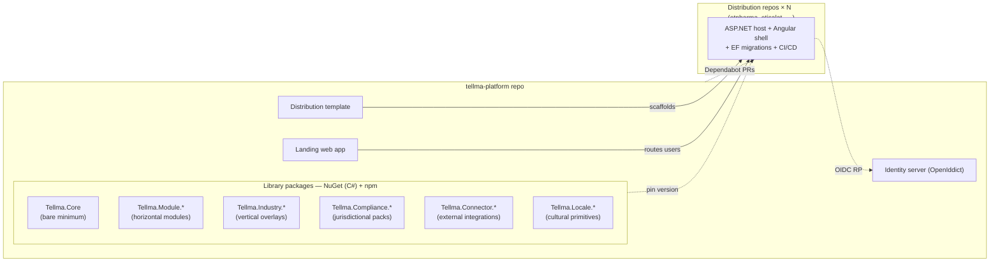
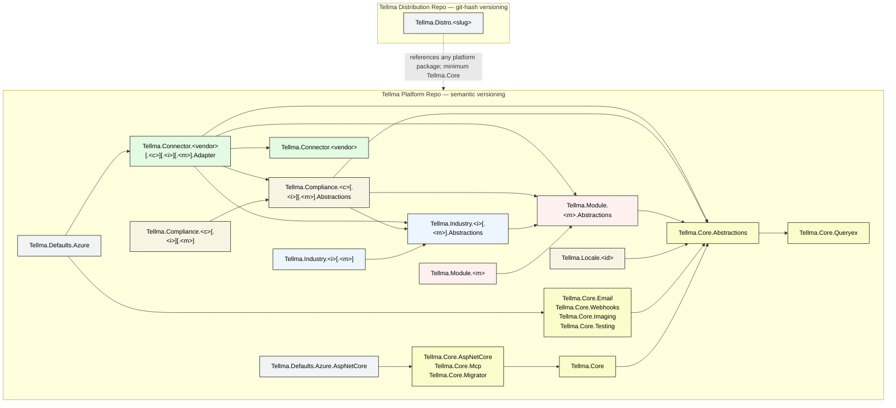
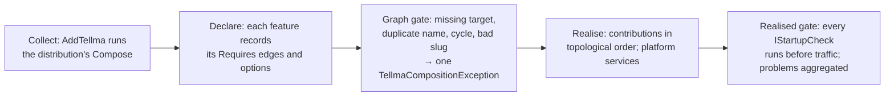
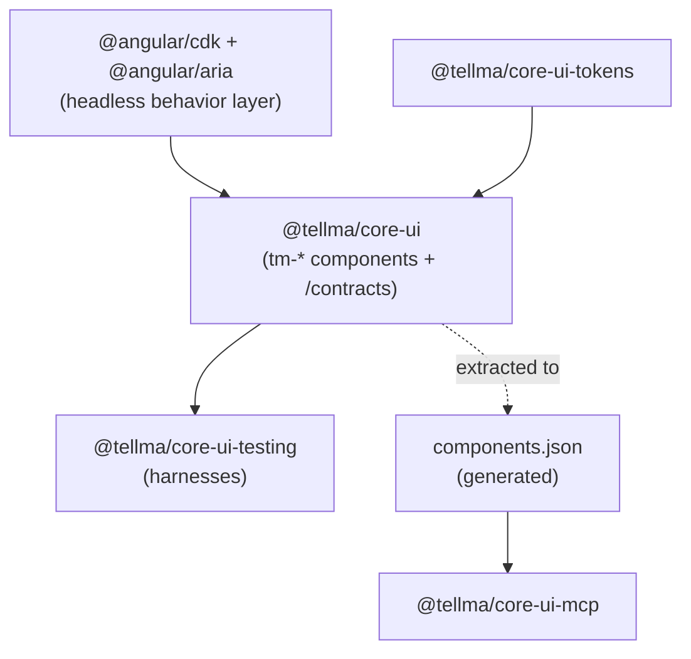
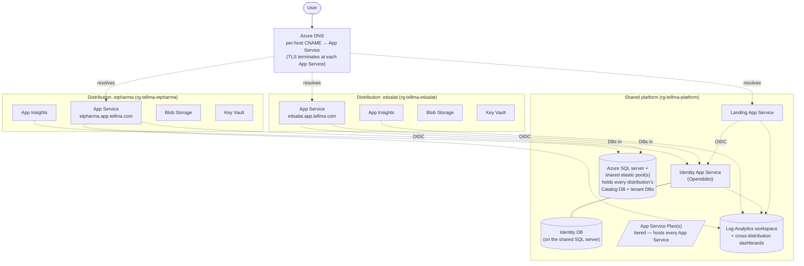

# Tellma Architecture

This document describes the architecture of the Tellma platform. It is a living document — edit it whenever a decision is made or changed.

## Vision

Today's Tellma is a single multi-tenant ASP.NET + Angular monolith with a per-tenant configuration and scripting layer. That layer:

- Limits customization to what the platform exposes; advanced changes require platform work.
- Is itself a coding environment — without modern IDEs, debugging, or test frameworks.
- Couples every tenant to the platform's release cadence: a platform change risks destabilizing complex production configurations, and we cannot test all tenants before rollout.
- Forces the platform to stay generic (`Text1`, `Text2`, …) which is hard to maintain.

This was acceptable when bespoke development was prohibitively expensive. With AI coding agents that reliably implement, test, and deploy, **the cost of bespoke is no longer the bottleneck** — so we trade the scripting layer for code.

The new shape:

- **`Tellma.Core` and platform packs** — a semver-versioned library family of ERP primitives (Angular components, C# services, SQL definitions). A bare-minimum core every distribution references, with opt-in packs layered on top along five dimensions: **Module** (horizontal functional areas), **Industry** (vertical specializations), **Compliance** (jurisdictional and standards-based rules), **Connector** (external-system integrations), and **Locale** (cultural and presentation primitives). See [Library architecture](#library-architecture). Extracted from today's monolith.
- **Distributions** — separate repos, one per tenant or per group of homogeneous tenants. Each takes a pinned dependency on `Tellma.Core`, adds tenant-specific code, and deploys as its own multi-tenant web app on its own sub-domain.
- **A shared landing page and identity provider** — single entry point and SSO across all distributions.
- **AI-native operations** — coding agents, automated tests, CI/CD, and dependabot upgrades make 100s of distributions feasible without a large team.

## Glossary

| Term | Meaning |
|---|---|
| **Tellma Platform** | The umbrella product: the reusable `Tellma.Core` library family, the deployable landing app, the deployable identity server, the dev toolchain, and the distribution template. Source lives in the `tellma-platform` GitHub repo. |
| **Tellma.Core** | The one runtime library every distribution references (`Tellma.Core` C# NuGet, `@tellma/core` npm package). Provides the cross-cutting machinery — feature composition, catalog and multi-tenancy, data access (batch, emitter, allocator, materializer, trees), the CRUD service pipeline, access control, settings, caching, localization and calendars, users and roles, provisioning, blobs, the Excel codec, background jobs and the scheduler, notifications — that every other pack and the distribution consume through `Tellma.Core.Abstractions`. It references `Tellma.Core.EntityFrameworkCore`, EF Core SQL Server (with HierarchyId), `Microsoft.Data.SqlClient`, Cronos, and OpenXml. The data-access, blob, Excel, job, and notification features are namespaces inside it, not packages. See [docs/specs/0011-distribution-host-and-multitenancy.md](docs/specs/0011-distribution-host-and-multitenancy.md) and [docs/specs/0012-data-access-layer.md](docs/specs/0012-data-access-layer.md). |
| **Tellma.Core.Abstractions** | The contract surface of `Tellma.Core` — extension-point interfaces (e.g. `IEmailSender`), the entity base classes and annotations, Core's own default entity leaves (`User`, `Role`, …), options types, capability interfaces, and telemetry names. It references `Tellma.Core.Queryex` and nothing else, because module code sees `FilterTree`, `QuerySpec`, and Queryex columns in service hooks and entity queries. Every layer above Core (Module, Industry, Compliance, Locale, Connector Adapter) consumes Core through this package; the full `Tellma.Core` is referenced only by hosts — the distribution as the composition root and the Core adapters below. |
| **Tellma.Core.Queryex** | The Queryex compiler: lexer, parser, binder, nullity analysis, and SQL emitter, with no Tellma reference and no third-party reference of any kind. It is referenced by `Tellma.Core.Abstractions` itself, because compiling a filter is not something a distribution opts into — it is how every read works, and the query contracts modules author against are Queryex types. Pack code and tools may reference it directly. |
| **Core adapters** | `Tellma.Core.AspNetCore` (the ASP.NET Core host: BFF, CSRF, tenant middleware, endpoint projection, problem mapping, blob endpoints, the SignalR hub, health, OpenAPI), `Tellma.Core.Mcp` (the Tellma Tenant MCP server), and `Tellma.Core.Migrator` (`TellmaMigrator`, the platform-owned catalog migrations, the design-time factory). Each references `Tellma.Core` and adapts it to one host technology; a distribution references the ones it deploys. `Tellma.Core.Analyzers` holds the platform's Roslyn analyzers (`TELLMA0001–0006`), packed as an analyzer asset of `Tellma.Core.Abstractions` so that every project referencing the contract runs them; no project references it directly. |
| **Optional Core-layer packages** | `Tellma.Core.Email` (the email pipeline: configuration-driven transport selection, the sandbox-tenant routing policy, the Development log sink, delivery-event dispatch, email telemetry), `Tellma.Core.Webhooks` (the shared HTTP fronting for inbound webhook receivers), `Tellma.Core.Imaging` (`SkiaImageProcessor : IImageProcessor` on SkiaSharp, with PDFtoImage rendering PDF thumbnails through PDFium — a separate package for native isolation: it is the only package carrying native binaries (Skia, PDFium), so a swap to another imaging library is a package swap in the distribution, never a change inside `Tellma.Core`), and `Tellma.Core.Testing` (test doubles and executable conformance suites for the `Tellma.Core.Abstractions` contracts, plus the diagnostics a credentialed suite needs to explain its own failures — the C# sibling of `@tellma/core-ui-testing`). Each depends on no Tellma package other than `Tellma.Core.Abstractions`, which is what lets a non-distribution host (identity, landing, a worker) reference the email pipeline and get only the email pipeline, without the CRUD, multi-tenancy, and jobs machinery. None is referenced by `Tellma.Core` either — a separate rule, buying a separate thing: Core binds to these contracts and never to their implementations, and no host can acquire a pipeline implicitly. Every host, distributions included, composes them explicitly. Third-party dependencies are a separate question — `Tellma.Core.Testing` deliberately exposes xunit on its public surface, because a conformance suite consumers execute has to be written in some test framework. |
| **`@tellma/core-ui` family** | The Angular UI component library, shipped as Core-layer npm packages (`@tellma/core-ui`, `-tokens`, `-testing`, `-mcp`). Greenfield on `@angular/cdk` + `@angular/aria`; `tm-`-prefixed; signal-first. See [Frontend → UI component library](#ui-component-library). |
| **Platform pack** | An opt-in library referenced by distributions along one of five extension dimensions: **Module**, **Industry**, **Compliance**, **Connector**, **Locale**. Each pack ships entity classes (where applicable) and services; only the distribution generates migrations. See [Library architecture](#library-architecture). |
| **Abstractions library** | The `*.Abstractions` companion of a runtime library — interfaces, base/abstract entity classes, capability interfaces, options types. Implementers reference the `.Abstractions` package; the full implementation is referenced only by the distribution at composition. Shipped wherever a library declares extension points consumed by other layers. |
| **Module / Industry / Compliance / Connector / Locale** | The five extension dimensions along which platform packs are organized. See [Library architecture — the five dimensions](#the-five-dimensions). |
| **Promotion** | The process by which a feature graduates from distribution-local code to a platform pack. Triggered once three or more production distributions have independently implemented the same feature and converged on a common shape. See [Feature promotion](#feature-promotion). |
| **Distribution** | A deployed multi-tenant web app for one tenant or a group of homogeneous tenants. Has its own repo, its own sub-domain, its own Azure resources. Depends on `Tellma.Core`'s published packages. |
| **Landing page** | `tellma.com`. Authenticates the user, looks up which distributions they belong to, and routes them. Source in `tellma-platform`; deployed as its own App Service. |
| **Identity Provider** | Shared OIDC authority (OpenIddict + ASP.NET Core Identity). Single sign-on across all distributions. Source in `tellma-platform`; deployed as its own App Service. |
| **Tenant** | A single business unit using the system. Always owns one application database, registered in the distribution's catalog database, and is at any moment in one of five states — `Provisioning`, `Active`, `ReadOnly`, `Suspended`, `Retired`. See [Multi-tenancy within a distribution](#multi-tenancy-within-a-distribution). |
| **Control plane** | A dedicated Tellma-owned distribution (the operator console) for managing tenants, billing, support, and operations *across* distributions. Distinct from any business distribution. See [Control Plane & Fleet Operations](#control-plane--fleet-operations). |
| **Stack** | The vertical unit of a feature: a table (with optional paired UDTT) generated from a C# entity class, plus the services, controllers/APIs, and Angular page that capture a full CRUD or report feature. The entity class is the single source of truth for storage shape. See [Data Layer](#data-layer). |
| **UDTT** | SQL Server user-defined table type — the TVP schema of the bulk save path. For tables that opt in, derived by migrations from the same entity class as the table itself (a row image of the table; no separate DTO class). See [Data Layer](#data-layer). |
| **Capability interface** | A C# interface, base class, or annotation on an entity that is at once the compile-time column opt-in a feature consumes and the single declaration of a stack capability — its operations, securables, gates and filters (e.g. `IActivatable` yields `activate`/`deactivate` and the activatable conjunct that `IncludeInactive` lifts). Never a paired interface per entity. See [Data Layer](#data-layer). |
| **Queryex** | Tellma's typed query language and compiler: user- and configuration-supplied expression text, bound against an entity schema and compiled to parameterized SQL. Ships as the dependency-free `Tellma.Core.Queryex` package and powers within-stack CRUD, row-level security criteria, and tier-1 reports. See [Reports — three tiers](#reports--three-tiers). |
| **`IDataBatch`** | The one unit of database I/O: a batch of model-emitted statements (queries, saves, updates, deletes, assertions) plus raw SQL through `IDataBatch.Sql` with declared writes, executed in one round trip. The only way any code, pack or distribution, reaches the database. See [docs/specs/0012-data-access-layer.md](docs/specs/0012-data-access-layer.md). |

## Guiding Principles

These principles are not aspirations — they are the constraints every later decision in this document is solving for. A choice that violates them is an architectural regression, not an acceptable trade-off.

### Performance and Responsiveness

The application must feel fast to every user on every interaction. Heavily optimize for this from the start; treat any regression as a bug.

- **Initial UI load is fast.** Bundles are split per feature; nothing unneeded for the landing route loads upfront.
- **Subsequent UI loads are instant, even days after last use.** Aggressive client-side caching of static assets, API responses, definitions, and translations. Stale-while-revalidate for anything mutable. The user should never see a cold-spinner on a return visit.
- **Every user interaction shows instant feedback (hard UI rule).** No perceptible lag between action and visual response. Optimistic UI for mutations, skeleton placeholders rather than blank waits, local commit before server reconciliation. Non-negotiable.
- **The server API is as fast as possible.** Private bounded in-memory caches, one per kind of cached thing, validated by per-tenant version tags rather than invalidated by broadcast (no `HybridCache`); output caching only for anonymous, tenant-independent GETs; response compression; prepared-statement reuse. Avoid N+1 queries with the same religious zeal as forbidding raw SQL string concatenation. See [docs/specs/0013-settings-localization-and-cache.md](docs/specs/0013-settings-localization-and-cache.md).
- **All I/O is bulkified.** Batch reads, batch writes, batch external calls. Loops that issue one query/request per iteration are bugs. Save endpoints accept arrays. Reports return aggregated data, not per-row computation across the wire. The one named exception: blob uploads are single-file raw request bodies (see [docs/specs/0017-blob-storage.md](docs/specs/0017-blob-storage.md)).

`Tellma.Core` provides the primitives that make these the defaults — caching wrappers, bulk-aware repository bases, optimistic-mutation helpers in the Angular library — and distributions inherit them. A feature that ships without these is incomplete.

### Parallel Local Development

Multiple coding agents must be able to develop the same distribution, different distributions, or `tellma-platform` itself in parallel without interfering with each other.

- Local-dev tooling never mutates tracked files — `git status` stays clean in every worktree.
- Unreleased platform packages reach a distribution through a local package feed with unique prerelease versions, so parallel agents never collide on artifacts. See [Local Development & Debugging Loop](#local-development--debugging-loop).
- Worktrees are top-level siblings with matching branch names. See [Workspace Layout](#workspace-layout).
- Local stack uses a **two-tier isolation model**:
  - **Shared infrastructure** (SQL Server, Azurite blob emulator, Redis only when exercising on-premises multi-instance SignalR) runs as a single instance per developer machine on default ports. Each distribution namespaces its data inside — databases prefixed `Tellma.dev.<slug>.*` (`Tellma.dev.acme.catalog`, `Tellma.dev.acme.1`, …), blob containers and Redis keys prefixed similarly. SSMS, Azure Data Studio, and other tools connect to default ports without hunting. A per-worktree suffix is a future refinement of the `dotnet tellma setup-worktree` naming scheme.
  - **Per-worktree app processes** (the distribution's ASP.NET host — running the in-proc identity mode for local auth, see [Identity](#identity) — and `ng serve`) bind to first-run-cached free ports. On initial setup, `dotnet tellma setup-worktree` asks the OS for free ports (`TcpListener` on port 0), writes them to a gitignored `.dev-ports.local` file in the worktree, and from then on every run reads from that file. Stable per worktree, no hash function, no collisions by design.
- **IDE integration is automatic.** (Target state; until the `dotnet tellma` CLI exists, `Properties/launchSettings.json` is tracked with fixed ports.) `Properties/launchSettings.template.json` is tracked; `Properties/launchSettings.json` is gitignored and generated from the template + `.dev-ports.local` by an MSBuild target inside `build/Tellma.Core.targets` (shipped in the `Tellma.Core` NuGet package and auto-imported by every distribution). The target runs `BeforeBuild`, runs `dotnet tool restore` first if the `dotnet tellma` tool is not yet restored, invokes `dotnet tellma setup-worktree` if `.dev-ports.local` is missing, and regenerates `launchSettings.json` if older than the template. Net effect: `git clone` → open in VS or Rider → F5 just works. Same flow for `dotnet run` and for `npm start` (which uses a `bin` script in `@tellma/core` that reads `.dev-ports.local` and passes `--port` to `ng serve`).

When introducing new tooling or local-dev features, this is a hard requirement: if it cannot be run twice in parallel against the same repo in different worktrees, it is broken.

## Naming Conventions

All repos use lowercase kebab-case: **`tellma-platform`** for the platform, **`tellma-<slug>`** for distributions. Inside the platform repo, names match function: the reusable library family is `Tellma.Core` / `Tellma.Core.EntityFrameworkCore` / `@tellma/core` (because that's what it is — the *core* libraries distributions build on); the deployable services are `Tellma.Identity.Web` and `Tellma.Landing` (the identity server's reusable engine is the `Tellma.Identity` library); the toolchain is `dotnet tellma`; the build asset is `Tellma.Core.targets`. PascalCase + dots is preserved where the .NET ecosystem expects it; npm packages stay lowercase as npm requires.

Repo names and package ids are deliberately decoupled. This follows modern .NET convention (`dotnet/aspnetcore` → `Microsoft.AspNetCore.*`, `dotnet/efcore` → `Microsoft.EntityFrameworkCore.*`) and reflects the fact that `tellma-platform` produces multiple outputs — library packages, deployable apps, dev tools — no single one of which is the canonical identity. The repo is named after the umbrella; the things inside it are named after their functions.

The `<slug>` is the canonical identifier for a distribution. It is chosen once and propagates everywhere:

| Asset | Pattern | Example |
|---|---|---|
| GitHub repo | `tellma-<slug>` | `tellma-etpharma` |
| Subdomain | `<slug>.app.tellma.com` | `etpharma.app.tellma.com` |
| Azure resource group | `rg-tellma-<slug>` | `rg-tellma-etpharma` |
| App Service | `tellma-<slug>` | `tellma-etpharma` |
| Azure SQL server (dedicated tier only) | `sql-tellma-<slug>` | `sql-tellma-etpharma` |
| Storage account | `sttellma<slug>` | `sttellmaetpharma` |
| Key Vault | `kvtellma<slug>` | `kvtellmaetpharma` |
| Local clone folder | matches GitHub repo name | `tellma-etpharma/` |

A per-distribution Azure SQL server exists only when a distribution is promoted to dedicated SQL; the default is the shared platform server and elastic pools (see [Hosting on Azure](#hosting-on-azure)). Storage-account and Key Vault names omit hyphens because both cap at 24 characters (and storage accounts forbid hyphens outright).

Slug constraints:

- Lowercase letters, digits, and hyphens only.
- Must start with a letter.
- Max 15 characters — the tightest Azure name limits (storage account and Key Vault, 24 characters) must fit the 8-character `sttellma` / `kvtellma` prefixes plus the slug.
- Reserved — cannot be used as a slug: `core`, `landing`, `identity`, `platform`, `tellma`, `www`, `app`, `api`, `admin`, `auth`, `login`, `secure`, `support`, `help`, `training`, `status`, `demo`, `test`, `staging`, `sample`, `dev`, and `acme` (taken by the platform's reference distribution). The list is held in `taxonomy.json` (`reservedSlugs`), next to the `distributions` the platform repo hosts. Because every distribution at `<slug>.app.tellma.com` is a first-party host with its own OIDC client and registered redirect URIs (see [Identity](#identity)), the reserved list is a security control kept deliberately broad against phishing-friendly names.

Local clones match the GitHub repo name exactly — never rename on clone. The workspace parent folder is a free local choice; a sensible default is `~/source/repos/tellma/`.

Shared-platform Azure assets sit in `rg-tellma-platform`, with App Services `tellma-landing` and `tellma-identity`.

Library package names follow a separate positional convention covered in [Library architecture — Package naming](#package-naming).

## Code Organization

There are exactly two kinds of repo: **one** `tellma-platform` repo and **N** distribution repos.


```mermaid
flowchart LR
    subgraph PLAT["tellma-platform repo"]
        subgraph LIB["Library packages — NuGet (C#) + npm"]
            CORE["Tellma.Core<br/>(bare minimum)"]
            MOD["Tellma.Module.*<br/>(horizontal modules)"]
            IND["Tellma.Industry.*<br/>(vertical overlays)"]
            COMP["Tellma.Compliance.*<br/>(jurisdictional packs)"]
            CONN["Tellma.Connector.*<br/>(external integrations)"]
            LOC["Tellma.Locale.*<br/>(cultural primitives)"]
        end
        LANDING["Landing web app"]
        IDP["Identity server (OpenIddict)"]
        TPL["Distribution template"]
    end

    subgraph DISTS["Distribution repos × N<br/>(etpharma, etisalat, …)"]
        D["ASP.NET host + Angular shell<br/>+ EF migrations + CI/CD"]
    end

    LIB -.->|pin version| D
    TPL -->|scaffolds| D
    PLAT -.->|Dependabot PRs| D
    D -.->|OIDC RP| IDP
    LANDING -->|routes users| D
```

The `tellma-platform` repo wears two hats: it publishes the `Tellma.Core` library family (NuGet + npm) that distributions consume as code, and it deploys the cross-cutting services — landing, identity — that every distribution integrates with at runtime. Distributions own only the per-tenant code and infra.

### Platform repo layout

```
tellma-platform/
├── .config/
│   └── dotnet-tools.json                # dogfoods Tellma.Cli inside the repo itself
├── .github/
│   ├── workflows/
│   │   ├── ci.yml                       # build + test on PR
│   │   ├── nightly.yml                  # credentialed live-connector suites; schedule + manual dispatch
│   │   ├── release.yml                  # tag-driven; aggregates news fragments, publishes packages
│   │   └── changelog-fragment.yml       # enforces fragment-on-PR rule
│   ├── dependabot.yml
│   └── ISSUE_TEMPLATE/
├── build/                               # MSBuild assets shipped inside the Tellma.Core NuGet
│   ├── Tellma.Core.targets              # auto-imported into every distribution csproj
│   ├── Tellma.Core.props
│   └── version.props
├── changelog.d/                         # per-PR news fragments
├── distributions/                       # Phase-1 distributions, each in distribution-repo shape (see Rollout & Phasing)
│   └── acme/                            # the reference distribution: a fictional customer, slug `acme`, the platform's smoke deployment
│       ├── src/
│       │   ├── Tellma.Distro.Acme.Web/          # ASP.NET host → Tellma.Distro.Acme + the host adapters; Program.cs, Endpoints/, wwwroot/; tracked launchSettings.json
│       │   ├── Tellma.Distro.Acme/              # class library — the composition both hosts reference: AcmeComposition.cs, Entities/, Services/
│       │   ├── Tellma.Distro.Acme.Client/       # the Angular application — esproj (JavaScript SDK); proxy.conf.js, aspnetcore-https.js
│       │   └── Tellma.Distro.Acme.Migrator/     # console host → Tellma.Distro.Acme + Tellma.Core.Migrator; owns Migrations/
│       └── test/
│           ├── Tellma.Distro.Acme.Web.Tests/
│           ├── Tellma.Distro.Acme.IntegrationTests/
│           └── Tellma.Distro.Acme.E2E/          # Playwright; empty until the UI specs ship
├── client/                              # single Angular workspace; project folders match npm package kebab-case
│   ├── projects/
│   │   ├── core/                                  # Core-layer Angular packages (every distribution references)
│   │   │   ├── tellma-core/                       # @tellma/core — cross-cutting services & helpers
│   │   │   ├── tellma-core-ui/                    # @tellma/core-ui — tm-* components (on @angular/cdk + @angular/aria) + /contracts entry point
│   │   │   ├── tellma-core-ui-tokens/             # @tellma/core-ui-tokens — typed design-token contract + presets + emitter
│   │   │   ├── tellma-core-ui-testing/            # @tellma/core-ui-testing — component harnesses
│   │   │   └── tellma-core-ui-mcp/                # @tellma/core-ui-mcp — scoped MCP server (data from generated components.json)
│   │   ├── module/
│   │   │   └── tellma-module-sales/               # @tellma/module-sales — example horizontal module
│   │   ├── industry/
│   │   │   └── tellma-industry-pharma-sales/      # @tellma/industry-pharma-sales — example vertical overlay
│   │   ├── compliance/
│   │   │   └── tellma-compliance-sa/              # @tellma/compliance-sa — example jurisdictional pack
│   │   ├── connector/
│   │   │   └── tellma-connector-zatca/            # @tellma/connector-zatca — example external integration
│   │   ├── locale/
│   │   │   └── tellma-locale-ar/                  # @tellma/locale-ar — example cultural primitive
│   │   └── apps/
│   │       └── tellma-landing/                    # Landing SPA, built into src/apps/Tellma.Landing/wwwroot
│   ├── angular.json
│   ├── package.json
│   └── tsconfig.json
├── docs/                                # repo-level docs not shipped in packages
├── eng/                                 # repo engineering scripts and developer tools; not shipped to distributions
│   └── queryex-inspection/              # self-hosted playground for the Queryex compiler; one static page, ephemeral port
├── infra/                               # Bicep for shared platform infra (Log Analytics, ASPs, SQL, …)
│   ├── shared-platform.bicep
│   ├── modules/
│   └── monitoring/                      # alert queries (KQL), cross-checked in tests against the emitted instruments
├── migrations/                          # breaking-change recipes; shipped in package docs/migrations/
│   └── v<major>/
├── releases/                            # aggregated release JSON; shipped in package docs/releases/
├── src/
│   ├── core/                            # bare-minimum family
│   │   ├── Tellma.Core.Abstractions/    # .csproj — every contract: entity bases and annotations, Core's default leaves, data/crud/access/settings/blob/excel/job/notification interfaces, options, telemetry names. References Tellma.Core.Queryex only. Published as Tellma.Core.Abstractions NuGet.
│   │   ├── Tellma.Core/                 # .csproj — the one runtime: composition, catalog and tenancy, data access, the pipeline, access, settings/cache/localization, users and provisioning, blobs, Excel, jobs, notifications. Published as the Tellma.Core NuGet.
│   │   ├── Tellma.Core.Queryex/         # .csproj — the Queryex compiler: expression text to parameterized SQL. Zero package and project references; referenced by Tellma.Core.Abstractions. Published as Tellma.Core.Queryex NuGet.
│   │   ├── Tellma.Core.AspNetCore/      # .csproj — the ASP.NET Core adapter of Tellma.Core: BFF, CSRF, tenant middleware, endpoint projection, problem mapping, limits, blob endpoints, TellmaHub, health, OpenAPI.
│   │   ├── Tellma.Core.Mcp/             # .csproj — the Tellma Tenant MCP server (/{tenantId}/mcp); references Tellma.Core.AspNetCore + ModelContextProtocol.AspNetCore.
│   │   ├── Tellma.Core.Migrator/        # .csproj — TellmaMigrator (migrate, provision, set-state, status), the platform-owned catalog migrations, the design-time factory; references Tellma.Core + the EF Design packages.
│   │   ├── Tellma.Core.Imaging/         # .csproj — SkiaImageProcessor on SkiaSharp (+ PDFtoImage for PDF thumbnails); references Tellma.Core.Abstractions only. Native-isolated (Skia, PDFium); never referenced by Tellma.Core.
│   │   ├── Tellma.Core.Analyzers/       # .csproj — the platform's Roslyn analyzers (TELLMA0001–0006: no hard-coded TVP ordinals, no EF query or SaveChanges over TellmaDbContext outside Tellma.Core and the migrators, raw SQL only through IDataBatch.Sql with declared writes and ScriptDom-checked text, no direct action calls, no nested pipeline run from a pipeline participant, no write into a stack-owned table by a type that is not its owner); packed as an analyzer asset of Tellma.Core.Abstractions.
│   │   ├── Tellma.Core.Email/           # .csproj — email pipeline: transport selection, sandbox routing, the Development log sink, delivery-event dispatch. Composed explicitly by each host; never referenced by Tellma.Core.
│   │   ├── Tellma.Core.EntityFrameworkCore/        # .csproj — EF Core extensions (runtime): table-type (UDTT) configuration, migration operations, migrations SQL generation, metadata API. Never references the EF Design package.
│   │   ├── Tellma.Core.EntityFrameworkCore.Design/ # .csproj — design-time companion: C# migration operation generator + IDesignTimeServices, discovered via the [assembly: DesignTimeServicesReference] its MSBuild targets inject into the consuming migrator assembly. Referenced only by migrator projects.
│   │   ├── Tellma.Core.Testing/         # .csproj — test doubles for the Abstractions contracts, the executable email-transport conformance suite, and test-run diagnostics. Referenced by test projects only.
│   │   └── Tellma.Core.Webhooks/        # .csproj — the shared HTTP fronting for inbound webhook receivers (/api/webhooks/{key}). Takes a FrameworkReference to Microsoft.AspNetCore.App, as Tellma.Core.AspNetCore and Tellma.Core.Mcp do.
│   ├── module/                          # horizontal functional modules (entity classes, services, endpoints)
│   │   ├── gl/                          # the first Tellma.Module.<M> pair — Center and the GL reference stack (docs/specs/0018-core-and-gl-reference-stacks.md)
│   │   │   ├── Tellma.Module.Gl.Abstractions/
│   │   │   └── Tellma.Module.Gl/
│   │   └── sales/
│   │       ├── Tellma.Module.Sales.Abstractions/
│   │       └── Tellma.Module.Sales/
│   ├── industry/                        # vertical industry overlays (per-module by default; see naming convention)
│   │   └── pharma-sales/
│   │       ├── Tellma.Industry.Pharma.Sales.Abstractions/
│   │       └── Tellma.Industry.Pharma.Sales/
│   ├── compliance/                      # jurisdictional and standards-based packs
│   │   └── sa/
│   │       ├── Tellma.Compliance.Sa.Abstractions/
│   │       └── Tellma.Compliance.Sa/
│   ├── connector/                       # external-system integrations and adapters, one grouping folder per vendor
│   │   ├── acs-email/
│   │   │   └── Tellma.Connector.AcsEmail.Adapter/            # adapter-only: Azure.Communication.Email is a fit first-party client
│   │   ├── azure-blobs/
│   │   │   └── Tellma.Connector.AzureBlobs.Adapter/          # adapter-only: AzureBlobStore over Azure.Storage.Blobs (docs/specs/0017-blob-storage.md)
│   │   ├── marmin-ae/
│   │   │   └── Tellma.Connector.MarminAe/                    # raw client library, because the vendor publishes no .NET SDK
│   │   ├── sendgrid/
│   │   │   ├── Tellma.Connector.SendGrid/                    # raw client library, because the official SDK is dormant
│   │   │   └── Tellma.Connector.SendGrid.Adapter/            # adapter implementing upper-layer interfaces
│   │   ├── smtp/
│   │   │   └── Tellma.Connector.Smtp.Adapter/                # adapter-only, on MailKit; a protocol name occupies the <vendor> slot
│   │   └── zatca/
│   │       ├── Tellma.Connector.Zatca/                       # raw client library
│   │       └── Tellma.Connector.Zatca.Sa.Sales.Adapter/      # adapter implementing upper-layer interfaces
│   ├── locale/                          # cultural and presentation primitives
│   │   └── Tellma.Locale.Ar/
│   ├── defaults/                        # distribution-layer bundles: one deployment shape's common composition in one call
│   │   ├── Tellma.Defaults.Azure/       # .csproj — UseAzureDefaults(): email (ACS, SendGrid), webhooks, Azure blobs, SkiaSharp imaging; no ASP.NET package (docs/specs/0011-distribution-host-and-multitenancy.md)
│   │   └── Tellma.Defaults.Azure.AspNetCore/   # .csproj — UseAzureWebDefaults(): the Azure SignalR backplane; references Tellma.Core.AspNetCore (docs/specs/0011-distribution-host-and-multitenancy.md)
│   ├── apps/                            # deployable services
│   │   ├── Tellma.Identity/             # .csproj — OpenIddict + ASP.NET Core Identity engine (Razor Class Library); referenced by Tellma.Identity.Web and by distributions running in-proc
│   │   ├── Tellma.Identity.Web/         # .csproj — deployable standalone identity App Service (hosts Tellma.Identity)
│   │   └── Tellma.Landing/              # .csproj — deployable App Service, serves the Landing SPA from wwwroot
│   └── tooling/
│       └── Tellma.Cli/                  # .csproj — published as the `dotnet tellma` CLI (dotnet tool)
├── templates/
│   └── tellma-distribution/             # `dotnet new tellma-distribution` template
├── test/                                # mirrors src/, grouping folders included (test/core/, test/connector/<vendor>/), plus test/shared/ for doubles reused across suites. *.IntegrationTests is reserved for suites needing external resources; a suite that hosts its own dependency in-process stays a *.Tests project
├── .editorconfig
├── .gitattributes
├── .gitignore
├── ARCHITECTURE.md
├── CHANGELOG.md
├── CLA.md                               # contributor license agreement (broad Apache-ICLA-style grant; preserves relicensing right)
├── CLAUDE.md
├── CONTRIBUTING.md                      # contribution guide; links to CLA.md and the CLA bot
├── Directory.Build.props
├── Directory.Build.targets
├── Directory.Packages.props             # central package management
├── global.json                          # pinned .NET SDK
├── LICENSE                              # Apache-2.0
├── NuGet.config
├── README.md
├── taxonomy.json                        # `modules` and `compliance` registries of reserved `<m>` and `<c>` segments, `reservedSlugs`, and the `distributions` this repo hosts (see Library architecture)
└── Tellma.slnx
```

Folder names follow standard .NET-ecosystem conventions (`src/`, `test/`, `eng/`, `build/`, `docs/`) so the repo is immediately legible to anyone familiar with `dotnet/aspnetcore` or `dotnet/efcore`; `distributions/` is the one Tellma-specific top-level folder, holding the Phase-1 distributions in exactly the shape a distribution repo takes (see [Rollout & Phasing](#rollout--phasing)). `src/` and `client/projects/` group projects by area (`core/`, `module/`, `industry/`, `compliance/`, `connector/`, `locale/`, `apps/`, `tooling/`) because the library family is expected to grow to dozens of packs; the grouping keeps a flat top-level legible. Category folders are lowercase to match other organizational folders (`src/`, `test/`, `eng/`); PascalCase is reserved for actual .NET project folders, which match their `.csproj` / assembly name. The same rule applies to the grouping folder inside a category — the vendor or pack name — so a path reads `src/connector/sendgrid/Tellma.Connector.SendGrid.Adapter/`, lowercase all the way down to the project folder. The Angular workspace lives once at the repo root in `client/` and produces every published `@tellma/*` library plus the Landing SPA. `build/` is the MSBuild-conventional folder name for assets shipped via NuGet under `build/<id>.targets`.

### Library architecture

The platform exposes its functionality through a layered family of NuGet packages organized along five extension dimensions. Distributions reference whichever combination they need; the dimensions are extension axes, not a partition of the catalog.

#### The five dimensions

| Dimension | Purpose | Owns new entities? | Cardinality |
|---|---|---|---|
| **Module** | Horizontal functional area (GL, Sales, Procurement, Inventory, HR, Manufacturing). Owns most entities and declares the bulk of extension points. | Yes — the bulk of them | ~10–20 |
| **Industry** | Vertical specialization (Pharma, Telecom, TextileFactories, …). Introduces new vertical entities and overlays horizontal modules. | Yes — both new vertical nouns and overlays | ~50–100 |
| **Compliance** | Jurisdictional or standards-based rules (SA, ET, IFRS, US-GAAP, …). Mostly parameterizes module behavior with regime-specific rules, rates, and document formats; occasionally introduces thin filing entities. | Sometimes — mostly behavior | ~50–100 |
| **Connector** | Leaf integration to a specific external system (Zatca, RajhiBank, SendGrid, Stripe, …). Ships one or more `.Adapter` libraries implementing upper-layer interfaces, plus a raw client library **when the upstream client is absent or unfit** — a per-vendor judgment, not a rule (SendGrid gets one because its official SDK is dormant; SMTP and ACS ride MailKit and `Azure.Communication.Email` adapter-only). | No — adapts to external | 100s |
| **Locale** | Cultural and presentation primitives (Ar, ArAe, Et, …). Implements `IAmountToText`, language-specific text utilities and client-side assets; calendars are Core's, never a Locale concern. | No | ~50–100 |

These dimensions are not orthogonal — Compliance often implies Locale, Industry often implies Compliance, Connector Adapters often imply both a Compliance regime and a Module. Cross-dimensional libraries are expressed as positional suffixes on the library name (see [Package naming](#package-naming)); no separate "Bridge" category exists.

#### Abstractions / implementation split

Every layer that declares extension points consumed by other layers ships as two packages:

- `Tellma.<Layer>…` — runtime implementation: services, controllers, default DI registrations, internal helpers, default extension-point implementations.
- `Tellma.<Layer>….Abstractions` — extension-point interfaces, base/abstract entity classes, capability interfaces, options types, public value objects and enums.

Implementers and overlay libraries reference only the `.Abstractions` package; the full implementation is referenced only by the distribution as the composition root. This forces the contract to be decoupled from the implementation, keeps overlay libraries lightweight, and gives compile-time enforcement of the dependency DAG.

The split applies wherever extension points exist. Core, Module, Industry, and Compliance routinely ship Abstractions. Locale, the raw `Connector.<vendor>`, and Connector Adapter libraries are leaves and ship without Abstractions companions — until and unless a leaf grows its own extension points consumed by another library.

A raw client library is written **when the upstream client is absent or unfit, not on principle**: wrapping a maintained, well-shaped first-party client is indirection without value. The evidence to weigh is release cadence, target frameworks and nullability, the dependencies it would impose transitively on every distribution, and whether it exposes the seams the adapter needs.

#### Package naming

Package names follow the pattern below. Square brackets denote optional segments; the slot order is fixed.

| Pattern | Example | Notes |
|---|---|---|
| `Tellma.Core` | `Tellma.Core` | Mandatory; every host references it. The one runtime package: data access, the CRUD pipeline, access, settings and cache, users and provisioning, blobs, the Excel codec, jobs and the scheduler, notifications. References `Tellma.Core.Abstractions`, `Tellma.Core.EntityFrameworkCore`, `Microsoft.EntityFrameworkCore.SqlServer` (+ `.HierarchyId`), `Microsoft.Data.SqlClient`, `Cronos`, `DocumentFormat.OpenXml`, `MessageFormat`. |
| `Tellma.Core.Abstractions` | `Tellma.Core.Abstractions` | Mandatory. Every contract of every Core feature. References `Tellma.Core.Queryex` and nothing else. |
| `Tellma.Core.Queryex` | `Tellma.Core.Queryex` | The Queryex compiler. Depends on nothing at all — no Tellma package, no third-party package — and is referenced by `Tellma.Core.Abstractions`. |
| `Tellma.Core.AspNetCore` | `Tellma.Core.AspNetCore` | Core adapter: the ASP.NET Core host (BFF, CSRF, tenant middleware, endpoint projection, problem mapping, blob endpoints, `TellmaHub`, health, OpenAPI). References `Tellma.Core` + the framework, which ships SignalR; the Azure SignalR pin lives in `Tellma.Defaults.Azure.AspNetCore`, the Redis backplane pin in the on-premises host. |
| `Tellma.Core.Mcp` | `Tellma.Core.Mcp` | Core adapter: the Tellma Tenant MCP server. References `Tellma.Core.AspNetCore` + `ModelContextProtocol.AspNetCore`; separate so air-gapped distributions can omit it. |
| `Tellma.Core.Migrator` | `Tellma.Core.Migrator` | Core adapter: `TellmaMigrator`, the platform-owned catalog migrations, and the design-time factory. References `Tellma.Core` + `Tellma.Core.EntityFrameworkCore.Design` + `Microsoft.EntityFrameworkCore.Design`; referenced only by migrator projects. |
| `Tellma.Core.EntityFrameworkCore` | `Tellma.Core.EntityFrameworkCore` | EF Core extensions (table types/UDTTs): configuration, migration operations, SQL generation, metadata API. Runtime-side — never references the EF `Design` package. |
| `Tellma.Core.EntityFrameworkCore.Design` | `Tellma.Core.EntityFrameworkCore.Design` | Design-time companion (C# operation generator, `IDesignTimeServices`). Referenced only by `Tellma.Core.Migrator`, and through it by the distribution's migrator project. |
| `Tellma.Core.Imaging` | `Tellma.Core.Imaging` | Optional Core-layer runtime: `IImageProcessor` as `SkiaImageProcessor` on SkiaSharp, with PDFtoImage (PDFium) rendering PDF thumbnails. Depends on `Tellma.Core.Abstractions`, SkiaSharp and PDFtoImage only; never referenced by `Tellma.Core` (native isolation — the only package carrying native binaries, and swapping the imaging library is a package swap in the distribution). |
| `Tellma.Core.Email` | `Tellma.Core.Email` | Optional Core-layer runtime: the email pipeline. Depends on no Tellma package other than `Tellma.Core.Abstractions`; each host adds it explicitly. |
| `Tellma.Core.Webhooks` | `Tellma.Core.Webhooks` | Optional Core-layer runtime: the shared HTTP fronting for inbound webhook receivers. |
| `Tellma.Core.Testing` | `Tellma.Core.Testing` | Test doubles for the Abstractions contracts, executable conformance suites, and test-run diagnostics. Referenced by test projects only. |
| `Tellma.Core.Analyzers` | `Tellma.Core.Analyzers` | The platform's Roslyn analyzers (`TELLMA0001–0006`). A project, not a referenced package: packed as an analyzer asset of `Tellma.Core.Abstractions`, so every project that references the contract runs them. |
| `Tellma.Defaults.Azure` | `Tellma.Defaults.Azure` | Distribution-layer bundle: `UseAzureDefaults()` composes email (ACS, SendGrid), webhooks, the Azure blob store and SkiaSharp imaging from configuration. References `Tellma.Core.Email`, `Tellma.Core.Webhooks`, `Tellma.Core.Imaging` and the ACS, SendGrid and Azure Blobs adapters, and no ASP.NET package, directly or transitively; referenced by no Core package. |
| `Tellma.Defaults.Azure.AspNetCore` | `Tellma.Defaults.Azure.AspNetCore` | Distribution-layer bundle for the web host: `UseAzureWebDefaults()` selects the Azure SignalR backplane when `Azure:SignalR:ConnectionString` is present. References `Tellma.Core.AspNetCore` + `Microsoft.Azure.SignalR` (the Azure SignalR pin); referenced by the Web project only, from the `composeWeb` delegate of `AddTellma`, and by no Core package. An on-premises pair of bundles follows with the first on-premises distribution. |
| `Tellma.Module.<m>` | `Tellma.Module.Sales` | `<m>` ∈ Modules registry. |
| `Tellma.Module.<m>.Abstractions` | `Tellma.Module.Sales.Abstractions` | |
| `Tellma.Locale.<id>` | `Tellma.Locale.Ar` | `<id>` ad-hoc. |
| `Tellma.Industry.<i>[.<m>]` | `Tellma.Industry.Pharma.Sales` | `<i>` ad-hoc; `<m>` optional, must be in Modules registry if present. |
| `Tellma.Industry.<i>[.<m>].Abstractions` | `Tellma.Industry.Pharma.Sales.Abstractions` | |
| `Tellma.Compliance.<c>[.<i>][.<m>]` | `Tellma.Compliance.Sa.Pharma.Sales` | `<c>` ∈ Compliance registry. `<i>` and `<m>` optional. |
| `Tellma.Compliance.<c>[.<i>][.<m>].Abstractions` | `Tellma.Compliance.Sa.Abstractions` | |
| `Tellma.Connector.<vendor>` | `Tellma.Connector.Zatca` | `<vendor>` ad-hoc. Raw client library, present only when the upstream client is absent or unfit. |
| `Tellma.Connector.<vendor>[.<c>][.<i>][.<m>].Adapter` | `Tellma.Connector.Zatca.Sa.Sales.Adapter` | `.Adapter` suffix mandatory. All scoping segments optional but ordered `<c>`, `<i>`, `<m>`; zero segments is the norm for cross-cutting infrastructure adapters (`Tellma.Connector.Smtp.Adapter`). For protocol-shaped connectors the protocol name occupies the `<vendor>` slot — the external system is the protocol itself. Three or four scoping segments at once is theoretically possible but a smell — break the adapter up. |
| `Tellma.Distro.<slug>` | `Tellma.Distro.Etpharma` | Project/namespace prefix for distribution repos (e.g. `Tellma.Distro.Etpharma.Web`); never published as a package and never lives in the platform repo. |

**Registry rules.** Two name registries are maintained at the platform level in `taxonomy.json` (which also carries `reservedSlugs` and the `distributions` the repo hosts — see [Naming Conventions](#naming-conventions)); each lists only what exists:

- **Modules registry.** Enumerated list of `<m>` values (currently `Gl`; Sales, Procurement, Inventory, HR, Manufacturing are the expected next entries), stored in the exact PascalCase segment form used in package names. New modules require a platform-repo PR.
- **Compliance registry.** Enumerated list of `<c>` values (currently empty; `Sa`, `Et`, `Ifrs`, `UsGaap` are the expected shape), stored in the exact PascalCase segment form used in package names. New compliance codes require a platform-repo PR.
- **Industry names are ad-hoc.** No central registry; distributions and platform packs introduce industry names as needed. New industries are introduced through [Feature promotion](#feature-promotion), not by upfront registration.
- **Cross-registry uniqueness is enforced at PR time.** A name in the Modules or Compliance registry cannot collide with each other, nor with any industry name in active use across the platform and any distribution. An analyzer rejects collisions when a registry is updated or when a new industry-scoped package is introduced.

**Parsing is deterministic** given the fixed slot order. A reader (or tool) walks segments left-to-right after the leading prefix: a segment that matches the Modules registry is `<m>`; a segment that matches the Compliance registry is `<c>`; any other segment is `<i>`. Since the slot order is `<c>` → `<i>` → `<m>` (where present), the meaning of every package name is unambiguous.

#### Dependency graph


```mermaid
flowchart TB
    classDef core fill:#fcfcca,stroke:#000,color:#000
    classDef module fill:#fff0f0,stroke:#000,color:#000
    classDef locale fill:#f7f4e4,stroke:#000,color:#000
    classDef industry fill:#edf5ff,stroke:#000,color:#000
    classDef compliance fill:#f7f4e4,stroke:#000,color:#000
    classDef connector fill:#e3fae3,stroke:#000,color:#000
    classDef distro fill:#f2f3f5,stroke:#000,color:#000

    subgraph PLATFORM["Tellma Platform Repo — semantic versioning"]
        CoreAbs["Tellma.Core.Abstractions"]:::core
        Core["Tellma.Core"]:::core
        CoreAdapters["Tellma.Core.AspNetCore<br/>Tellma.Core.Mcp<br/>Tellma.Core.Migrator"]:::core
        CoreOptional["Tellma.Core.Email<br/>Tellma.Core.Webhooks<br/>Tellma.Core.Imaging<br/>Tellma.Core.Testing"]:::core
        Queryex["Tellma.Core.Queryex"]:::core
        ModuleAbs["Tellma.Module.&lt;m&gt;.Abstractions"]:::module
        Module["Tellma.Module.&lt;m&gt;"]:::module
        Locale["Tellma.Locale.&lt;id&gt;"]:::locale
        IndustryAbs["Tellma.Industry.&lt;i&gt;[.&lt;m&gt;].Abstractions"]:::industry
        Industry["Tellma.Industry.&lt;i&gt;[.&lt;m&gt;]"]:::industry
        ComplianceAbs["Tellma.Compliance.&lt;c&gt;[.&lt;i&gt;][.&lt;m&gt;].Abstractions"]:::compliance
        Compliance["Tellma.Compliance.&lt;c&gt;[.&lt;i&gt;][.&lt;m&gt;]"]:::compliance
        Connector["Tellma.Connector.&lt;vendor&gt;"]:::connector
        Adapter["Tellma.Connector.&lt;vendor&gt;[.&lt;c&gt;][.&lt;i&gt;][.&lt;m&gt;].Adapter"]:::connector
        Defaults["Tellma.Defaults.Azure"]:::distro
        DefaultsWeb["Tellma.Defaults.Azure.AspNetCore"]:::distro

        Core --> CoreAbs
        CoreAbs --> Queryex
        CoreAdapters --> Core
        CoreOptional --> CoreAbs
        Locale --> CoreAbs
        Module --> ModuleAbs
        ModuleAbs --> CoreAbs
        Industry --> IndustryAbs
        IndustryAbs --> ModuleAbs
        Compliance --> ComplianceAbs
        ComplianceAbs --> CoreAbs
        ComplianceAbs --> ModuleAbs
        ComplianceAbs --> IndustryAbs
        Adapter --> Connector
        Adapter --> CoreAbs
        Adapter --> ModuleAbs
        Adapter --> IndustryAbs
        Adapter --> ComplianceAbs
        Defaults --> CoreOptional
        Defaults --> Adapter
        DefaultsWeb --> CoreAdapters
    end

    subgraph DIST["Tellma Distribution Repo — git-hash versioning"]
        Distro["Tellma.Distro.&lt;slug&gt;"]:::distro
    end

    Distro -.->|references any platform package; minimum Tellma.Core| PLATFORM
```

The rules these arrows encode:

1. **Full implementations depend only on their own Abstractions.** `Tellma.Module.Sales` depends on `Tellma.Module.Sales.Abstractions`, not on `Tellma.Core`. The `.Abstractions` package is the only upward-facing API surface of a layer; whatever a lower layer needs to expose, it exposes through its Abstractions.

2. **`Tellma.Module.<m>` never references `Tellma.Core`.** Cross-cutting Core services (data batches, the service pipeline, settings, caching, multi-tenancy, access, blobs, jobs, notifications) are exposed as interfaces in `Tellma.Core.Abstractions`, and Core's own default entity leaves (`User`, `Role`, …) live there too, because every module's audit columns reference `core.Users`. Modules consume those interfaces via DI; the Distro is the only place that registers the concrete `Tellma.Core` implementations. Any new cross-cutting Core service must be reachable through an interface in `Tellma.Core.Abstractions` — adding a `Module → Core` reference is forbidden.

3. **Industry depends only on `Module.<m>.Abstractions`,** not on the full `Module.<m>`. The abstract generic bases and non-abstract default leaves Industry needs to subclass live in `Module.<m>.Abstractions`. Industry overlays never reach into Module services or controllers.

4. **Industry references at most one Module.** A single `Tellma.Industry.<i>[.<m>]` library references at most one Module's Abstractions. An industry that spans many modules ships as multiple packages (`Tellma.Industry.Pharma.Sales`, `Tellma.Industry.Pharma.Inventory`, …). Consolidating per-module industry libraries into one monolithic industry library is a future option if cardinality grows unwieldy.

5. **Compliance and Connector Adapter target any subset of upstream Abstractions.** A `Tellma.Compliance.<c>` library implements interfaces from any combination of `Core.Abstractions`, `Module.<m>.Abstractions`, and `Industry.<i>.Abstractions`, whichever its overrides need. Same for `Tellma.Connector.<vendor>.Adapter`, which additionally references the raw `Tellma.Connector.<vendor>` it adapts. Each library declares only the Abstractions packages it actually consumes; the diagram shows the union of possible edges, not edges that must all be present in every library.

6. **The optional Core-layer packages are composed, never inherited.** Two rules, doing different work. First, `Tellma.Core.Email`, `Tellma.Core.Webhooks`, `Tellma.Core.Imaging`, and `Tellma.Core.Testing` depend on no Tellma package other than `Tellma.Core.Abstractions` — that is what lets a non-distribution deployable (the identity server, the landing app, a worker) reference the email pipeline and get only the email pipeline, without the CRUD stack, multi-tenancy, settings, and jobs machinery. Second, none of them is referenced by `Tellma.Core`. That rule buys what the first does not, and not by transitive weight: a `Core` → `Email` edge would never reach a host that does not reference Core in the first place. What it would do is let Core bind to `EmailRouter` and its siblings instead of the contracts, and make it expressible for `AddTellma()` to pull in a pipeline whose startup validation then demands `Email:Provider`, `DeploymentIdentity`, and `ISandboxContext` from a distribution that never sends mail — or, for `Tellma.Core.Imaging`, to load Skia's and PDFium's native binaries into every distribution. Every host, distributions included, adds what it wants explicitly. The distribution-layer bundles — `Tellma.Defaults.Azure`, whose `UseAzureDefaults()` composes email, webhooks, the blob store and imaging for an Azure deployment in one call, and `Tellma.Defaults.Azure.AspNetCore`, whose `UseAzureWebDefaults()` composes the web host's SignalR backplane — are that explicit composition packaged for one deployment shape: they sit above the connectors and adapters they reference, and no Core package references either. `Tellma.Core.Queryex` is deliberately not one of these: `Tellma.Core.Abstractions` references it, because compiling an expression is not a capability a host chooses but the mechanism every read already goes through, and the filter and query types module code authors against are Queryex types. It earns that position by depending on nothing — no Tellma package and no third-party package — so the edge carries no weight and imposes no configuration.

7. **One runtime, adapted per host technology.** Everything every distribution ships — data access, the pipeline, access, settings, blobs, Excel, jobs, notifications — is one `Tellma.Core` package (separate runtime packages would buy isolation nobody consumes while multiplying composition calls). `Tellma.Core.AspNetCore`, `Tellma.Core.Mcp`, and `Tellma.Core.Migrator` are its **adapters**: each references `Tellma.Core` and one host framework, and nothing else in the platform references them. Modules reference only Abstractions packages; every host references `Tellma.Core`. Codified in [docs/specs/0011-distribution-host-and-multitenancy.md](docs/specs/0011-distribution-host-and-multitenancy.md).

8. **Distributions may reference any platform package directly,** subject to a minimum of `Tellma.Core`. There is no scaffolding restriction; the distribution is the composition root and pulls in whichever combination of full implementations its tenants need. The reference distribution's composition library `Tellma.Distro.Acme` references `Tellma.Core`, `Tellma.Defaults.Azure` (which brings `.Email`, `.Webhooks`, `.Imaging` and the Azure connectors) and `Tellma.Module.Gl` (+ `.Abstractions`), and never an ASP.NET package, directly or transitively; its Web project references that library plus `Tellma.Core.AspNetCore`, `Tellma.Core.Mcp`, `Tellma.Defaults.Azure.AspNetCore` and `Tellma.Identity` (in-proc), and its migrator references that library and `Tellma.Core.Migrator`.

#### Per-dimension contents

A non-exhaustive list of what each dimension's libraries can ship:

- **Module** — entity classes, services, controllers, default workflows, default extension-point implementations, capability interfaces, default seed data, baseline document templates, baseline notification templates, baseline permissions and roles, baseline feature flags, baseline CRON jobs.
- **Industry** — new vertical entity classes (Batch, Lot, ColdChainEvent, Prescription, …), additive overlays on horizontal module entities, industry-specific services and validators, industry-specific reports, industry-specific extension-point implementations.
- **Compliance** — jurisdictional rule sets (tax calculators, withholding rules, validation rules), document numbering sequences, statutory document templates (tax-invoice format, payslip format), regulatory filing entities and workflows, audit signature requirements, charts-of-accounts templates.
- **Connector** — client library for a specific external system: HTTP client, authentication, retry policy, serialization, vendor-specific error model.
- **Connector Adapter** — implementations of one or more upper-layer extension-point interfaces using the connector (e.g. `IBankTransactionFetcher` via the Rajhi connector; `IElectronicInvoiceClearance` via the Zatca connector).
- **Locale** — `IAmountToText` (number-to-words), client-side assets (a locale's UI strings and font subset), language-specific text utilities. Implements interfaces declared in `Core.Abstractions`; never module-specific. Calendars are *not* a Locale concern: `gc` (Gregorian), `uq` (Umm al-Qura), and `et` (Ethiopic) are implemented and registered by Core, and server-side `.resx` satellite assemblies ship with the package that owns the strings — see [docs/specs/0013-settings-localization-and-cache.md](docs/specs/0013-settings-localization-and-cache.md).

### Distribution repo layout

```
tellma-<slug>/
├── .config/
│   └── dotnet-tools.json                # restores `dotnet tellma` at the version this distribution pins
├── .github/
│   └── workflows/
│       ├── ci.yml
│       └── deploy.yml
├── client/                              # Angular workspace
│   ├── projects/
│   │   └── app/                         # distribution SPA — imports @tellma/core
│   ├── angular.json
│   ├── package.json
│   └── tsconfig.json
├── infra/                               # Bicep for the distribution's Azure resources
│   ├── main.bicep
│   └── modules/
├── src/
│   ├── Tellma.Distro.<Slug>.Web/        # ASP.NET host — references Tellma.Distro.<Slug> + Tellma.Core.AspNetCore + Tellma.Defaults.Azure.AspNetCore (Azure deployments) + any other host adapter it serves (e.g. Tellma.Core.Mcp), and the Client esproj (ReferenceOutputAssembly=false) with Microsoft.AspNetCore.SpaProxy. Never references Design-time packages.
│   │   ├── Program.cs                   # three platform calls: build, compose, map
│   │   ├── Properties/
│   │   │   ├── launchSettings.template.json    # tracked (target; until the CLI exists launchSettings.json itself is tracked with fixed ports)
│   │   │   └── launchSettings.json             # gitignored, generated by Tellma.Core.targets
│   │   ├── Endpoints/                   # custom endpoints mapped onto the groups the platform returns
│   │   ├── wwwroot/                     # the published SPA (build output, untracked)
│   │   └── Tellma.Distro.<Slug>.Web.csproj   # SpaRoot, SpaProxyServerUrl, SpaProxyLaunchCommand
│   ├── Tellma.Distro.<Slug>/            # class library — the composition both hosts reference. References Tellma.Core + Tellma.Defaults.Azure (Azure deployments) + opt-in packs; never a host adapter, a Design-time package or the Client esproj, and never an ASP.NET package, directly or transitively.
│   │   ├── <Slug>Composition.cs         # Slug + Compose(TellmaBuilder)
│   │   ├── Entities/                    # distro-specific entity classes (sealed leaves that inherit from pack defaults; new distro-only entities). See Data Layer.
│   │   ├── Services/                    # custom services, validators, effects
│   │   └── Tellma.Distro.<Slug>.csproj
│   ├── Tellma.Distro.<Slug>.Client/     # the Angular application — an esproj (Microsoft.VisualStudio.JavaScript.Sdk) scaffolded from a current Angular CLI workspace (vitest, pnpm); the Visual Studio template is a guide only
│   │   ├── src/
│   │   ├── proxy.conf.js                # forwards every non-SPA prefix (/bff, /api, /id, /signin-oidc, /signout-callback-oidc, /health, /.well-known, /{tenantId}/api|hub|blobs|mcp) to the Web project in Development
│   │   ├── aspnetcore-https.js          # exports the ASP.NET Core development certificate for the dev server
│   │   └── Tellma.Distro.<Slug>.Client.esproj
│   └── Tellma.Distro.<Slug>.Migrator/   # console host — EF design-time target + deploy-time migrator. References Tellma.Distro.<Slug> + Tellma.Core.Migrator, which carries the Design packages; never the Web project or the esproj, so its build needs no Node. See Data Layer → Migrations & seeding.
│       ├── <Slug>DesignTimeFactory.cs   # derives TellmaDesignTimeDbContextFactory<TellmaDbContext>
│       ├── Migrations/                  # tenant-model EF Core migrations + ModelSnapshot, generated by `dotnet ef migrations add` and committed to source control.
│       └── Tellma.Distro.<Slug>.Migrator.csproj
├── test/
│   ├── Tellma.Distro.<Slug>.Web.Tests/
│   └── Tellma.Distro.<Slug>.E2E/        # Playwright
├── .dev-ports.local                     # gitignored, written once by `dotnet tellma setup-worktree`
├── .editorconfig
├── .gitattributes
├── .gitignore
├── CLAUDE.md                            # short; points at the package-shipped guidance channels
├── Directory.Build.props
├── Directory.Packages.props
├── global.json
├── NuGet.config
├── README.md
└── Tellma.Distro.<Slug>.slnx
```

`Tellma.Distro.<Slug>` is the .NET project and namespace prefix — the composition library itself (`Tellma.Distro.Etpharma`) and its hosts (`Tellma.Distro.Etpharma.Web`, `Tellma.Distro.Etpharma.Migrator`) — matching the `Tellma.Distro.<slug>` slot reserved in [Package naming](#package-naming); the `Distro` segment keeps distribution namespaces unambiguously outside the platform's package namespace. `Entities/`, `Services/`, `Endpoints/` name what a distribution adds; there is no `Data/` folder, because a distribution owns no data-access code — the tenant `DbContext` (`TellmaDbContext`) is platform-internal (see [Migration generation](#migration-generation--tenant-model-distro-owned-catalog-platform-owned)). The distribution carries no `Directory.Build.targets` — the heavy MSBuild logic ships inside the `Tellma.Core` NuGet under `build/Tellma.Core.targets` and is auto-imported. Distribution repos own only the configuration layer described in [Logic vs. configuration](#logic-vs-configuration); cross-cutting fixes flow in through dependabot.

In addition to the file layout, every distribution exposes:

- A small **distribution contract surface** — well-known endpoints (e.g. `GET /api/distribution-info`) and an `appsettings.json` shape — so the landing page and identity provider integrate without bespoke per-distribution code.
- An OIDC client registration with the shared identity provider.
- Tenant-specific controllers, services, background jobs, screens, themes, translations, tables, and views, layered on top of the bare-minimum `Tellma.Core` and any opt-in Module, Industry, Compliance, Connector, and Locale packs the distribution references — see [Library architecture](#library-architecture). No stored procedures or functions: logic lives in C# except in exceptional, documented circumstances (see [Data Layer](#data-layer)); persisted modules referencing generated UDTTs are forbidden outright.

### Multi-tenancy within a distribution

Each distribution is sharded — one **catalog database** per distribution, always, plus one application database per tenant. The catalog is written fresh for this platform (nothing is reused from today's monolith) and owned by `Tellma.Core`: its `catalog` schema holds `Tenants`, `TenantMemberships`, `Sessions`, and `CatalogState`; its migrations ship in `Tellma.Core.Migrator`. A distribution may host a single tenant or a group of homogeneous tenants — what its operators register decides which; there is no policy setting — and every tenant is in one of five states: `Provisioning`, `Active`, `ReadOnly`, `Suspended`, `Retired`. `catalog.TenantMemberships` is a navigation hint (which tenants a subject may be shown), never an authorization source; permissions live in each tenant database. **No SaaS tenant database has a password**: SaaS uses managed identity with contained database users, on-premises uses integrated security on Windows or a host-injected SQL login on Linux (`Tellma:Sql:AllowSqlPassword`), and the credential profile is configuration; the catalog row stores only a location and a profile name. Key Vault holds only the OIDC client secret and on-prem-style secrets. See [docs/specs/0011-distribution-host-and-multitenancy.md](docs/specs/0011-distribution-host-and-multitenancy.md).

**Every tenant is Live or Sandbox.** The category is a property of the tenant, not of the deployment: staging and production distributions both host tenants of either kind, and distribution code mostly does not know which environment it runs in. A sandbox may name the live tenant it derives from or stand alone. A sandbox tenant must produce **no external side effects** — nothing it does may reach a real customer, whether by email, an e-invoicing filing, or a payment instruction.

Connectors learn the category through one narrow seam, `ISandboxContext` in `Tellma.Core.Abstractions`. `AddTellma` registers the platform's `TenantSandboxContext` over the bound tenant, resolvable wherever side effects happen — request scopes and background-worker scopes alike — and throwing when no tenant is bound; a host without tenants registers the fixed never-sandboxed implementation. No package registers a default of its own, so a composition that forgot to decide fails at startup rather than silently treating sandbox tenants as live.

The pattern every side-effecting connector follows: ship **live and sandbox channels as explicit configuration** (using the provider's own sandbox facility where one exists), consult `ISandboxContext` through a central policy component owned by the platform rather than scattered through business logic, and report every interception as **one explicit success-class outcome meaning “nothing real happened”** — whether the provider simulated the call or the platform withheld it. Workflows then proceed exactly as in production, while the result, the records, and the telemetry all state the truth. The email pipeline is the first instance and the reference implementation.

## Licensing & Intellectual Property

The platform/distribution split is also the open/closed boundary.

The `tellma-platform` repo is licensed **Apache-2.0** — permissive, no copyleft. Distributions, and anyone building on the published packages, carry no source-disclosure obligation.

Distributions are **closed-source and proprietary**; a distribution's IP may be sold or delivered to its customer, on-premises included. A distribution references the published `Tellma.*` packages only and ships no platform source, so its sole Apache obligation is preserving the bundled packages' license and `NOTICE` files.

Contributions to `tellma-platform` require a signed **Contributor License Agreement** granting Tellma the right to relicense — preserving the option to move a future major to a more restrictive or source-available license without tracing every contributor. A CLA bot gates pull requests; it never touches consumption.

**Tellma** is a registered trademark. Apache-2.0 grants no trademark rights: a fork may use the code but not the name or brand.

## Data Layer

The C# entity classes are the single source of truth for storage shape. EF Core migrations derive the deployed schema from those classes; the SQL is generated, not authored. Every other concern lives in C#: CRUD, validation, pre/postprocessing, posting orchestration, reports, auto-generation. The "logic in C#, not in sprocs" argument is load-bearing when 50+ distributions run in production — C# composes with DI/decoration/generics/testing, and slot-swap deploys roll back cleanly where SQL deploys do not.

This section defines what lives where, the unit of customization, the closed set of composition mechanisms, and how distributions customize without forking pack logic.

### What lives where

| Concern | Lives in | Notes |
|---|---|---|
| Tables and indexes | Generated by EF Core migrations from the C# entity classes | Entity classes are in pack assemblies; the distribution generates and owns the tenant-model migrations, the platform owns the catalog's (`Tellma.Core.Migrator`). |
| User-defined table types (UDTTs) | Generated by EF Core migrations from the same entity classes, for tables that opt in | The `Tellma.Core.EntityFrameworkCore` extension derives each opted-in table's UDTT as a row image of the table (writable columns minus exclusions, PK mirrored) and emits it through first-class migration operations — content-hash-versioned creates plus a grace-period cleanup sweep (see [UDTT generation](#udtt-generation--the-tellmacoreentityframeworkcore-extension)). No index/ordinal columns — IDs are app-assigned before save (see [ID allocation](#id-allocation--app-assigned-from-sequences)). |
| Integrity constraints (PK, FK, NOT NULL, CHECK) | EF Core migrations, configured on the entity classes via attributes and fluent API | DB-enforced everywhere, including across stacks and across packs. The cross-fork invariant is the PK contract — see [The entity class — unit of customization](#the-entity-class--unit-of-customization). |
| Within-stack CRUD (`Save`, `Read`, action operations) | **C# — runtime SQL emitted from the entity model, like Queryex** | No pre-compiled CRUD sprocs. The same framework that handles reads handles writes; one I/O layer, one set of cross-cutting concerns. |
| Reports and auto-generation | **C# — owning pack assembly, raw SQL only through `IDataBatch.Sql`** | Composed SQL runs server-side in one round-trip; user-input through parameters, every written table declared on the statement, syntax and writes checked by the ScriptDom analyzer. EF `SaveChanges` is banned by analyzer — see [Reports — three tiers](#reports--three-tiers). |
| Validation, preprocessing, postprocessing | C# | Composes via the service pipeline's hooks (validators, effects) — see [docs/specs/0015-crud-service-pipeline.md](docs/specs/0015-crud-service-pipeline.md). |
| Cross-stack posting orchestration | C# | Calls each table's bulk write within one batch's transaction. |
| Context loading (entities needed for validation/posting) | C# → keyed bulk loads (by id, parent id, natural key) as model-emitted SQL through the DataLoader-style `IContextLoader` | Queryex compiles only user- or permission-authored text; keyed loads never go through it. No bespoke context-loader sprocs. |

All I/O is bulk-shaped. Loops that issue per-row queries are bugs.

User-input *values* always flow through `SqlParameter`; only schema *identifiers* (table and column names) are interpolated into SQL strings.

### The entity class — unit of customization

The unit of customization is the **C# entity class** — the single source of truth from which the table is generated and, for tables that opt in, the paired UDTT is derived (see [UDTT generation](#udtt-generation--the-tellmacoreentityframeworkcore-extension)). There is no separate DTO model on the persistence path: with all logic in C#, the bulk-save payload is the fully enriched row image, so the UDTT mirrors the table itself. (A parallel `ForSave` class hierarchy as the UDTT source was considered and rejected — duplication with a silent drift/truncation failure mode.)

An entity class (e.g. `Invoice<TCustomer>` and the concrete leaf `Invoice : Invoice<Customer>`) carries `[Column]`/`[MaxLength]` and EF fluent configuration; with `<Nullable>enable</Nullable>`, the C# nullability of reference types drives NOT NULL/NULL on the deployed columns.

Child tables are separate entity classes. `gl.Invoices` and `gl.InvoiceLines` each have their own table (+ UDTT) and fork independently. The FK from `InvoiceLines.InvoiceId` to `Invoices.Id` survives either-side forks as long as the PK contract holds.

**Schema-on-fork: the schema is part of the entity's declaration.** A fork replaces the implementation, never the canonical table name. `[gl].Invoices` and its UDTT's logical name `[gl].[InvoicesList]` keep those names regardless of which distro deploys them (the UDTT's deployed physical name carries a content-hash version suffix, but that is an app-internal detail — see [UDTT generation](#udtt-generation--the-tellmacoreentityframeworkcore-extension)). External consumers (SSMS queries, BI dashboards, monitoring) see consistent canonical names everywhere.

**PK contract is the cross-fork invariant.** The fork's primary-key columns (names, types, composite order) must be preserved. The PK is what FKs from other tables and other packs resolve against. Changing the PK is a breaking change to every dependent FK and is coordinated as a major-version migration. No separate PK-contract test is needed — FK resolution at migration apply time *is* the enforcement (a renamed or retyped PK column makes every referencing FK unresolvable, and the deploy fails with a precise diagnostic).

### The entity class hierarchy — generic bases + non-abstract pack defaults

Every entity derives from one of the platform's bases in `Tellma.Core.Abstractions` — `Entity<TKey>` (the keyed base, `int` or `long`), `TopLevelEntity<TKey>` (adds the four server-owned audit columns `CreatedAt`/`CreatedById`/`ModifiedAt`/`ModifiedById`), `ChildEntity<TKey>` (saved only with its owner, no audit columns, owning FK marked `[ParentKey]`), `TreeEntity<TKey>` and `ActivatableTreeEntity<TKey>` (self-referencing trees) — and declares the rest through annotations (`[Temporal]`, `[Tree]`, `[Multilingual]`, `[NaturalKey]`, `[Unique]`, `[ServerOwned]`, `[WriteOnce]`, `[BlobReference]`, `[ExcludeFromExcel]`, `[Stack]`, `[ApiResource]`, …) and one-property capability interfaces (`IActivatable`, `IJobEntity`). Core's own default leaves (`User`, `Role`, …) live in Abstractions too, unsealed, because every module's audit columns reference `core.Users` and modules never reference `Tellma.Core`. `[Temporal]` entities are system-versioned; the emitter skips unchanged rows so history holds only real changes, while a parent whose children changed is still stamped. The full contract is [docs/specs/0012-data-access-layer.md](docs/specs/0012-data-access-layer.md).

Pack-shipped entity classes follow a two-class pattern when they carry cross-entity navigation properties:

1. **Abstract generic base** — `public abstract class Invoice<TCustomer> : Document where TCustomer : Customer { ...; public TCustomer? Customer { get; set; } }`. Carries the columns and cross-entity navigations typed against the generic parameter. The generic parameter exists so that the leaf's `Customer` navigation property is typed against the concrete leaf — `i.Customer.Name` translates to a single JOIN in LINQ.
2. **Non-abstract default leaf** — `public class Invoice : Invoice<Customer>`. Closes the generic with the pack's own default leaf types. Distros that don't fork register this directly.

For entities with no cross-entity navigations (e.g. `Customer`), the pack ships a single non-abstract class — no generic ceremony is needed. A self-referencing tree entity is the same: `Center : ActivatableTreeEntity` in `Tellma.Module.Gl.Abstractions` is one non-abstract, unsealed class that a distribution extends by plain inheritance (`MyCenter : Center`) and registers with `tellma.UseEntity<Center, MyCenter>()`, exactly like `User` and `Role`.

**Generic parameters are used sparingly.** Only navigations that need ergonomic `i.X.Y` access in LINQ get a generic parameter; relationships that are accessed only via FK column + explicit join stay as plain `int CustomerId` properties. This bounds the generic parameter count to the few high-value navigations per entity rather than every cross-entity relationship.

**Navigation directionality is asymmetric and deliberate:**

- **Child → parent: typed reference navigation.** `InvoiceLine.Invoice` is a typed back-reference. Reports that pivot from lines (the common shape) get single-JOIN ergonomics.
- **Parent → child collection: no EF navigation.** `Invoice.Lines` exists on the class as a `[NotMapped]` `List<InvoiceLine>` — it is how a save payload and a details read carry children — but it is never part of the EF model. That keeps the bulk-shape rule structurally enforceable — `Include`-style cartesian-explosion reads cannot happen because the property EF would need to load isn't mapped — while the platform's details read stitches parent and children from two bulk queries inside the data layer, so pack code never does the stitching itself.

**Visibility:**
- Pack-shipped classes (`Invoice<TCustomer>`, the default `Invoice`, `Customer`, `InvoiceLine`) are `public`.
- The pack's default concrete classes are **not sealed** — distros that only add columns inherit from them.
- Distro-shipped concrete leaves are `public sealed`.

Pack defaults are left unsealed deliberately: the class **is** the storage — the table is generated from the class, so class-vs-table drift cannot occur — and a distro leaf that inherits from the pack's default automatically picks up pack column additions on version bump, which is the desired behavior.

One footgun: a distro that ships its own forked leaf could accidentally `new Pack.DefaultInvoice()` somewhere instead of using its own leaf. This is a code-review concern, optionally enforceable with a small Roslyn analyzer; it is not a deploy-time correctness concern.

### Composition — three mechanisms, closed set

A distribution interacts with pack-shipped storage in exactly one of three ways:

1. **Reuse a pack entity.** No distro code for it. The pack's default class becomes the distro's leaf via the registration extension. The distro deploys exactly what the pack ships.
2. **Extend a pack entity (additive — the common customization).** Inherit from the pack's default and add columns. `public sealed class Invoice : Pharma.Invoice { public string OliveRegionCode { get; set; } }`. Inherited columns plus added columns flow into the single canonical `[gl].Invoices` table via leaf-only mapping.
3. **Fork a pack entity (rare — type substitution).** Inherit from the pack's abstract generic base, closing the generic with a different leaf type for one of the related entities. Used when a related entity itself is forked and the navigation target needs the fork's leaf type. Most distros never need this.

A fourth implicit category — **add a brand-new entity** not in any pack — works the same way the distro builds its own: define the entity class, register it as an entity contribution in the distro's own feature (`contribution.Entity<…>()`; `UseEntity<TDefault, TLeaf>()` is reserved for substituting a pack's leaf); the platform-owned `TellmaDbContext` maps it, opting into a UDTT where it participates in bulk save, and EF generates the migration.

### Leaf-only mapping — the deployed table shape

Only the distro's concrete leaf class is mapped to a table. Abstract intermediate bases (`Invoice<TCustomer>`, intermediate pack abstracts) are C# inheritance scaffolding, not EF entity types. EF reflects on the leaf and produces one table containing all inherited and locally-declared columns, flat. Net effect:

- `[gl].Invoices` carries columns from `Document` (Core) + `Invoice<TCustomer>` (GL) + intermediate pack additions (Pharma) + distro additions (Olive) — all in one table.
- No `pharma.Invoices`, no `olive.Invoices`. The canonical schema-qualified name is preserved across every distribution.
- For Core's abstract `Document` (TPT root), the migration generates `[core].Documents` containing only Document's own columns; the leaf-mapped Invoice is a TPT child joining on PK.

### Migration generation — tenant model distro-owned, catalog platform-owned

The distribution generates and ships the **tenant-model** migrations; the **catalog** database's migrations are platform-owned and ship inside `Tellma.Core.Migrator`. Modules and packs ship entity classes only — no `DbContext`, no migration files; the tenant `DbContext` (`TellmaDbContext`) is platform-internal: no derived context, no injection into distribution or pack code, no LINQ surface. The pack chain only needs `Microsoft.EntityFrameworkCore.Relational` (for `[Column]`, `ToTable`, fluent configuration types). `Tellma.Core` imports `Microsoft.EntityFrameworkCore.SqlServer`; design-time packages live exclusively in `Tellma.Core.Migrator` and, through it, the distribution's **migrator project** (see [Migrations & seeding — the deploy-time migrator](#migrations--seeding--the-deploy-time-migrator)), which holds the scaffolded `Migrations/` folder and is the only distribution project reaching `Microsoft.EntityFrameworkCore.Design` and `Tellma.Core.EntityFrameworkCore.Design`. The web server's publish output therefore contains no Design-package assemblies (Roslyn, templating) — enforced by unit tests over the runtime library's transitive dependency closure (a framework-dependent publish ships exactly that closure); the web host's pipeline additionally asserts the literal publish output once the host exists.

`Microsoft.EntityFrameworkCore.Design` is marked `developmentDependency=true` in its `.nuspec`, so it does not flow transitively; the migrator csproj references it directly. EF tooling (`dotnet ef migrations add`) targets the migrator project and discovers Tellma's design-time services automatically via an `[assembly: DesignTimeServicesReference]` on the **migrator assembly itself** — EF scans only the startup and migrations assemblies for that attribute, never referenced libraries, so the `Tellma.Core.EntityFrameworkCore.Design` package ships MSBuild targets that inject it into the consuming project at build time (the same mechanism EF's own extension packages use). Referencing the libraries remains sufficient — no manual wiring in the distribution; under Phase-1 in-repo `ProjectReference`s the repo's `Directory.Build.targets` imports the same targets file.

Model registration is feature-driven: each feature a distribution selects contributes its own model configuration — concrete entity leaf types, TPT relationships, FK constraints, UDTT opt-ins — during the realize phase of [Feature Composition](#feature-composition). The concrete leaf types the distro takes a position on (pack defaults, extended leaves, or forks) are supplied at the feature's selection site inside `AddTellma(…)`; a single composition declaration is shared by the runtime host and the migrator's design-time `DbContext` factory, so the model that generates migrations is identical to the model that serves traffic.

### UDTT generation — the Tellma.Core.EntityFrameworkCore extension

UDTTs are not a native EF concept. The `Tellma.Core.EntityFrameworkCore` package (with its design-time companion `Tellma.Core.EntityFrameworkCore.Design`) makes them first-class in the migrations pipeline. The full design is specified in [docs/specs/0001-efcore-table-types.md](docs/specs/0001-efcore-table-types.md); the load-bearing points:

1. **Opt-in, 0 or 1 per table.** `optionsBuilder.UseSqlServer(...).UseTableTypes()` activates the extension (an additive `IDbContextOptionsExtension`; `UseSqlServer` is never wrapped). A table opts in via `entity.HasTableType(name?, schema?)` or `[TableType]` on the entity class. Attributes (opt-in, per-property exclusions) are **inherited** by derived leaves — a distro leaf extending a pack default inherits the pack's UDTT configuration; fluent configuration always wins over attributes, and explicit fluent opt-outs (`HasNoTableType()`, re-including an excluded column) let a leaf override what it inherits. (Prose uses the SQL Server term *UDTT*; API names use *TableType* — shorter, not an acronym.)
2. **Derived row image.** The UDTT's columns, store types, facets, nullability, collation, and order are taken from the relational model EF already built for the table — included columns are the insertable/updatable columns minus exclusions, computed columns always excluded; the PK mirrors the table's PK; rowversion columns are included as nullable `binary(8)` by default (excludable) — an extension capability the platform schema never exercises, since **no table carries a `rowversion` column**: `ModifiedAt datetimeoffset(7)`, server-stamped once per batch at offset zero from `SYSUTCDATETIME()`, is the concurrency token; never IDENTITY, defaults, FK or named constraints. A native `json` column — including a `ToJson()` owned navigation or complex property (one container column), a primitive collection, or an explicit `HasColumnType("json")` — is carried as `varchar(max)` with the json type's UTF-8 collation (or `nvarchar(max)` on a memory-optimized type, where UTF-8 collations are unsupported), the form the bulk-save TVP pipeline binds — a transient TVP gains nothing from native `json` (and the current driver cannot bind it as a `SqlMetaData` column anyway) — non-Latin safe and implicitly converted back to the table's column type on insert; a *flattened* complex type or an owned type mapped into the owner's table is still rejected as a partial row image. **Column order is part of the type's contract** (TVP binding is ordinal) and is captured in the model snapshot so a pure reorder produces a diff.
3. **First-class migration operations.** The differ emits `CreateTableTypeOperation` plus a keep-list `CleanupTableTypesOperation` (with `MigrationBuilder.CreateTableType`/`DropTableType`/`CleanupTableTypes` extensions for manual authoring), and the migrations SQL generator handles them — including `dotnet ef migrations script --idempotent` and bundles. SQL Server has no `ALTER TYPE`, and none is needed: a definitional change creates a new content-hash-named version *alongside* the old one, and stale versions are garbage-collected by the sweep after a grace period (see the deployment-window paragraph below). Every drop is preceded by a `sys.sql_expression_dependencies` pre-flight: a manual `DropTableType` THROWs with the dependent modules by name, while the sweep skips the offending orphan and surfaces it instead (GC of a version nothing uses must not block deployments); configured `GRANT EXECUTE ON TYPE` statements are emitted with every version create.
4. **Design-time wiring is automatic.** The C# migration operation generator lives in the `.Design` package, discovered by EF tooling via the `[assembly: DesignTimeServicesReference]` that the package's MSBuild targets inject into the migrator assembly (EF scans only the startup/migrations assemblies for it) — referencing the libraries is sufficient.

UDTT **logical names** default to the table's own schema plus a `List` suffix — `[gl].[InvoicesList]`, `[gl].[InvoiceLinesList]` — overridable per entity; the deployed **physical name** appends a content-hash version suffix (`[gl].[InvoicesList_3fa9c2d1]`, 8 hex chars of the SHA-256 of the definition's canonical JSON). Column types match the corresponding table columns byte-for-byte. Operation-specific shapes with no paired table (bulk delete, bulk state updates) are **standalone table types**, declared ad hoc through the fluent builder or derived from a plain `[TableType]`-annotated class that doubles as the TVP row DTO; the platform's canonical bulk shapes — `[IdList]` (`int`), `[BigIdList]` (`bigint`), `[GuidList]` (`uniqueidentifier`), `[StringList]` (`nvarchar(450)`) — ship as plain classes in `Tellma.Core.Abstractions` and are registered by each distribution's composition through that same route (one mechanism, no special handling) — and version identically.

**Deployment windows — content-hash versioned types.** Zero-downtime deploys migrate every tenant DB *before* the slot swap, and a swap rollback puts the old app back on the new schema — so an app one version behind must keep working against the migrated database. TVP binding is positional and name-blind, which makes a reshaped same-named type the worst kind of hazard: two same-typed columns swapped would bind cleanly and corrupt data silently. Instead, the physical type name *is* the definition (`<LogicalName>_<hash8>` of its canonical JSON): a definitional change creates the new version alongside the old, each app binds the physical names derived from its own compiled model, and N−1 or rolled-back instances keep hitting the exact shape they were built against. Retirement is garbage collection, not a diff event — every created type is stamped with extended properties (logical name, sweep scope, full definition hash), and a keep-list sweep appended to type-touching migrations orphan-marks stamped types absent from the current model — within the context's own sweep scope only, so contexts sharing a database never collect each other's types — collecting them only after a 48-hour grace period. The sweep discovers rather than remembers (no recorded lineage), so renames, opt-outs, `Down()` migrations (creates are idempotent by content-addressed name), and even squashing the migrations folder all converge through the same path. Versioned names are viable precisely because no persisted module or hand-written SQL ever spells a UDTT name (next paragraph). Full mechanics: [spec 0001 §3 → Versioning](docs/specs/0001-efcore-table-types.md).

**No persisted SQL module may reference a generated UDTT** — every consumer is dynamic SQL composed in C#. Enforced three ways: the drop-time dependency guard, a CI integration test asserting zero `sys.sql_expression_dependencies` rows after applying all migrations to a fresh database, and a static tripwire over the migrations assembly flagging generated type names inside `CREATE/ALTER PROCEDURE|FUNCTION` batches. More broadly, **no logic lives in the database** except in exceptional, documented circumstances: C# deployments are reliable and cleanly reversible (slot-swap) in ways SQL deployments are not.

**Ordinal-binding rule.** Because column order is the contract, runtime TVP binding (`SqlDataRecord`/`DataTable`) must be driven by the extension's metadata API (`model.GetTableTypes()`, per-entity ordered columns with store types) — never by hard-coded ordinals — and must address each type by the **physical** (version-suffixed) name from the app's own model, never a name discovered from the database. A pack adding a column in a base class legitimately reorders the flattened leaf table; metadata-driven binding makes that a non-event. A Roslyn analyzer flags hard-coded ordinal binding.

**Memory-optimized types** are an explicit per-table opt-in emitting `MEMORY_OPTIMIZED = ON`. In-Memory OLTP requires Premium/Business Critical tiers — not the default shared standard elastic pools — so the generated SQL pre-flights support (`DATABASEPROPERTYEX(DB_NAME(), 'IsXTPSupported')`) and THROWs an actionable error on unsupported tiers rather than silently falling back: the on-disk and memory-optimized declarations differ structurally, so a silent fallback would create cross-environment schema drift.

### ID allocation — app-assigned from sequences

**There are no IDENTITY columns anywhere in the schema.** Every table draws its surrogate keys from a per-table SQL sequence, named `sq_<TableName>` in the table's schema (`START WITH 1000`; ids 1–999 are the reserved band); the application reserves ranges via `sp_sequence_get_range` through the in-process `IIdAllocator`: **exact-deficit reservation** on the save's first round trip, riding the batch that is already going to the database, plus a small warm buffer (refilled to a low-water mark on batches the executor runs anyway) so the common create is one round trip. Ids are assigned before validators run, and temporary negative ids in a payload are rewritten into every self-typed FK. Rows therefore arrive at the persistence boundary with real PKs and real FKs already wired — which is what lets UDTTs carry no `[Index]`/`[HeaderIndex]` ordinal columns and lets inserts return no ID mappings.

Sequences are declared with EF's standard `HasSequence`/`CreateSequence` — the table-types extension ships no sequence operations. Disabling database key generation on every UDTT-paired table, wiring the `sq_<TableName>` sequences, and the allocator itself are specified in [docs/specs/0012-data-access-layer.md](docs/specs/0012-data-access-layer.md).

The allocator **self-heals from sequence desync** caused by out-of-band inserts (imports, restores, backdoor fixes) by consuming the gap: a bulk insert failing specifically with a PK-constraint violation on the table's primary key (a duplicate on any other unique index is a validation error, never a heal) jumps the sequence past `MAX([Id])`, re-assigns ids to the in-memory batch (rewiring intra-batch FKs), and retries exactly once; every recovery event is logged and alerted, since it is evidence of out-of-band writes.

**Seed conventions.** `HasData` is restricted to well-known rows whose IDs code references, confined to the reserved band below sequence output; a test enumerates `IEntityType.GetSeedData()` across the model and asserts the band. Ordinary reference data is seeded at runtime by the migrator's provisioning steps through the bulk save pipeline, so it draws IDs from the allocator and keeps sequences consistent by construction.

### Migrations & seeding — the deploy-time migrator

Migrations are applied by a dedicated console project per distribution — `Tellma.Distro.<Slug>.Migrator`, a one-line host over `Tellma.Core.Migrator`'s `TellmaMigrator` — deployed as its own versioned artifact and invoked on demand, **never run in the web process**. The migrator and the Web project both reference the distribution's composition library `Tellma.Distro.<Slug>`, so the same composition that serves traffic builds the model that generates and applies migrations (a test asserts the two models are byte-identical) while a migrator build never builds the SPA; the migrator is also the `dotnet ef` design-time target and owns the tenant-model `Migrations/` folder, while the catalog's migrations ship inside `Tellma.Core.Migrator`. This keeps Design-time dependencies (Roslyn, templating) out of the web server's publish output entirely — and because the web app triggers the migrator rather than migrating itself (see *Hosting* below), the web publish needs neither the Design packages nor the migration-apply path at all. (*Applying* migrations needs no Design packages regardless — scaffolded migration files call runtime-side operations and `Migrate()` lives in the runtime relational package; Design is needed only to *scaffold*.)

The migrator has four commands: `migrate` (converge the catalog and every tenant), `provision` (create and provision one tenant, with `--admin-email` / `--admin-subject` naming its first administrator), `set-state` (move a tenant between its five states), and `status`. Per tenant database, a run executes: `migrate` → **provisioning steps** — `ITenantProvisioningStep`s (`Name`, `Order`, `Version`) recorded in `dbo.__TellmaProvisioning`, re-run when a step's `Version` exceeds the recorded one, transactional and idempotent, seeding through the bulk save pipeline so seeded rows draw IDs from the allocator. Provisioning also enables read-committed snapshot isolation and creates the `tellma_app` database role with its grants (see [Open Questions](#open-questions)). The platform step at order 10 bootstraps the first administrator; for a deployed tenant the migrator then invites that administrator after the steps through the `invite` action of `UserService` (`ExecuteActionAsync`, the one entry to an entity action) under the migrator's system scope, before the tenant turns `Active` — the migrator, not the web app, holds the distribution's service-client credentials for the identity server. Contracts in [docs/specs/0011-distribution-host-and-multitenancy.md](docs/specs/0011-distribution-host-and-multitenancy.md); the reference provisioning in [docs/specs/0018-core-and-gl-reference-stacks.md](docs/specs/0018-core-and-gl-reference-stacks.md).

**Tenant fan-out.** A distribution is sharded — one catalog database plus one application DB per tenant — so "apply migrations" means: migrate the catalog first, read the tenant registrations from it, then converge every tenant DB:

- **Converge, don't all-or-nothing.** `__EFMigrationsHistory` + `dbo.__TellmaProvisioning` make migrate-and-provision idempotent per database, so the unit of atomicity is the single tenant DB; the fleet-level strategy is convergence. The migrator processes tenants with bounded parallelism (protecting the shared elastic pool), continues past per-tenant failures, and emits a per-tenant outcome report.
- **Partial failure blocks the swap.** Any failed tenant fails the pipeline step (no slot swap) with the failed subset named; re-running the migrator is always safe and only touches databases that are behind.
- **N−1 compatibility makes partial states safe.** While the migrator works (or after an aborted swap), some tenant DBs are ahead of the running app — so schema changes must be backward-compatible with the previous app version (expand/contract: add-then-use, stop-using-then-drop). Concretely: every `INSERT` the emitter generates lists its columns and every reader binds by name, never by ordinal; a new column is nullable or defaulted; a column is dropped only after one release in which no shipped application version reads or writes it; a rename is add, copy, then drop across three releases under rolling deployment. The rule binds the platform's tables and every distribution's own, and it is enforced rather than assumed: the migrator records the model's storage fingerprint in each tenant database (`dbo.__TellmaSchema`, the two newest), and the executor's first statement on every round trip refuses a database that does not list the running model's fingerprint with `503 tenant-schema-behind` ([docs/specs/0012-data-access-layer.md](docs/specs/0012-data-access-layer.md)). This same discipline is what makes slot-swap rollback safe without rolling schemas back. Generated UDTTs satisfy N−1 automatically: a definitional change deploys as a new content-hash-named version retained alongside the previous one, so the still-running old app keeps binding the version it was compiled against (see [UDTT generation](#udtt-generation--the-tellmacoreentityframeworkcore-extension)).
- **Concurrency guard.** The migrator takes a per-database `sp_getapplock` so overlapping runs (retries, parallel pipelines) cannot interleave on the same tenant DB.
- **New tenants are born converged.** Self-serve provisioning triggers a single-tenant `provision` execution of the migrator job, which creates the DB in the `Provisioning` state, applies the full migration chain + provisioning steps, and activates it — the same code path as a fleet run, scoped to one tenant.

**Hosting — a Container Apps Job, dual-triggered.** The migrator is deployed as an **Azure Container Apps Job**, not bundled into the web app. Two triggers invoke the *same* job image with different arguments: CI/CD starts a fleet execution (`migrate`) as a release step before the slot swap, and the web app starts a single-tenant execution (`provision`) for self-serve provisioning. One image, one DDL-privileged managed identity (so the web app and the pipeline runner never hold `CREATE DATABASE`/DDL rights), one code path — the button and the pipeline provably run identical code at the identical version. Provisioning is therefore self-service in the Salesforce/Odoo sense: a sign-up enqueues a job execution and the user gets an async "your org is being set up" state — no ops ticket, no human in the loop. (The job's internal fan-out, parallelism, and reporting are the bullets above; the host just runs it.)

**Version ordering keeps provisioning safe.** Schema/UDTT compatibility is guaranteed in one direction only — an app at most one version *behind* its database (N−1 app on N schema; expand/contract). The release order preserves it: deploy the new job revision first, run the fleet migration through it, then swap the web apps. Because every provisioning path goes through the currently-deployed job revision — which is always ≥ the running web apps — a newly provisioned tenant is never created at a version the app that will serve it is *ahead* of. An in-process or web-bundled migrator would instead carry the web app's own version, so a straggler old instance could provision a behind-version DB later served by a new app (the unsafe direction); that is precisely why the migrator is a separate, ahead-deployed artifact.

**Compute split.** This places one workload — the migrator job — on Azure Container Apps while the web app, landing page, and identity provider stay on Azure App Service. Container Apps Jobs are the right tool for an on-demand, scale-to-zero, separately-versioned job (App Service's bundled WebJobs would version-couple it to the web app), and this jobs-on-Container-Apps / web-on-App-Service split is **not** the "Container Apps as a possible future swap" noted under deployment topology — that refers to moving the **web** compute, which is unchanged.

### Cross-table references — fully FK-enforced

All cross-table and cross-pack references are normal DB `FOREIGN KEY` constraints. No exception.

- The forked table's schema-qualified name and PK columns are identical to the original (per the [PK contract](#the-entity-class--unit-of-customization)), so FKs from anywhere in the deployment resolve correctly across a fork.
- A distribution that legitimately needs a different PK type takes the upstream-coordination hit explicitly: it proposes the change to the pack as a breaking-change PR, the pack ships a major release, and every distribution and FK-ing pack bumps together. This is the correct cost surface for a real change to a foundational column.
- No separate PK-contract test is needed. FKs elsewhere in the deployment *are* the enforcement: a PK rename or type change makes referencing FKs unresolvable and the migration apply fails with a precise diagnostic.
- Soft-delete semantics on master data remain useful as a **domain concern** (don't actually delete a customer that has historical invoices); they are no longer a referential-integrity mechanism.

### Capability interfaces — feature-specific, not per-entity

Capability interfaces do two jobs, and the same declaration does both. The first is **per-feature column gating**: a report that consumes columns beyond the entity's universal shape declares an interface listing those columns; forks that don't implement the interface can't generate the report (compile-time error via generic constraint). The second is **declaring a stack capability exactly once**: a capability interface, base class, or annotation on the entity (`IActivatable`, `TreeEntity`, `[Temporal]`, `[BlobReference]`, …) is also what gives the stack its operations, securables, gates and filters — `IActivatable` alone yields `activate`/`deactivate`, the `Activate` securable, and the activatable conjunct that `IncludeInactive` lifts — so nothing is declared a second time on the service or the endpoint (see [docs/specs/0015-crud-service-pipeline.md](docs/specs/0015-crud-service-pipeline.md)).

```csharp
public interface IEmployeeForSalaryBandReport
{
    decimal BaseSalary { get; }
    int JobLevel { get; }
}

public string BuildSalaryBandReport<TEmployee>()
    where TEmployee : Employee, IEmployeeForSalaryBandReport { ... }
```

The pack's default leaf implements its own capability interfaces out of the box. A fork opts in by implementing the interface on its leaf class — the inherited properties usually satisfy the interface automatically, so opting in is just adding the interface to the type declaration. A fork that doesn't opt in compiles but cannot call the report (the type parameter constraint fails).

The same declaration is how a pack asks for columns on an entity it does not own (a compliance pack tracking e-invoice state on the sales module's invoice): the pack declares the interface and contributes `RequiresShape<TDefault, TShape>()`, and the startup gate refuses a composition whose registered leaf does not implement it, naming the members to add ([docs/specs/0011-distribution-host-and-multitenancy.md](docs/specs/0011-distribution-host-and-multitenancy.md)). The alternative, when the pack must own the data's lifecycle outright, is a pack-owned sibling table keyed by the owner and marked `[Sibling]`, written in the owner's persist batch and reachable from the owner through a one-to-one Queryex navigation ([docs/specs/0012-data-access-layer.md](docs/specs/0012-data-access-layer.md)). A pack never alters another pack's class.

**No paired interface per entity class.** Pack code works with the entity classes directly (`Invoice<TCustomer>`) — typed navigations work, fork compatibility is enforced via generic constraints, no double declaration of property lists. Interfaces are paid for where the contract earns its keep (per-feature opt-in gating), not where they would only restate the class's property list.

### Reports — three tiers

| Tier | Lives in | When |
|---|---|---|
| Tier 1 — Queryex-expressible | Queryex expression text compiled to parameterized SQL at runtime; pack code authoring a read in C# builds the same expressions or filter trees | List reports, GROUP BY aggregations, simple pivots — most reports |
| Tier 2 — complex aggregation | C# in the owning pack, raw SQL through `IDataBatch.Sql` | Trial balance, P&L, cost-center rollups, complex pivots beyond Queryex's expressiveness |
| Tier 3 — analytics, BI, dashboards | Separate analytical store fed by within-stack exports — the display-shape Excel export of any stack is the within-stack export tier ([docs/specs/0019-excel-codec.md](docs/specs/0019-excel-codec.md)) | Out of scope for the OLTP module's contract; designed when needed |

Tier 1 is the default and has one authoring path. Queryex compiles expression *text* — what a user types into a filter, what a stored report definition holds, what a permission criterion says — through its own binder and emitter, and references no EF package at all; it has to, because that text arrives at run time and no LINQ translator can type-check a string. Pack code that authors a read in C# builds the same expression text or filter trees; there is no EF LINQ surface, and `TellmaDbContext` is platform-internal — it builds the model and serves the migrator, and nothing injects it into distribution or pack code. The adapter that lets the EF model serve as the Queryex schema lands with [docs/specs/0012-data-access-layer.md](docs/specs/0012-data-access-layer.md). Tier-2 SQL runs server-side in one round-trip — joins, aggregations, reads happen in SQL; C# only composes the text from user-input parameters — and reaches the database only as an `IDataBatch.Sql` statement that declares the tables it writes, gated by an analyzer that parses the text with ScriptDom, distinguishes identifier interpolation (`nameof`, qualified-table helper) from value interpolation (which must be a parameter), and checks the declared writes against the statement. There is no other raw-SQL path, and an EF query or `SaveChanges` over `TellmaDbContext` is banned outside `Tellma.Core` and the migrator projects.

### Validation — what remains useful

The class **is** the table by construction, so no class ↔ table consistency check is needed. The validation surface:

- **`IDataBatch.Sql` analyzer.** `Tellma.Core.Analyzers` recognizes `Sql(...)` statements, requires interpolation holes to be either `nameof`/identifier helpers or parameters, parses the literal text with `Microsoft.SqlServer.TransactSql.ScriptDom` for syntax errors at PR-review time, checks the declared writes against the statement, and refuses an EF query or `SaveChanges` over `TellmaDbContext` outside `Tellma.Core` and the migrator projects.
- **Schema-shape test.** A test pass instantiates every report/auto-gen entry point against each registered leaf type, renders the SQL, and runs `sp_describe_first_result_set` against a LocalDB with the migrations applied. Catches missing tables, type mismatches at the SQL-execution level.
- **Integration tests.** Reports have known inputs/outputs; running them against a seeded LocalDB is the final backstop.
- **Schema drift check (per-distribution).** Production must match what the migration chain produces. A scheduled job applies the distribution's full migration chain to a clean database, extracts a `.dacpac`, and schema-compares it against the production databases (`sqlpackage /Action:DeployReport` with the dacpac as source and the live database as target — a non-empty report is drift and raises an alert). The distribution's own migrations are the reference; no pack-published artifact is needed. The check is structural, not textual, so cosmetic differences in migration SQL don't cause noise.

### Determinism discipline

EF's migration generation stays deterministic across distributions on the same pack version — this keeps cross-distribution debugging and support tractable. Discipline:

- **Central package management** pins the EF Core version once at the repo root in `Directory.Packages.props`; every project consumes the same version.
- **Explicit names** for indexes, FK constraints, default constraints (`HasConstraintName(...)`, `HasName(...)`) — never rely on EF's implicit naming, which can shift across patches.
- **No *implicit* shadow properties on mapped entities.** A Roslyn analyzer bans navigations without explicit FK declarations. Exactly two platform-declared shadow properties exist, both configured by convention from an annotation: the system-versioning period columns of a `[Temporal]` entity and the `hierarchyid` `Node` column of a tree entity.
- **`__EFMigrationsHistory` is the production source of truth.** Squash migrations periodically once every production database is on the latest version; this is mechanical and verifiable from the central distribution dashboard.

## Feature Composition

A distribution assembles its functionality by *composing features* through a single `services.AddTellma(…)` call. Whatever cannot be guaranteed at compile time is guaranteed at startup: the composition is validated in full before the application serves traffic. The mechanism is built at **minimal fidelity** — the smallest shape that keeps every dependency declared exactly once and every violation caught before traffic — and is specified in [docs/specs/0011-distribution-host-and-multitenancy.md](docs/specs/0011-distribution-host-and-multitenancy.md).

### Catalog vs. configuration

Two artifacts, authored by different parties:

- **Catalog** — packs *declare* the features they offer: a feature is a class implementing the BCL-only `ITellmaFeature` contract in `Tellma.Core.Abstractions`, whose `Name` property identifies it and whose `Declare` records its `Requires` edges and its options bindings. A feature's dependencies are intrinsic to the feature and live on its declaration in the pack, not at each distribution's selection site.
- **Configuration** — a distribution *selects and configures* features inside `AddTellma(…)` with explicit `AddFeature<T>()` calls (idempotent; `CoreFeature` is added unconditionally), declaring dependencies only for the bespoke features it invents itself.

### Features and edges

A **feature** is the composable unit and a node in the dependency graph. It owns *contribution items* — entity leaves (with UDTT opt-in), services, securables, provisioning steps, job handlers, notification types — that are **data**, realised by Core in topological order; a feature never touches the container directly. Dependencies are `Requires` edges only: an edge whose target was not added is an error, non-waivable. Structural foreign-key edges between entities are derived from the EF model, not hand-declared.

**Deferred**, each with a named seam so it can be added without reshaping what exists: `Recommends` and `Excludes` edges, slots and providers with cardinality, the manifest source generator (features are added explicitly, not discovered), the bypass analyzer, and the Builder Tool GUI. Compile-time enforcement of type-shaped constraints still comes for free from generic constraints on capability interfaces, as before.

### The composition root and the two gates

`AddTellma` owns the composition root. It registers the platform-owned `TellmaDbContext`, wires UDTT generation, and installs the startup gate — the distribution writes no validation ceremony. A single composition declaration (`<Slug>Composition.Compose`) is shared by the runtime host and the migrator's design-time factory, so the generated schema is identical and migrations do not drift.

Composition runs in order, with two aggregated gates:


```mermaid
flowchart LR
    SEL["Collect: AddTellma runs<br/>the distribution's Compose"] --> DECL
    DECL["Declare: each feature records<br/>its Requires edges and options"] --> G1
    G1["Graph gate: missing target,<br/>duplicate name, cycle, bad slug<br/>→ one TellmaCompositionException"] --> REAL
    REAL["Realise: contributions in<br/>topological order; platform services"] --> G2
    G2["Realised gate: every IStartupCheck<br/>runs before traffic; problems aggregated"]
```

The **graph gate** throws from `AddTellma` itself, before `Build()`, and runs host-free in tests through `TellmaComposition.Validate`. The **realised gate** (`TellmaStartupGate`, the first hosted service) runs every registered `IStartupCheck` — any package may register one — inside one scope and throws one exception carrying every problem before the host serves traffic; tests run the same checks under a test host. The host's **endpoint audit** is one such check: an endpoint without an authentication policy is a startup failure, not a production surprise.

**Endpoints are generated, not hand-written.** A feature's API is a transport-agnostic C# service; its web surface is projected from the capabilities its entity declares onto a POST-only private surface at `/{tenantId}/api/web/{resource}/{operation}` (`query`, `get`, `save`, `delete`, `activate`, tree and custom operations each an operation name, never a verb). CRUD flavors are simply capability sets — a read-only stack yields no write routes — and the API stays unit-testable without HTTP. The public API is the one exception: its endpoints are hand-written by the distribution over the same services, with DTOs of their own, under the versioned group `/{tenantId}/api/v{version:apiVersion}` (bearer policy `Tellma.Api`), because projecting stacks onto a public surface would freeze every entity behind a public compatibility promise; the platform ships only the plumbing (the group and the policy in this release; API versioning, idempotency keys, rate and timeout policies and one OpenAPI document per version with the later public-API spec). The blob `GET` is the one `GET` on the tenant surface. See [docs/specs/0016-crud-web-api.md](docs/specs/0016-crud-web-api.md).

## Frontend

Angular for every distribution SPA and the landing page; Blazor is not used. The deciding constraint is end-user experience on low-end devices and constrained networks — initial bundle size, cold-start time, and memory footprint — where Angular's characteristics win over a WASM/.NET client. The reusable client primitives ship as the `@tellma/core` npm package plus per-pack `@tellma/*` libraries (see [Library architecture](#library-architecture)); each distribution composes them in its own Angular workspace (see [Distribution repo layout](#distribution-repo-layout)). The cross-cutting pull that favored a unified .NET client (one package ecosystem, shared DTOs) is outweighed by the UX constraint and is mitigated by the npm package family.

**No server-side rendering.** Distributions are client-rendered single-page apps. SSR's wins — fast first paint for new, unauthenticated visitors and SEO — do not apply to an authenticated ERP whose value is in repeat sessions: the auth round-trip erases SSR's time-to-first-byte advantage, personalized screens are not cacheable as HTML, and repeat loads are served from the service-worker/PWA cache (see [Guiding Principles](#performance-and-responsiveness)). Instant first paint comes from a static, SW-cached **app shell** — which is not SSR and needs no render server. No distribution, and not the (deferred) landing page, uses SSR or hydration.

### UI component library

The reusable UI ships as a `core-*` package family in the Angular workspace under `client/projects/core/`, part of the bare-minimum Core layer every distribution references and family-major versioned with the rest of the platform. It is built greenfield on `@angular/cdk` + `@angular/aria` — never by extending Material or PrimeNG, and never through a framework-agnostic styling engine (Angular-only, permanently). `@angular/aria` and Signal Forms are stable as of Angular v22; `@angular/aria` ships in lockstep with the framework and is pinned to the platform's Angular minor, tracking only the latest stable release (no preview/next tags). The Material/PrimeNG comparison and the rationale behind every choice below live in [`docs/research/angular-component-library-analysis.md`](docs/research/angular-component-library-analysis.md).

| Package | Role |
|---|---|
| `@tellma/core-ui` | The `tm-*` components — ordinary Angular components/directives that own their own logic and compose `@angular/aria` directives in their templates where the keyboard/selection behavior is non-trivial (listbox, combobox, …). There is **no separate per-component headless "pattern" layer**: `@angular/aria` is the headless behavior layer, and the leftover per-control logic is too thin to justify a second layer. A `@tellma/core-ui/contracts` secondary entry point holds the cross-cutting types/interfaces (`SignalLike`/`WritableSignalLike`, `TmFormFieldControl`, `TmCellEditor`, `TmCellDisplay`) so the future grid can depend on them without pulling in the components. The primary distribution import. |
| `@tellma/core-ui-tokens` | Typed design-token contract, presets, and the `tokens → CSS-variables` emitter. |
| `@tellma/core-ui-testing` | Component harnesses — a typed, implementation-independent automation surface for tests and agents. |
| `@tellma/core-ui-mcp` | Scoped MCP server; its data is the generated `components.json`. |


```mermaid
flowchart TB
    cdk["@angular/cdk + @angular/aria<br/>(headless behavior layer)"] --> ui["@tellma/core-ui<br/>(tm-* components + /contracts)"]
    tok["@tellma/core-ui-tokens"] --> ui
    ui --> test["@tellma/core-ui-testing<br/>(harnesses)"]
    ui -.->|extracted to| meta["components.json<br/>(generated)"]
    meta --> mcp["@tellma/core-ui-mcp"]
```

A headless, separately-tested *engine* (the D4 pattern idea) is **reserved for the future editable data grid** — a substantial, aria-uncovered state machine — and would ship in its own package when built, not speculatively per component now.

**Conventions.** Prefix `tm-` / `Tm…` on every selector, class, token, and provider, enforced by an ESLint selector rule. Public API is signal-first (`input()`/`model()`/`output()`); components are zoneless (OnPush is the Angular v22 default — not set explicitly) and own their own logic directly (signals, `effect()`, DI). Templates are **inline for small components** (the Angular v22 best practice; the Angular CLI MCP's `get_best_practices` is the source of truth for framework conventions and takes precedence over the research doc), reserving external `.html` for larger components with rich named slots; static slots use attribute-selector `ng-content` (a documented `[tmXxx]` convention, never bare CSS-class selectors); data-bearing slots use typed `ng-template` contexts guarded by `ngTemplateContextGuard`. Config is supplied through per-feature injection tokens + `provideTm*()` functions; composition is via `hostDirectives` over inheritance; anything pluggable is an adapter.

**Theming.** Typed TS/JSON design tokens in three tiers (primitive → semantic → component). The `TmTokens` contract generates a JSON Schema; presets are validated at build against the schema and a missing-ref check, so a theme that references a missing token fails the build (color contrast is measured by the axe CI gate over the rendered components, not by token arithmetic). Themes are runtime-switchable via CSS variables + `@layer`, with dark mode by selector and overrides authored as CSS custom properties — at build time (a distribution's token deltas) or at runtime (a settings screen calling `setProperty` on a scope, e.g. a tenant colour picker); there is **no theme-builder UI**, now or later. Forced-colors is first-class. **Density is a shipped, token-expressed size ladder** — `sm`/`md`/`lg`, each carrying control height, control type size, inline padding, label gap and dropdown row height, defaulted workspace-wide by `TM_FORM_FIELD_DEFAULTS` and overridable per control. **The default is `sm`:** an ERP is read in dense forms and long tables, so the number of rows on screen at once is a functional property rather than a matter of taste. A *runtime-switchable* density knob (re-pointing the ladder live, without a reload) and a swap-the-type-scale axis remain deferred but designed for, so they can be added without a major refactor. Emission needs no server rendering: base and default-theme CSS are generated at build time and shipped as static stylesheets, and each distribution's token deltas are emitted at build time into a static stylesheet baked into its `index.html` (no runtime or server-rendered style injection). **Per-distribution themes are authored mostly by agents** against the schema and via MCP `generate_theme` / `validate_theme` tools.

**Accessibility & i18n.** Accessibility is built in (CDK a11y utilities + `@angular/aria` patterns), with axe-core as a CI gate. RTL/Arabic is first-class: CDK `Directionality` auto-detection, CSS logical properties throughout, and RTL-aware keyboard navigation. The platform standardizes on **Transloco** as the runtime i18n library; the library's own strings are resolved through a thin `TM_UI_TRANSLATE` injection token whose default implementation is Transloco-backed, so a distribution on the default needs **zero config code**, while the token remains a clean escape hatch for any other backend. The `@tellma/core-ui/contracts` entry point never imports Transloco; only the components' default provider does. Server-originated text reaches the SPA as resource keys and raw arguments, not rendered text, and the host serves each offered language's shared `.resx` strings as one **string pack** that the SPA merges into Transloco beside its own strings, so a language switch re-renders labels, messages and content in place without a request ([docs/specs/0013-settings-localization-and-cache.md](docs/specs/0013-settings-localization-and-cache.md)). Only the **English** library-string preset ships in the core; every other locale — **Arabic and Amharic included** — ships as an optional per-distribution **Locale pack** (Transloco's `fallbackLang` is English, so a missing or not-yet-installed locale degrades to English, never to a blank). The reference **`@tellma/locale-ar` (Arabic) pack ships with the foundation**, proving the locale-pack mechanism (a locale's strings **+** its self-hosted font subset, merged at build) end-to-end; further packs (`@tellma/locale-am`, …) are mechanical copies. Dates, numbers, and currency format through swappable `TmDateAdapter` / `TmNumberAdapter` / `TmCurrencyAdapter` — e.g. a Hijri calendar provided by a Locale pack. **Fonts** are self-hosted (no CDN, intranet-safe) and ride the regular application build pipeline: each package's `@font-face` stylesheet (with `unicode-range` subsetting, `font-display: swap`, and metric-adjusted local fallback faces for a layout-shift-free swap) goes in the app's `styles` array, and the builder fingerprints the woff2 like any other CSS-referenced asset. Only the **Latin** family ships in the core (Arabic and other scripts come with their Locale pack, which bundles both the locale's strings and its font subset). Preloading is a post-build step that scans the emitted CSS and injects matching `<link rel="preload">` tags into the built `index.html` — Latin by default, other scripts opt in per distribution and otherwise fetch on demand via `unicode-range`.

**Forms.** Signal Forms only — it is stable in Angular v22 and every distribution is greenfield v22+, so there is no `ControlValueAccessor` dual path. `[formField]` binds on the control; each control implements the matching custom-control interface — `FormValueControl<T>` (value controls, `value = model<T>()`) or `FormCheckboxControl` (`tm-checkbox`, `checked = model<boolean>()`, **no `value` property**) — and re-surfaces the field state it receives (`errors`/`touched`/`dirty`/`invalid`/`pending`/`required`) so `tm-form-field` reads it generically. When bound, the field/schema is authoritative for `disabled`/`required`; the component's own such inputs apply only in non-form usage. Schema-inline validation messages win; otherwise a validator-key resolver supplies a localized default. **Validation messages are an anchored popover, never a row under the field:** a row makes every field either reserve empty space forever or reflow the page the moment it goes invalid, and a long form does both dozens of times as it is filled in. The bubble lists *every* current error and is shown while the control holds focus; out of focus the field keeps its invalid border and an in-field glyph, and the bubble returns on refocus. The hint stays visible throughout — it is the field's standing instruction, and it is most useful precisely when the value is wrong. Accessibility does not ride on any of that: the messages live in a permanently rendered, visually-hidden `aria-live` region that is always in the control's `aria-describedby`, and the visible bubble is `aria-hidden` so nothing is announced twice. The grid's active-cell error renders the same bubble. Cross-cutting form policy lives in `provideTellmaForms()`, composed under a `provideTellmaUi()` umbrella that also wires the default Transloco-backed translation — a distribution on the defaults calls `provideTellmaUi()` once and writes no further config.

**Icons.** SVG only — no icon fonts. The component library's own built-in glyphs are private inline SVGs (plus the shared decorative `tm-spinner`), drawn from **Lucide at a single 1.75 stroke weight in a 24 viewBox**, sized by token at each use; `tm-icon` + a `TmIconRegistry` (default set Lucide, sanitized/Trusted Types, swappable per distribution) arrive with the first component that accepts consumer-supplied icons.

**Quality & docs.** API goldens per entry point (Microsoft API Extractor + an `approve-api` CI gate) prevent silent public-API drift; every `@deprecated` is paired with an enforced `@breaking-change <version>` (the platform-wide convention). CI runs unit + harness + axe + bundle-size budget; lint is ESLint flat config + prettier (commit-message linting is a repo-wide concern, not library-specific). Docs are generated from source: typed inputs + JSDoc + co-located `*.examples.ts` → API Extractor + a thin extractor → **`components.json`**, the single source of truth that feeds the showcase app, `llms.txt`, the MCP server, scaffold/validate tooling, and the API goldens. The generated metadata, harnesses, uniform naming, and MCP make the library legible to coding agents by construction.

**MCP topology.** Two named servers, for two audiences. The **Tellma Developer MCP** (`tellma-dev`) serves coding agents: `@tellma/core-ui-mcp` is scoped to the UI library and versioned with it, so `npx @tellma/core-ui-mcp@<pinned>` answers against the exact version a distribution depends on, and the `dotnet tellma mcp` umbrella federates the scoped servers a distribution pins (UI + backend) at their pinned versions, with cross-layer scaffolding tools (e.g. entity-to-screen) in the umbrella; clients may also aggregate by listing multiple servers directly. The **Tellma Tenant MCP server** (`tellma-tenant`, package `Tellma.Core.Mcp`) serves end users' agents at `/{tenantId}/mcp` on the running distribution, exposing the tenant's stacks under the user's own permissions with a per-tenant token audience — individual users only this release; service accounts exist as `Kind = Service` user rows, and the machine-token transport is a later amendment. See [docs/specs/0016-crud-web-api.md](docs/specs/0016-crud-web-api.md).

## Identity

OpenIddict with ASP.NET Core Identity, packaged as the reusable engine library `Tellma.Identity` and deployed by the standalone host `Tellma.Identity.Web` as its own Azure App Service. All distributions (and, when reintroduced, the landing page) are configured as OIDC relying parties. Because distributions are plain OIDC relying parties the authority is swappable; a managed authority such as Microsoft Entra External ID is noted as a possible future migration path.

**In-proc identity mode (opt-in).** A distribution can host the OIDC authority inside its own ASP.NET host by referencing the `Tellma.Identity` engine — the same stack, embedded rather than remote. It serves two cases: **local development**, where a fresh distribution clone runs and authenticates with no dependency on shared platform services, and **standalone hosting**, where a distribution is deployed in isolation from the shared Tellma estate (e.g. on-premises delivery). The mode is selected by configuration (`Tellma:Identity:Mode`); the reference distribution references `Tellma.Identity` and runs in-proc in Development, and the in-proc store is the distribution's **catalog database**, schema `idsvr`. The Azure-hosted default remains the shared identity App Service.

**Each distribution is its own confidential OIDC client, provisioned at onboarding.** Every distribution is reachable at `<slug>.app.tellma.com`, isolated from Tellma's own subdomains (`www`, `help`, `training`, …). Each distribution is a confidential client using the BFF pattern (`client_id = <slug>`, secret in the distribution's Key Vault); the onboarding script provisions the client record automatically and, because it knows the slug, registers the client's **exact** redirect URIs (`https://<slug>.app.tellma.com/signin-oidc` and post-logout `…/signout-callback-oidc`). Redirect validation therefore uses OpenIddict's built-in exact match — there is **no wildcard redirect/CORS trust and no custom validator**, which keeps the open-redirect surface minimal. **The distribution owns its BFF**: the session store is the catalog database (`catalog.Sessions`), token refresh is compare-and-set against it, and the distribution receives back-channel logout — none of this lives in the identity server. Step-up authentication reads the distribution's **sensitive securables**, a Core default set (user and role administration, …) the distribution may extend or narrow, on by default; sensitive operations are not reachable through the tenant MCP server, which has no answer to a step-up challenge ([docs/specs/0014-users-roles-and-permissions.md](docs/specs/0014-users-roles-and-permissions.md)).

**Amendments to the identity server** are specified by [docs/specs/0010-identity-server-amendments.md](docs/specs/0010-identity-server-amendments.md), deltas to [docs/specs/0003-identity-server.md](docs/specs/0003-identity-server.md) that the tenant surfaces require: a `Distribution` seed-client kind with stable secrets; per-tenant resources under a granted origin, so a token for `<origin>/{tenantId}/mcp` carries that resource in `aud` and a refresh never widens it; Client ID Metadata Documents with `none` advertised (pre-registered public clients for the mainstream coding agents meanwhile); control-plane grants per distribution origin; a `tellma_kind` claim; on the bulk invite API, a per-invitation `existingOnly` flag that resolves a known subject without ever sending mail, so provisioning a sandbox tenant never emails anyone; and a version segment on the management API's routes, so a breaking change ships beside the old shape while distributions on older platform releases still call it.

DNS hygiene under `app.tellma.com` remains a hosting control: every name there is first-party, and a dangling or orphaned CNAME could host a hostile relying party, so the reserved-slug list (see [Naming Conventions](#naming-conventions)) is kept deliberately broad against phishing-friendly names.

## Versioning & Upgrades

- Every library in the platform family follows SemVer. Breaking changes bump major.
- **Major-version coupling, patch/minor independence.** All libraries in the platform family share a family major — Tellma 3.x covers `Tellma.Core 3.x`, every `Tellma.Module.* 3.x`, every `Tellma.Industry.* 3.x`, every `Tellma.Compliance.* 3.x`, every `Tellma.Connector.* 3.x`, every `Tellma.Locale.* 3.x`, and the matching npm packages. Within a family major, each library patches and minor-bumps independently — `Tellma.Module.Sales 3.1.5` and `Tellma.Core 3.0.7` coexist. A family-major bump is a coordinated release; patches and minors are not. Precedent: `Microsoft.AspNetCore.*` follows the same pattern.
- Distributions pin individual packages and accept independent dependabot PRs. Patches to packages a distribution doesn't reference produce no noise. A future `Tellma.Pack.Recommended.<major>` metapackage may pin a tested combination for distributions that prefer turnkey upgrades over per-package coordination.
- Each family-major release ships data-migration recipes (EF migration steps for non-trivial data transforms, plus Roslyn code-mods for breaking API changes). Schema migrations themselves are generated by the distribution's EF migrations against the bumped pack version, not shipped by the pack. Coding agents regenerate the migration, apply data-migration recipes, run the test suite, and open the PR.
- A distribution can stay on an older family major while urgent work is queued; long-running drift is surfaced on the central dashboard.

### Feature promotion

Features start their life inside a single distribution and graduate to a platform pack only after sustained demand confirms the abstraction is real. The platform catalog grows by evidence, not by prediction.

**The N ≥ 3 rule.** A feature is promoted from distribution code to a platform pack when **three or more production distributions have independently implemented it and the implementations agree on the core shape — interface and behavior.** Independent agreement is the load-bearing condition: the abstraction is genuine only when multiple distros, working without coordination, converge on the same primitive. Two implementations that agree may have copied from each other; three that agree are evidence of a real shared concept.

Until N ≥ 3, the feature lives entirely inside the distribution(s) that need it. The first customer in any new industry, compliance regime, or vendor integration has *everything* inside their distribution — entity classes, services, validators, reports — and that distribution is the innovation lab for the eventual pack. Pulling things up to the platform is a deliberate later step.

This trades some duplication for protection against the dominant failure mode of platform-style architectures: freezing one customer's idiosyncrasies into a public API and then maintaining them forever. The duplication is paid in a small number of early distributions; the protection is paid out over the lifetime of every pack that ships.

**Promotion tagging.** Code in a distribution that's a plausible promotion candidate is tagged at the point it's written, so the candidate set is enumerable when N ≥ 3. The convention is a `[Promotable("Tellma.Industry.Pharma.Sales")]` attribute (or a `// [Promotable: Tellma.Industry.Pharma.Sales]` comment on non-class declarations), naming the target platform pack. At promotion time, an agent enumerates `[Promotable]`-tagged code across all distributions matching the target pack name and produces a candidate diff.

**Promotion workflow.**

1. Three or more production distributions have independently implemented the feature and a comparison shows convergent shape.
2. An agent (or the platform team) drafts the new pack in `tellma-platform` with the convergent interface. The pack is named per the [Package naming](#package-naming) convention.
3. The new pack lands on `main` and ships in the next family-major (or minor, if the addition is non-breaking and within an existing pack's surface).
4. Each contributing distribution opens a follow-up PR that removes its local copy and consumes the pack. The bump is coordinated through dependabot.
5. The new pack inherits the [release-notes fragment](#release-notes--breaking-change-migrations) discipline; the initial promotion ships as a `feature` fragment.

### Git branching & releases

**Distribution repos: trunk-based / GitHub Flow.** `main` is always deployable; CI auto-deploys merges to the distribution's App Service. Feature and hotfix branches are short-lived, PR back to main, deleted on merge. No long-lived release branches — a distribution has only the version currently deployed. Branch protection on main: PR + green CI + at least one human approval.

**`tellma-platform`: release-branch model.** Library consumers pin specific versions, so multiple majors must be patchable in parallel.

- `main` is current development; becomes the next minor or major release.
- `release/<major>.x` per major version (e.g. `release/1.x`, `release/2.x`), created at first release of that major. All minor and patch updates for that major land here.
- Immutable tags drive package publication: `v1.0.0`, `v2.1.3`, `v3.0.0-beta.1`.
- Bug or security fix: PR against `release/<major>.x`, tag a new patch, CI publishes. Forward-port to newer release branches and `main` where the bug exists.
- Security fixes are applied **in parallel** to every `release/<major>.x` still in production use. The central distribution dashboard reports which majors are deployed; coding agents automate the parallel cherry-picks.
- Pre-release tags (`v3.0.0-beta.1`) for early testing of major work landing on `main`.

An agent working on a distribution that depends on `Tellma.Core 2.1.3` and needs a platform fix worktrees `tellma-platform` at `release/2.x` (or the exact tag `v2.1.3`) so the patch lands on the right line, and validates it against the distribution through the local package feed (see [Local Development & Debugging Loop](#local-development--debugging-loop)).

**Major-version cadence.** Today, all distributions are Tellma-owned, so we mandate fast adoption: dependabot opens major-bump PRs, coding agents handle most of the work, distributions land on a new major within days of release. Old `release/<major>.x` branches retire when the dashboard reports zero distributions still on them.

If distributions ever come to be owned by third parties, longer support windows and parallel security fixes across more `release/<major>.x` branches will be required. The release-branch discipline is in place from day one so this is a cadence shift, not an architectural rework.

### Release notes & breaking-change migrations

Every PR to `tellma-platform` adds a structured **news fragment** describing the change. At release time, fragments are aggregated into a human-readable `CHANGELOG.md` and a machine-readable `releases/v<X.Y.Z>.json` consumed by distribution agents during major bumps.

**Fragment format.** One file per PR at `changelog.d/<id>.<type>.md`, where `<id>` is the PR number once known (e.g. `123.feature.md`, `145.breaking.md`) or a short kebab-case descriptor during local development before the PR exists (e.g. `rename-iagentservice.breaking.md`); `<type>` is one of `feature | fix | breaking | security | chore | convention`. The `<id>` identifies this one change in `tellma-platform` and has nothing to do with any distribution — `tellma-platform` is slug-agnostic. The filename's type forces categorization. Frontmatter carries machine-consumable metadata; the body carries human-readable narrative. A fragment of **any** type may reference a **recipe** (code-mod, SQL script, manual steps, or config change) under `migrations/v<major>/` — recipes are not exclusive to breaking changes. Each recipe-bearing fragment carries an `obligation: required | recommended` flag, orthogonal to `breaking`, so a non-breaking-but-mandatory change (e.g. a coding convention every distribution must adopt) is expressible. `breaking`-type fragments must always reference a recipe.

```markdown
---
prs: [123]
breaking: true
affects: [csharp]
migration:
  kind: code-mod
  recipe: migrations/v3/rename-IAgentService.md
---

Renamed `IAgentService` to `IAgentDirectory` to clarify intent.
```

A non-breaking convention that every distribution must adopt looks like:

```markdown
---
prs: [210]
type: convention
breaking: false
affects: [csharp]
obligation: required
recipe:
  kind: code-mod
  recipe: migrations/v3/adopt-primary-constructors.md
---

All services adopt primary constructors. The code-mod rewrites existing constructors; a new analyzer flags regressions going forward.
```

Per-PR fragments avoid the merge-conflict hot-file problem of editing `CHANGELOG.md` directly.

**Three-layer enforcement.**

1. **CLAUDE.md rule in `tellma-platform`** — instructs agents to author the fragment as part of the PR. Best-effort, fast feedback, correct-on-first-push for the common case.
2. **GitHub Action on every PR** — enforces the rule for all PRs (agent or human authored). Fails if the diff touches code without an accompanying fragment. If missing, drafts one via Claude (custom step calling the Claude API for narrow prompts; `anthropics/claude-code-action` for richer validation like "does the stated breaking-change category match the actual diff?") and commits to the PR branch for the author to refine.
3. **Release CI on tag** — when `v<X.Y.Z>` is pushed, aggregates fragments into `CHANGELOG.md`, generates `releases/v<X.Y.Z>.json`, removes consumed fragments, and ships both files inside the `Tellma.Core` NuGet package and `@tellma/core` npm package under the `docs/` channel that distribution agents already read.

**Distribution agent's major-bump workflow.** When dependabot opens a `Tellma.Core 2.4.1 → 3.0.0` PR against a distribution, the agent handling it:

1. Reads `~/.nuget/packages/tellma.core/3.0.0/docs/releases/v3.0.0.json` from the package cache — no clone of `tellma-platform` required.
2. Walks each `breaking: true` entry between the pinned version and the target.
3. For each, applies the referenced `migrations/v3/<recipe>` (Roslyn-based code-mods, SQL scripts, config edits, or flagged manual steps) shipped in the same package's `docs/migrations/` folder.
4. Runs the distribution's full test suite.
5. Posts the PR with a summary of migrations applied and any manual-only tail still pending.

The pattern works the same for npm-side breaking changes via `@tellma/core`'s equivalent `docs/releases/` folder.

### Logic vs. configuration

To make sure improvements in `tellma-platform` actually reach distributions, the rule is: **logic lives in the published packages and propagates on version bump; configuration is scaffolded once and owned by the distribution.** Dev tooling counts as logic.

| Category | Examples | Where it lives |
|---|---|---|
| Logic | `launchSettings.json` regeneration; worktree setup/cleanup helpers; the local-feed publish helper; the upgrade-skill catalog | `build/Tellma.Core.targets` inside the NuGet package (auto-imported by every csproj that references `Tellma.Core`); a `dotnet tool` package (`dotnet tellma <command>`); `bin` scripts in `@tellma/core`. All flow with version bumps. |
| Configuration | Distribution name, slug, branding, region; CI/CD workflow YAML (each distribution may diverge); `.gitignore`; README; `.config/dotnet-tools.json` manifest; `launchSettings.template.json` profile names | Scaffolded into the distribution repo at creation, owned thereafter. |

A distribution's repo therefore contains very little dev-tooling code — mostly `PackageReference` lines and tracked manifests. The actual mechanics live in `tellma-platform`'s packages, where bug fixes can be made once and propagated everywhere.

### Central command — versioned agent guidance

Coding standards, conventions, and "from now on, do it this way" directives for distribution coding agents are governed centrally and versioned with the platform family. Two delivery channels, deliberately separated:

- **Standing guidance (declarative, read on every task).** Conventions, patterns, and do/don't rules live in `tellma-platform` as `CLAUDE.md` + a `guidance/` folder (rules, skills) and ship through the package `docs/` channel (see [How distribution agents read Tellma.Core guidance](#how-distribution-agents-read-tellmacore-guidance)). Because guidance is **version-pinned with the package**, each distribution follows the rules of the platform version it depends on; the version bump is the deterministic moment of adoption. Guidance is never consumed "live" from `main` for rule-following — that would break reproducibility (the GitHub-raw channel is for peeking at current `main`, not for runtime rules).
- **Retrofit directives (imperative, applied once on bump).** Bringing *existing* distribution code into compliance with a changed rule is a **recipe** (code-mod), carried by a `convention` news fragment and applied by the distribution agent on the version bump that introduces it.

The strongest form of a mandatory new convention ships all three at once in one version: a **Roslyn/ESLint rule** that flags violations going forward (enforcement — this is what makes a rule stick), a **code-mod recipe** that fixes existing code (retrofit), and a **`convention` fragment** that announces it (`obligation: required`). Distribution agents apply the code-mod on bump, the analyzer keeps it enforced, and CI fails regressions. `convention` and other recipe-bearing entries are processed on **minor** bumps, not only majors.

While distributions live inside `tellma-platform` (see [Rollout & Phasing](#rollout--phasing)), this whole pipeline is unnecessary: every distribution is at `HEAD`, so a single repo-root `CLAUDE.md` + `guidance/` is in effect everywhere at once with no version skew. The announce/version/recipe machinery earns its keep only once distributions move to their own repos and pin versions independently.

## Workspace Layout

A distribution-scoped task never requires cloning `tellma-platform`. `git clone <distribution>` + `dotnet restore` + `npm install` is the full setup. Cross-cutting platform guidance reaches the agent through the package channels (see below).

A checkout of `tellma-platform` is only needed when the task **modifies** platform code. Unreleased platform changes are validated against a distribution through the local package feed (see [Local Development & Debugging Loop](#local-development--debugging-loop)), so the checkout's location is unconstrained. For cross-repo work the convention is top-level sibling worktrees with matching branch names:

```
<workspace>/
├── tellma-platform/                # main checkout
├── tellma-platform-feat-x/         # worktree, branch feat-x
├── tellma-etpharma/                # main checkout (distribution)
├── tellma-etpharma-feat-x/         # worktree, branch feat-x — paired with tellma-platform-feat-x
└── …
```

The parent folder is **not** a repo — no umbrella, no submodules, no meta-repo. The version pin in each distribution's `csproj` and `package.json` already provides the atomic cross-repo snapshot that submodules would otherwise offer, and at much lower operational cost.

### How distribution agents read Tellma.Core guidance

`Tellma.Core` ships agent-facing documentation (`CLAUDE.md`, API summaries, upgrade skills, PR-coordination protocol) inside its `.nupkg` and npm package, under a `docs/` folder. Distribution agents reach it through three channels, in order of preference:

1. **Local package cache (default).** After restore/install, docs are on disk at:
   - `$env:USERPROFILE\.nuget\packages\tellma.core\<version>\docs\`
   - `node_modules\@tellma\core\docs\`
   
   Version-pinned to exactly what the distribution depends on. Works offline.

2. **GitHub raw URL.** `tellma-platform` is open-source. Agents can WebFetch `https://raw.githubusercontent.com/tellma/tellma-platform/main/<path>` when they specifically want current-`main` guidance (e.g. to check whether a recent platform change affects an upgrade decision).

3. **Sibling clone.** Only present when the task modifies platform code. Read access during normal distribution work goes through channel 1.

Cross-cutting platform assets — agent instructions, scripts, upgrade skills — live **in the `tellma-platform` repo** (and ship through these channels), not at the parent-folder level. Distribution `CLAUDE.md` files stay short and point at the channels above for anything that spans repos. A versioned umbrella repo is deferred until a concrete need surfaces (multi-repo orchestration that genuinely belongs nowhere else).

A small future ergonomics improvement: a build target in the `Tellma.Core` NuGet package can copy `docs/` to a stable project-local path (e.g. `obj/tellma.core/docs/`) on restore, so agents don't have to resolve cache paths. Apply when the package layout is designed.

## Local Development & Debugging Loop

A distribution depends on `Tellma.Core` via NuGet and npm — compiled and packaged artifacts. To keep this boundary while still allowing developers and coding agents to debug into and modify platform code, every distribution supports two modes:

**Read-only step-through (the default).** `Tellma.Core` publishes:

- `.snupkg` symbol packages with [Source Link](https://github.com/dotnet/sourcelink) pointing at the GitHub commit, so debuggers download .NET source on demand.
- npm packages with sourcemaps + original `.ts` files (default `ng-packagr` output) for the Angular library.

With these in place, F5 in a fresh distribution clone gives full step-through into Tellma.Core code — breakpoints, locals, call stack — with zero configuration. Source is read-only.

**Local package feed (opt-in) — exercising unreleased platform changes.** When a task requires changing platform code and validating it against a distribution before a release ships, the distribution consumes the change the same way it consumes everything else — as packages — just from a local feed:

1. Make the change in a `tellma-platform` checkout, on the branch matching the fix's target line (`main` for next-minor work; `release/<major>.x` for a fix to the distribution's pinned major).
2. Pack every affected library with a unique prerelease version (e.g. `3.2.0-local.feat-x.1`) into a **local NuGet folder feed** and a **local npm registry** (e.g. Verdaccio). `dotnet tellma publish-local` wraps pack-and-push for both ecosystems.
3. Point the distribution at the local feeds through user-level configuration (NuGet user config / `.npmrc`) — no tracked file changes — and pin the prerelease versions in the working tree.
4. Build, run, and test the distribution against the prerelease. Iterate; each republish takes a fresh prerelease suffix.
5. Finalize as two PRs: one against `tellma-platform`, and one against the distribution that replaces the prerelease pin with the released version once platform CI publishes it.

The prerelease pin is a working-tree-only state, never committed. Because prerelease versions are unique per agent/worktree and feeds are append-only, parallel agents on the same machine never overwrite each other's artifacts. CI and unconfigured machines never see the local feeds, so they can never accidentally consume an unreleased package.

This deliberately keeps the package boundary intact in both modes — there is no project-reference rewiring or `npm link`ing of a distribution against a platform checkout. By the time distributions live in their own repos, the platform is expected to be stable enough that published packages plus the local feed cover the entire development loop.

**Worktree location: top-level siblings, not nested.** Worktrees for paired cross-repo work belong at the workspace top level (siblings to main checkouts, matching branch names — see [Workspace Layout](#workspace-layout)), not nested inside a gitignored folder of the parent repo (e.g. `.claude/worktrees/`): sibling pairs make the cross-repo pairing visually obvious, and git worktree linkage is fragile when the worktree path is nested under a folder the parent repo's lifecycle can delete. `dotnet tellma new-paired-worktree <branch>` creates the platform + distribution worktree pair correctly.

## Tenant & Distribution Onboarding

- **New distribution:** `dotnet new tellma-distribution` template + a PowerShell script that provisions Azure resources via Bicep, registers the OIDC client with the identity provider, and configures DNS.
- **New tenant inside an existing distribution:** an admin flow inside the distribution triggers the migrator's `provision` command, which creates the tenant DB, runs the provisioning steps, and invites the first administrator (see [Migrations & seeding — the deploy-time migrator](#migrations--seeding--the-deploy-time-migrator)).
- **Local development:** a single PowerShell script + `docker-compose` for SQL Server brings up a distribution on a developer laptop. Setup must be straightforward enough for non–highly technical staff.
- **AI skills** automate routine onboarding tasks (Azure provisioning, identity registration, smoke tests, branding swaps).

## Control Plane & Fleet Operations

Managing tenants, billing, support, and operations *across* distributions lives in a dedicated **control plane**, separate from any business distribution. The control plane is itself a Tellma distribution — the operator console — Tellma-owned and deployed like any other distribution.

### Operators and partners

Two parties operate Tellma; the control plane's RBAC is scoped accordingly:

- **Tellma** owns platform/distribution development and hosting — infrastructure provisioning, releases, fleet health, security. Unrestricted in the control plane.
- **Implementation partners** own the customer relationship in a region — sales, onboarding, configuration, training, support, payment collection. Scoped to the customers and regions they manage.

The first partner, **Banan LLC** (MENA), is **customer-zero**: it runs its own business on an ordinary Tellma ERP distribution *and* operates the control plane.

### Distribution vs. tenant

- A **distribution is built, not provisioned**: a bespoke app scaffolded from the template, implemented by an engineer with coding agents, and deployed by its own repo's Bicep + GitHub CI/CD across successive PRs. Azure resources are created by CI/CD when Bicep merges. **The control plane does not provision distribution infrastructure** and holds no infrastructure identity; it learns a distribution exists when that distribution **self-registers on first boot**.
- A **tenant is a runtime entity** — a Catalog-DB row plus an application DB created and seeded by an admin action *inside* a running distribution (see [Tenant & Distribution Onboarding](#tenant--distribution-onboarding)). Tenant lifecycle, billing, support, and fleet operations are the control plane's domain; none of it is infrastructure-as-code.

### The two seams

The control plane never touches a distribution's databases directly (distributions pin different `Tellma.Core` versions, so Catalog schemas are not uniform, and direct access would concentrate blast radius). It crosses the boundary two ways:

- **Command path** — control plane → a distribution's **admin contract surface** (a versioned extension of the [distribution contract surface](#distribution-repo-layout): `info`, `tenants`, `tenants/{id}/state`, `tenants/{id}/members`), authenticated machine-to-machine through the shared identity provider.
- **Telemetry path** — each distribution emits per-tenant usage and health, tagged `tenantId` + `distributionId`, to the shared Log Analytics / metering store; the control plane reads aggregates. The per-tenant telemetry dimension is the primitive that makes billing and fleet views possible.

### Tenant suspension

Suspension is owned and enforced by the **distribution**. The control plane posts the target state (`ReadOnly` or `Suspended`) to `tenants/{id}/state`; the distribution sets the tenant's Catalog state, invalidates its tenant-resolution cache, and its multi-tenancy middleware refuses further requests for that tenant (soft = read-only, hard = lockout; data retained). The control plane holds only a mirror for the operator UI. Enforcement is local: a control-plane outage neither suspends nor un-suspends, and distributions never depend on the control plane to serve traffic.

### Billing — the control plane meters, an ERP invoices

The control plane is a **meter**, not a billing system. It owns per-tenant usage quantities (which no single ERP sees across the fleet) and the customer ↔ tenant ↔ distribution map, exposed as data. **Invoices are generated in an ERP**, where GL/AR posting, VAT / e-invoicing (e.g. ZATCA), collection, and reconciliation belong.

- A partner bills its customers from **its own Tellma ERP distribution**: a billing integration pulls metered usage, applies the customer's contract/price list (held in the ERP), and produces draft sales invoices its finance team posts — Banan billing customers with Tellma's own Sales/AR module is the canonical dogfooding loop.
- Tellma bills partners (wholesale hosting) the same way: control plane meters, Tellma's ERP invoices.
- The apps integrate at two points: **usage-out** (control plane → ERP) and **suspension-in** (ERP/ops → control plane, e.g. on non-payment). Finance works in the ERP; operations in the control plane.

Centralized SaaS-style plans (rating in the control plane, emitting priced lines) are a future option; invoicing still lands in an ERP.

### Exposed functionality

RBAC-scoped per operator/partner: **fleet inventory** (distribution registry via self-registration, version-drift, rollout status); **tenant lifecycle** (create / clone / sandbox / suspend / retire, consented audited impersonation, export); **metering** (usage records + the usage-out API); **customer & sales** (customer registry, the customer ↔ tenant ↔ distribution map, onboarding, partner pipeline); **support** (tickets and feature-requests routed to GitHub, status page); **identity & access** (operator users/roles, OIDC client registrations, cross-fleet end-user support actions, immutable operator audit); **observability & cost** (fleet health, utilization, per-tenant cost-to-serve vs. revenue); **security & compliance** (data-residency tracking, cert/secret expiry, backup/DR, GDPR requests).

## Hosting on Azure


```mermaid
flowchart TB
    USER([User])
    DNS["Azure DNS<br/>per-host CNAME → App Service<br/>(TLS terminates at each App Service)"]

    USER --> DNS

    subgraph SHARED["Shared platform (rg-tellma-platform)"]
        LANDING_APP["Landing App Service"]
        IDP_APP["Identity App Service<br/>(OpenIddict)"]
        IDP_SQL[("Identity DB<br/>(on the shared SQL server)")]
        PLAN[/"App Service Plan(s)<br/>tiered — hosts every App Service"/]
        SQL_POOL[("Azure SQL server +<br/>shared elastic pool(s)<br/>holds every distribution's<br/>Catalog DB + tenant DBs")]
        LOG_WS[("Log Analytics workspace<br/>+ cross-distribution dashboards")]
        IDP_APP --- IDP_SQL
    end

    subgraph D1["Distribution: etpharma (rg-tellma-etpharma)"]
        D1_APP["App Service<br/>etpharma.app.tellma.com"]
        D1_AI["App Insights"]
        D1_BLOB["Blob Storage"]
        D1_KV["Key Vault"]
    end

    subgraph D2["Distribution: etisalat (rg-tellma-etisalat)"]
        D2_APP["App Service<br/>etisalat.app.tellma.com"]
        D2_AI["App Insights"]
        D2_BLOB["Blob Storage"]
        D2_KV["Key Vault"]
    end

    DNS -.->|resolves| LANDING_APP
    DNS -.->|resolves| D1_APP
    DNS -.->|resolves| D2_APP

    D1_APP -.->|DBs in| SQL_POOL
    D2_APP -.->|DBs in| SQL_POOL

    D1_APP -.->|OIDC| IDP_APP
    D2_APP -.->|OIDC| IDP_APP
    LANDING_APP -.->|OIDC| IDP_APP

    D1_AI -.-> LOG_WS
    D2_AI -.-> LOG_WS
    IDP_APP -.-> LOG_WS
    LANDING_APP -.-> LOG_WS
```

Resource sharing model — share where cost saving is real and isolation cost is low; keep per-distribution where isolation matters and idle cost is negligible:

| Resource | Sharing | Notes |
|---|---|---|
| Edge ingress / WAF | **None (default)** | No Front Door. Users reach each distribution directly at `<slug>.app.tellma.com`; TLS terminates at the App Service via a free, auto-renewed **App Service Managed Certificate** (one per host — managed certs don't cover wildcards or apex). A central ingress (Front Door / App Gateway / Cloudflare) for WAF, L7 rate-limiting, DDoS, and edge caching — including a static-asset CDN for users far from the hosting region — is a planned later optimization, added when a concrete trigger fires (see [Open Questions](#open-questions)). |
| Landing app, Identity Provider | Shared (one) | Single instance by their nature. |
| Log Analytics workspace | Shared (one) | All App Insights instances stream here; backs cross-distribution dashboards. |
| App Service Plan | **Shared, tiered** | Biggest cost lever. App Services from many distributions cohabit one plan; promote a distribution to a dedicated plan when load or criticality warrants. |
| Azure SQL server + elastic pool | **Shared, tiered** | One logical server with tiered shared pools (e.g. one pool per region or per criticality tier). Per-distribution pool only when regulatory or perf isolation requires. |
| Application Insights | **Per distribution** | Cost is per-GB ingest, unchanged by sharing. Per-distribution instances give clean dashboards and alerts; all stream into the shared Log Analytics workspace, which provides the cross-cutting view. |
| Blob Storage account | **Per distribution**, one container per tenant | No idle cost; sharing offers no real saving. Per-distribution gives clean blast radius for tenant data; the per-tenant container is the unit of retirement and export ([docs/specs/0017-blob-storage.md](docs/specs/0017-blob-storage.md)). |
| Key Vault | **Per distribution** | Per-transaction pricing only. Sharing concentrates blast radius with no cost benefit. |
| Resource Group | **Per distribution** | Free; the unit of billing, RBAC, and decommissioning. |

Migrating a distribution from shared to dedicated compute or SQL is an infra-only change — application code doesn't move. So this is a reversible default.

Other notes:

- **Compute:** Azure App Service hosts the web-facing workloads — distributions, the landing page, and the identity provider; moving *those* to Container Apps is a possible future swap. The per-distribution **migrator already runs as a Container Apps Job** (on-demand, scale-to-zero, separately versioned — see [Migrations & seeding — the deploy-time migrator](#migrations--seeding--the-deploy-time-migrator)); that is a deliberate jobs-on-Container-Apps / web-on-App-Service split, not the web swap.
- **Scaling unit:** adding a tenant adds a DB to a shared pool. Adding a distribution adds an App Service + per-distribution Resource Group, App Insights, Blob, Key Vault — no new compute or SQL infrastructure unless the distribution earns dedicated tier.
- **Secrets:** no SaaS tenant database has a password — the App Service's managed identity is a contained user in every database it serves (integrated security on Windows on-premises; a host-injected SQL login on Linux on-premises), and the credential profile is plain configuration. A distribution's Key Vault holds only the OIDC client secret, external API keys, and the on-premises-style secrets a deployment cannot avoid.
- **App Service settings the platform requires:** `Always On` (the scheduler and job worker live in the web process) and `WEBSITES_CONTAINER_STOP_TIME_LIMIT = 30`, so a draining instance can finish or release its leased jobs ([docs/specs/0020-background-jobs-and-scheduler.md](docs/specs/0020-background-jobs-and-scheduler.md)). Tenant schedules run on Cronos inside `Tellma.Core`; Quartz remains an identity-server-only dependency.
- **Real-time and Redis:** SaaS distributions use Azure SignalR Service (hub-only token), one instance per environment shared by that environment's deployments and isolated by application name; Redis is required only for an on-premises deployment running more than one instance, as the SignalR backplane ([docs/specs/0021-notifications-inbox-and-hub.md](docs/specs/0021-notifications-inbox-and-hub.md)). Nothing else in the platform needs it.
- **Configuration sections:** every platform option binds under `Tellma:` — `Tellma:Sql`, `Tellma:Tenancy`, `Tellma:Identity`, `Tellma:Blobs`, `Tellma:Excel`, `Tellma:ScratchPath` (the temp-file root blob uploads, exports and imports stream through), `Tellma:Jobs`, `Tellma:Notifications`, `Tellma:Realtime`, `Tellma:Seed` (Development only) — each with `ValidateOnStart`.
- **Routing & TLS:** there is no shared edge. Azure DNS resolves each `<slug>.app.tellma.com` to its distribution's App Service via a per-host CNAME, and TLS terminates at the App Service with a free **App Service Managed Certificate** (auto-renewed; one per custom domain). The onboarding flow adds the custom domain, binds the managed cert, and creates the DNS record — no per-distribution cert work by hand. A central ingress that would centralize TLS (a single wildcard cert) and add WAF / DDoS / edge caching — including static-asset CDN latency wins for far-from-region users — is a deferred later optimization (see [Open Questions](#open-questions)).

## CI/CD & Quality Gates

- Per-distribution GitHub Actions pipelines: build, test, deploy.
- Coding agents drive most PR work; humans review.
- Required tests on every PR: unit, integration against a real SQL Server, and the distribution's E2E project (Playwright smoke against the deployed staging slot; the project runs empty until the UI specs ship).
- .NET suites are tiered by two xUnit traits, and CI filters on them rather than on project paths — a suite added later is gated automatically. `Category=Integration` marks a suite that needs infrastructure it brings up itself (Testcontainers); `Live=true` marks one that talks to a real third-party API. Live suites never run on a PR: an external service on the merge path is a flakiness tax, and fork PRs cannot read the secrets anyway. They run nightly and on manual dispatch, filtered by the same traits rather than by project path, and skip cleanly wherever their credentials are absent — except in the nightly workflow itself, which fails outright on a missing credential, because a run that skipped everything and reported green is the failure mode a nightly exists to prevent.
- Dependabot opens PRs for `Tellma.Core` upgrades; the CI pipeline + agents handle most of them end-to-end.
- Before the swap, the release pipeline triggers a fleet execution of the distribution's migrator job (`migrate`: catalog migrations, tenant migrations, and versioned provisioning steps across every tenant DB — see [Migrations & seeding — the deploy-time migrator](#migrations--seeding--the-deploy-time-migrator)); the swap proceeds only when all tenant DBs have converged.
- Production deploys are slot-swap with automatic rollback on health probe failure (safe without schema rollback because migrations are N−1 compatible).

## Observability

- Each distribution emits to its own Application Insights instance.
- All instances feed a central Log Analytics workspace.
- A cross-distribution dashboard tracks health, usage, error rate, and `Tellma.Core` version drift across all distributions.
- Alerts fan out via Azure Monitor (email / Teams / on-call).
- Platform libraries emit through `IMeterFactory` meters named after the emitting package (`Tellma.Identity`, `Tellma.Email`, `Tellma.Webhooks`; `Tellma.Core` for everything inside the runtime — `tellma.data.*`, `tellma.jobs.*`, `tellma.schedules.*`, `tellma.notifications.*`, …; `Tellma.Core.AspNetCore` for the host and `tellma.realtime.*`; `Tellma.Core.Mcp`; and `Tellma.Blobs` for the store instruments, shared between `Tellma.Core` and the Azure adapter that implements them), and through an `ActivitySource` of the same name wherever a library traces at all (`Tellma.Email` for the email pipeline, `Tellma.Core` for the job worker) — a library may meter without tracing, as `Tellma.Core.Webhooks` does. Instrument names are lowercase and dot-separated under a `tellma.` prefix (`tellma.email.sent.messages`), with units in instrument metadata and durations in seconds. Hosts opt in by adding those names to their OpenTelemetry configuration, so no library takes an OpenTelemetry dependency.
- Telemetry names — meter, instruments, tag keys, and the closed set of tag values — are `const`s in the emitting package's `.Abstractions`, not string literals at each call site. A connector adapter cannot reference the runtime library it adapts to, so without a shared home its half of a shared instrument drifts to a spelling no query matches; the shared home also gives the alert cross-check something to resolve against.
- Tag cardinality is bounded by construction: every dimension is a small closed set, and a value that arrives from outside the process — a correlation off the wire, a key off a URL — is replaced with a literal before it is ever used as a tag, with the real value going to the structured log instead. Per-tenant identity is deliberately absent from library instruments: it multiplies every other dimension, and the structured logs answer that question better. It is present on traces and logs (`tellma.tenant.id`), never on metrics.
- The alert queries a package's instruments were designed to back are checked in under `infra/monitoring/`, and a test cross-checks every instrument name, dimension key, and compared-against tag value in them against what the code can actually emit — so renaming any of the three turns a stale alert into a failing build rather than an alert that quietly reports zero forever.

## Rollout & Phasing

This document describes the **target** architecture. A few elements are deliberately deferred in the current phase; the body above remains the destination, and this section records what is sequenced and why — deferrals are captured here rather than by rewriting the target.

**Phase 1 — distributions inside `tellma-platform`.** The first distributions live as separate folders inside the `tellma-platform` repo under `distributions/<slug>/`, each in exactly the shape of a distribution repo — `distributions/acme/` is the first, the reference distribution and the platform's smoke deployment — rather than in their own repos; `taxonomy.json` lists them. They depend on platform projects via `<ProjectReference>` (C#) and TypeScript path mappings (Angular), under a **strictly enforced one-way dependency**: a distribution may reference platform projects, never the reverse, and one distribution never references another. The boundary is enforced by an architecture test (e.g. NetArchTest) / analyzer so the eventual repo split is mechanical. Consequences of this phase:

- **The cross-repo machinery is dormant.** SemVer pinning between platform and distributions, dependabot upgrade PRs, the local-package-feed workflow, and the news-fragment/recipe pipeline are not yet active — a single git history versions platform and distributions together. These activate when distributions move to their own repos, by which point the platform is stable enough for pinned published packages (plus the local feed for in-flight changes) to fully replace project references.
- **No landing page.** Users reach a distribution directly at `<slug>.app.tellma.com`; SSO across distributions still works through the shared identity provider. The landing page's unique job — cross-distribution discovery ("which distributions does this user belong to") — is deferred until a user can belong to more than one distribution. The landing app and the "My Companies" cross-distribution entry point remain the target (see [Glossary](#glossary) and [Hosting on Azure](#hosting-on-azure)); they are reintroduced when that need is real.
- **Central command is just repo-root guidance.** A single `CLAUDE.md` + `guidance/` at the repo root governs every distribution agent with no version skew (see [Central command — versioned agent guidance](#central-command--versioned-agent-guidance)).
- **Local development runs on fixed names and ports.** Development databases are `Tellma.dev.<slug>.*` (the catalog is `Tellma.dev.<slug>.catalog`), and each distribution's `Properties/launchSettings.json` is tracked with fixed ports until the `dotnet tellma` CLI exists to generate it from a template and `.dev-ports.local`. From a fresh clone, `dotnet run --project distributions/acme/src/Tellma.Distro.Acme.Migrator -- migrate` creates the catalog and provisions the Development tenants, then `dotnet run --project distributions/acme/src/Tellma.Distro.Acme.Web` serves them.

**Transition to the target.** When a distribution graduates to its own repo, its `<ProjectReference>`s become pinned package dependencies, the local-feed workflow and the SemVer/dependabot/news-fragment/recipe pipelines come online, and the landing page and versioned-guidance channels are introduced. Because Phase 1 keeps the dependency boundary strict, the split is a packaging change, not a code reorganization.

## Open Questions

- **Pool tiering policy:** what triggers promoting a distribution from a shared App Service Plan or SQL pool to a dedicated one? Candidate signals: sustained CPU/DTU/RPS thresholds, a specific compliance requirement, an explicit customer SLA. Needs concrete thresholds and tooling.
- **Edge ingress / WAF trigger:** central ingress (Front Door / App Gateway / Cloudflare) is a planned later optimization; what fires it — a public-facing security/compliance requirement, observed credential-stuffing or bot traffic, an edge-caching need, static-asset latency for users far from the hosting region, or a customer SLA? Until a trigger fires, distributions are direct-to-App-Service with per-host managed certs and no shared WAF.
- **Distribution discovery:** the **control plane's fleet registry** (populated by distribution self-registration) is the operator-side system-of-record for which distributions exist (see [Control Plane & Fleet Operations](#control-plane--fleet-operations)). The **end-user routing** side — how the landing page and identity resolve a signed-in user to their distribution(s) — remains deferred with the landing page; users currently navigate directly to `<slug>.app.tellma.com`.
- **Identity migration path:** when, if ever, do we move from OpenIddict to a managed authority like Microsoft Entra External ID? (Distributions are plain OIDC relying parties, so the authority is swappable.)
- **Tenant data residency:** how do we honor per-tenant region requirements within a single distribution? (Likely answer: region-specific shared SQL servers + pools, with the distribution's tenant DBs placed by region. Needs to be designed.)
- **Cross-repo PR coordination:** when a distribution task forces a platform change, what is the merge protocol? (Likely: PR lands on the appropriate `tellma-platform` branch — `main` for new feature work, the matching `release/<major>.x` for a fix targeting the distribution's pinned major. CI tags a release and publishes the new package. Dependabot opens the bump PR in the distribution. Needs to be confirmed and tooled, including the forward-port discipline so fixes don't regress on `main`.)
- **Per-worktree DB name suffix:** development databases are `Tellma.dev.<slug>.*` (see [Parallel Local Development](#parallel-local-development)), which isolates distributions but not two worktrees of the same distribution. A per-worktree suffix — 8 hex chars of SHA-256 of the worktree path, the sanitized branch name, or a UUID stored in `.dev-ports.local` — is picked when `dotnet tellma setup-worktree` is implemented.
- **Permissions model under ad-hoc SQL — answered.** Provisioning creates a `tellma_app` database role in every tenant database and grants it `SELECT`/`INSERT`/`UPDATE`/`DELETE` per schema, `UPDATE` on every `sq_<Table>` sequence (for `sp_sequence_get_range`), and `EXECUTE ON TYPE` for every generated UDTT; the app's managed identity (or integrated login) is a member. The single-app-identity assumption stands; the DDL identity is the migrator's alone ([docs/specs/0011-distribution-host-and-multitenancy.md](docs/specs/0011-distribution-host-and-multitenancy.md)).
- **Drift-check mechanics:** the production drift check compares a clean migrations-deployed schema against the live databases (see [Validation](#validation--what-remains-useful)). Needs design: where the job runs and on what schedule, whether every tenant DB is compared or a per-distribution sample, and how ignorable differences (permissions, fulltext catalogs, replication artifacts) are filtered from the report.
- **Cross-distribution `EF Core` version updates:** when EF Core itself releases a new minor, every distribution must regenerate migrations. Coding-agent driven, dependabot-coordinated — but the mechanics of "regenerate-and-diff-check-pass" across many distros simultaneously need playbook documentation.
- **UI component-library foundation:** the forms foundation (text input, checkbox, select, plus `tm-form-field`) is specified in [`docs/specs/0002-component-library-foundation.md`](docs/specs/0002-component-library-foundation.md). It resolves several prior open items: `@angular/aria` and Signal Forms are **stable in v22** (build on both directly; no in-house aria fallback, no CVA), there is **no theme-builder GUI** (themes are CSS custom properties, authored as CSS or set at runtime), and runtime density/typography axes are deferred-but-designed-for.
- **MCP federation mechanics:** how `dotnet tellma mcp` discovers a distribution's pinned packs and proxies their scoped MCP servers (tool namespacing, transport, auth in headless/CI runs) needs design and tooling.
- **UI component-library v1 scope:** the v1 ERP component set (basic inputs, editable data-grid, entity-picker, tree-table, layouts, app shell, plus the form-field wrapper, field-array/line-items editor, filter/query-builder, description list, and toast/confirm services identified in the research doc) needs finalizing and prioritizing.
